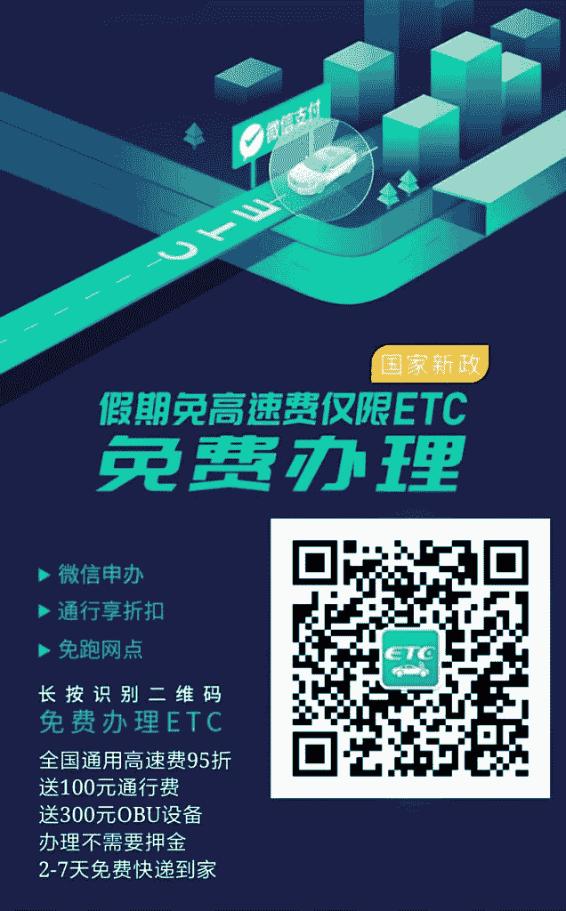

# 全民 etc | 莉琴小姐姐 | 银行分销平台

月初圈友们在讨论 etc 红利，我们车联网企业也对接了几家银行，经过半个多月的跟进，银行的推广费达到了每单 100 元，每天全国完成 42 万用户，一个月 1200 万左右，距离发改委和交通部要求的 1.2 亿新增还很远，今年任务极难完成，按这速度要到明年 5 月了，各家银行亚历山大！银行员工每人 200～800 个任务，凑钱找渠道完成任务，我们接到了好几家需求，银行小姐姐哭着喊着找我们帮忙，对话场面惨不忍睹……

腾讯投资的微信小程序“etc 助手”号称完成全国 30%的量

推广费还在上涨，这个变成了一项政治任务，现在出钱的不仅有银行，证券、互金公司抢着帮银行小姐姐完成任务，换取银行其他项目做交换。6 月发文，7 月刚开始准备，今年还将有 1 亿的新增，去掉微信、支付宝、银行网点办理的，预计会有 3000 万要靠社会各界（我辈中人报效国家的机会到了）完成，佣金大概 15 亿。

现在市场上动作最快的是工行，各城市工行八仙过海，打的是群架，地面部队处处可见，地推最多，动员周边合作公司的能力强，送 100 元通行费、加油打折、送话费、摆摊、送米送油，分销系统人工参与的多，其次是建行，开发的 etc 小程序好几个，信息化能力最强，招行分销平台 8 月初上线，农行没啥动静，中国银行最肯花钱，出价最高，交通银行各城市政策不统一，各自为战，群龙无首，优惠政策只管本市，出了城不管，其他什么中信银行、农商银行、邮政银行、xx 城市银行……陆续上线办理平台

关键是各家银行的分销平台，也是人传人，先到先做上级，后做啥都没了，只能是下下下级了，虽然越到年底银行压力越大，推广费用越高，但到时和自己没啥关系了，能分到手的没剩多少

1 亿的车主市场，银行出钱，出系统，全程时时查询数据，无限量生成下级二维码，普通用户还能裂变，裂变的也算业绩，我都怀疑银行会不会因为 etc 而变成一个传销公司

最近才知道，车主不愿办 etc 的主因是啥，罪魁祸首竟然是收费站小姐姐！全国最火的网红收费站小姐姐，名字叫莉琴，累计 500w 粉丝，在湘西永顺收费站，途径湖南境内的司机绕道去看莉琴，etc 车主也走收费道，而且丧心病狂地宣称“你永远不知道收费站小姐姐的手有多滑”，莉琴还是湖南高速的形象代言人，各类公路活动都会出席，代表全国车友和领导握手，湘西车匪路霸都要给三分薄面

湖南几家银行都在抢着和莉琴合作代言，推广自家的 etc 小程序，战争才刚刚开始

插播一条:想要莉琴小号地址的可以找我们，里面都是生活照和视频

想要对接银行 etc 分销平台的圈友也可以找我们，我们和莉琴一起分享银行 1 亿车主的推广费用

说回正题，现在让用户和各家银行头疼的是，etc 设备发货太慢了，全国暴增 1000 万用户，厂家加班加点定制 etc 卡，etc 助手被投诉爆了，负面信息极多，99 元押金费也取消了，因为各家银行送的设备值 300 元，专门到厂家现场取货，再快递的生意都出现了，比厂家送快多了，不要和几十万车主排队

问题是，越迟办，到货时间越慢，明年只留一条人工收费道，市内停车场增加 etc 停车，收费站小姐姐没得看了……

现在市场极乱，银行分销平台结算还有分立结、日结、次日结、下午 3 点结、周结、今日 40 明日 20 结，还有报单结、图片结、办理结、激活结、视频结，乱象丛生，哈哈哈😄

我只想问，莉琴小姐姐明年会去哪儿？手还滑吗？

莉琴 小姐姐

莉琴 小姐姐

莉琴 小姐姐

**评论：**

张五哥：感谢业内大佬分享！有几个细节问题请教：1 存不存在互相撬存量客户的情况，比如我已经用了工行的 etc，换成建行的，会不会还有优惠和补贴。2 文中提到的分销系统是各银行哪个层面做的，是总行，省分行还是市分行？3 邮寄安装怎么解决绑定车辆的问题，记得以前是严格一卡一车的，因为运营的大车用私家车的 etc 高速同行可以省很多钱，也是高速公路严厉打击的违法犯罪

不躲闪 回复 张五哥：1.互相撬存量用户的行为极少，原因有三：一是新增用户足够多，银行人员在实际操作中，你有 etc 了，就不花时间问你，看你车中没 etc 才来问，二是用户从一家银行转到另外一家要等很久打很多次电话，银行注销 etc 的系统都没有，打各家 955xx 客服电话，客服看不到用户信息，银行的 etc 系统都没有，现在在线办理系统都没做完，注销系统都没空做，按银行人员的说法，你好不容易办了 etc，不会轻易让你注销；最重要的是银行是 6 月才加入 etc 的推广，之前不是主要业务，门槛很高，用户花钱买设备，要预存，现在全免费，6 月之前全国推广 etc 的主要力量是各省高速发卡方，粤通卡、苏通卡、黔通卡、鲁通卡….在国家压迫之下，银行才成为推广主力，腾讯的 etc 助手做的也是集成平台，把银行、etc 发卡方拉一起，在线办理，现在各家要注销平均时间是 30-45 天，已经有用户通过投诉黑猫暴力上诉，这注销快；换银行当然是有优惠的，找最优惠的办，首先要在原来的办理渠道注销，注销难； 2、现在的分销系统是省分行和市分行，比如我们工行就接了三家，分别是成都、长沙、厦门的分行，只要有技术实力的行都能做，6 月份发文的最大变动是：各省 etc 卡取消省级限制，全国通用，银行加入推广，etc 卡银行卡都通用了，现在村支行有实力都能做分销系统，哪个行愿意出钱，想多完成任务，想多圈银行卡，就可以做系统 3、绑定车辆问题，私家车在线办理的时候提交车辆和身份证信息，然后发卡方制定卡，一卡一车已经绑定；这个技术不属于 6 月份行业变动的内容，原来怎么打击现在照样怎么打击，货车一卡多车用一直都存在，主要从各省高速关系放出来的渠道，手持 e t c 设备；6 月行业变动，是针对私家车的办理