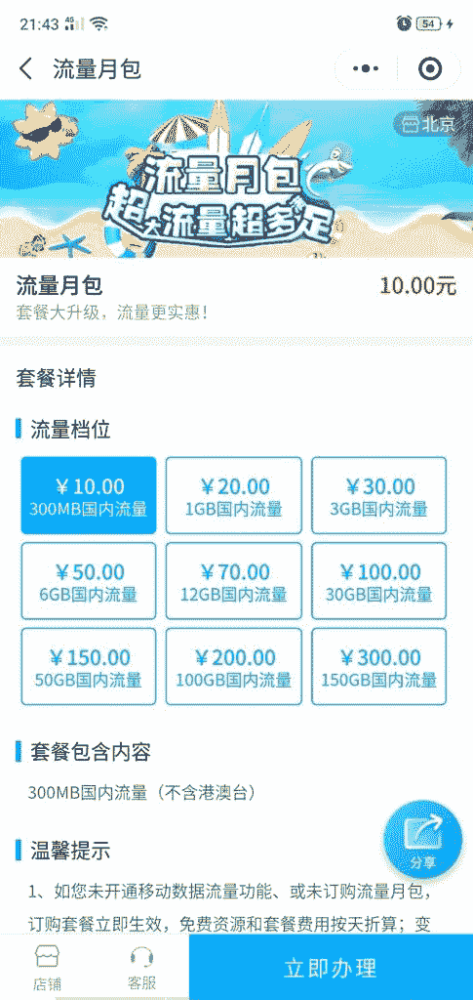
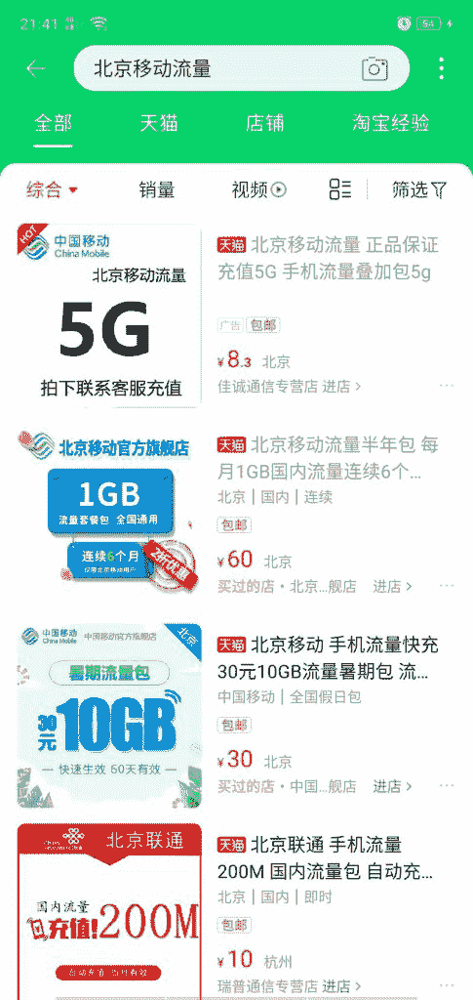
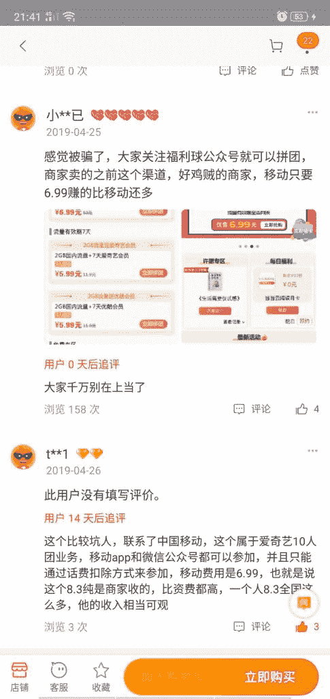
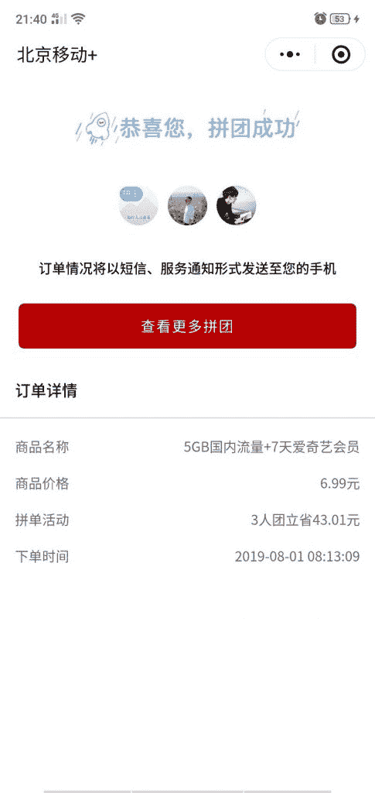

# 利用信息差

手机更改了基础套餐，流量不太够用。
移动官方流量 20 块钱 1G
想到以前淘宝买会便宜，发现一个销量比较高的 8 元，销量很多，最新评论都是好评。
习惯性看差评追评，发现很多人提到付给店铺 8 元后，还会扣 6-7 元话费。一共 15 元左右。

后来发现，店家用买家手机号参与移动和爱奇艺的一个活动，5G6.99，2G5.99，这个活动直接扣话费。

所以相当于，店家净赚 8 元，不求甚解的客户 15 元买了 5G 流量。为知识付费了。

热心群众分享出方案，我们可以学习店家也可以为自己省钱。

移动官方流量

移动流量

淘宝评论

移动流量

**评论：**

安迪：信息不对称