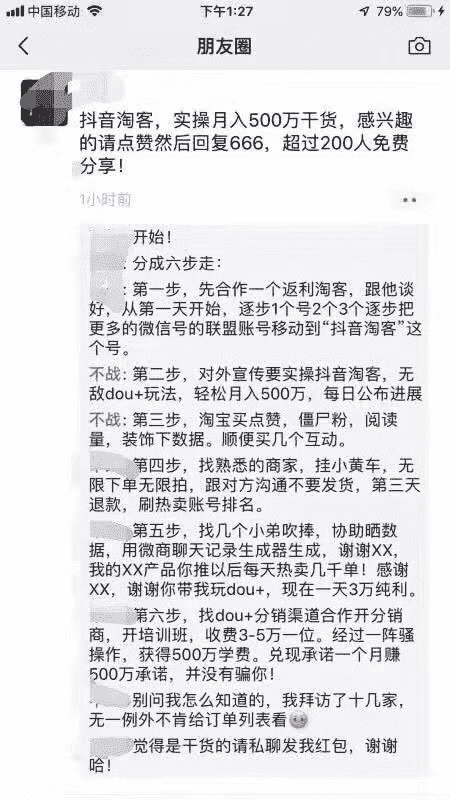
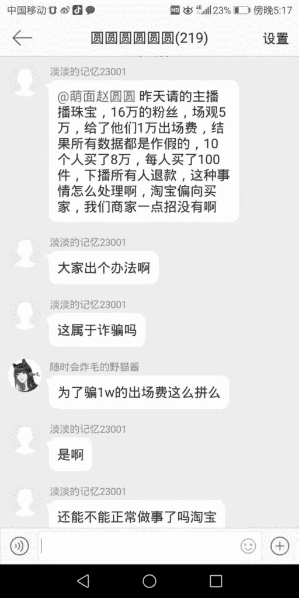

# 淘宝直播和抖音淘客的黑幕

不知道为什么，越学越感觉自己越差劲，感觉永远学不完

今天给大家分享一个自己踩的新坑，希望正在做和准备做淘宝直播和走抖音淘客的商家能够避开这些坑…

7.30 我做了我跟的主播第一个美妆专场，服务费 2500，佣金 30%，约的晚上八点开播。那场直播，主播没有发布预告，没有发预告意味着当场直播的流量会降低很多。

直播八点半左右开始，开播后主播几乎一直在化妆，中间间断的描述了产品，然后就十点了。告诉我说，说的一个小时，播了一个半小时…于是这场直播产出 3020

直播结束，我找主播助理协商希望能够补场，消息一直不回，后来才了解到这个助理已经被拉进美妆商家的黑名单…

遇到过骗样品的，遇到过骗服务费的，这样要播不播半吊子的…我也是很服气

配图，图一是淘客圈子里的一位带淘客团队的人写的关于抖音淘客的运作（投机倒把），第二张图片是淘宝直播商家的一个互动群消息

希望正在做这一块儿的商家朋友一定要小心谨慎，还请大佬多多指教

抖音淘客

抖音淘客

**评论：**

阿枫：良莠不齐，浑水摸鱼

故事、自己写：水太深。