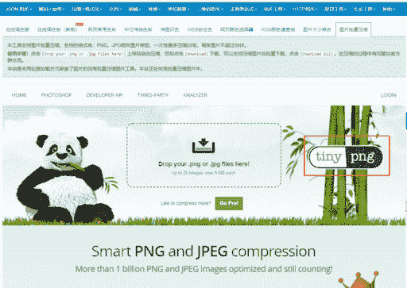

# 优秀的 PNG 图片压缩工具 | tinypng

国外一款优秀的 PNG 图片压缩工具，叫 tinypng，其实很多人不知道这个工具。我作为程序员比较早知道它，也一直在用，还推广给一些设计师。

我能做的就这么多，但下图的这个工具网站，把 tinypng 页面直接抓取到自己的网页里，用这个优秀工具给自己提升网站品质

这也是信息差吧，还有认知差，目前就看到一家工具网站这么做

tinypng

跹尘：这个只要是个前端都知道吧

瓶子 回复 跹尘：那你知道 pngquant 吗

跹尘 回复 瓶子：一般都用 tinypng

FangXY：wordpress 站长应该大都知道

瓶子 回复 FangXY：这个我就不确定了，程序员届知道 tinypng 也正常，不过玩这种操作的就少见了

一条枸杞：如果只看压缩，也可以选择智图 [`zhitu.isux.us`](https://zhitu.isux.us/) ； 不过把 TinyPNG 拿过来直接用，这个确实是难得一见的逻辑

微光：微软也推出类似的

萝卜：是直接把人家的网站嵌套在自己的页面吗

瓶子 回复 萝卜：嗯