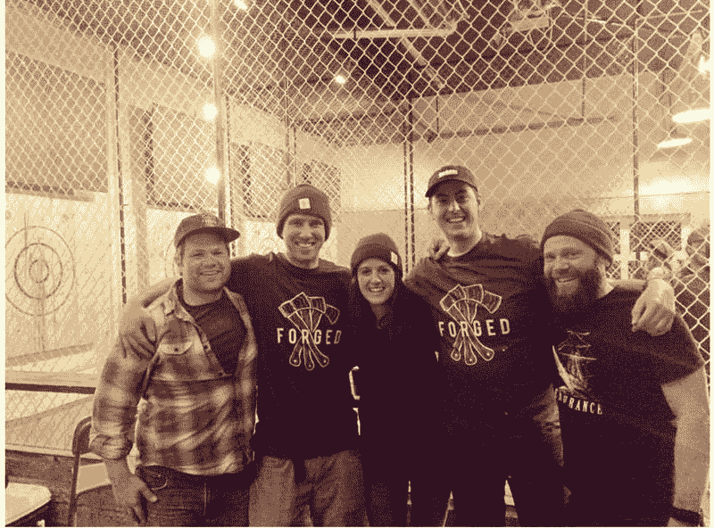
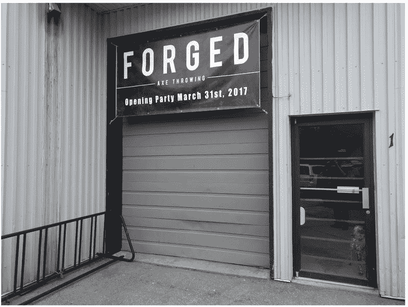
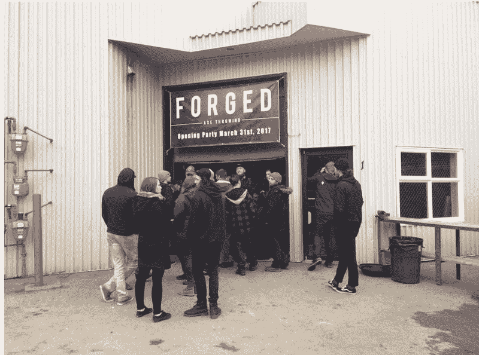
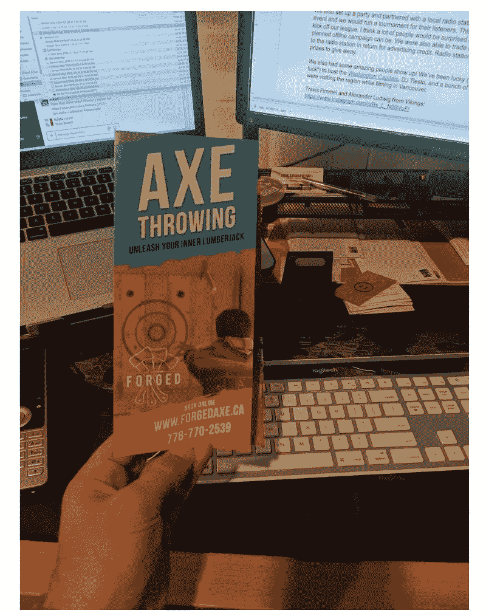
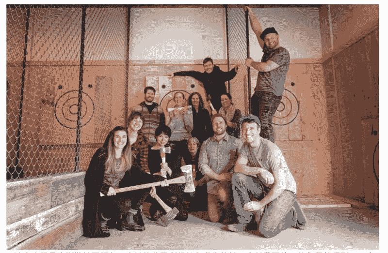

# 派对上玩的喝酒游戏“扔斧头”

又到周五啦，鱼丸又来了。

射箭、套瓶子，大家玩过吧？今天要讲的这个项目，和这个有点像，是远在美国的一个小伙子参加单身派对时不经意发现的，2 个创始人，6 个员工，1 年收入竟然达到了 96,0000 美元！约合人民币 700 多万，可以说是非常惊人了！

一，这个项目具体是什么呢？小伙子是怎么发现的？
项目就是扔！斧！头！

这个奇葩的想法源于，他参加了一个单身派对，派对上玩的喝酒游戏就是“扔斧头”，输了的喝啤酒，通过这个活动大家喝完了 1000 多瓶啤酒，小伙子觉得很有意思，去 google 了一下，发现加拿大有一个同样聪明的朋友已经开始商业化“扔斧头”的项目了，试探问时候可以加盟，答案是“NO”，于是他准备拉团队自己开始干。

二，这个项目启动难度大吗，前期需要做哪些准备？

①、人和钱：他找了他的好兄弟合伙，两个人各自出了 3 万美元，主要用来租场地、装修。 每个月房租 5000 美金，不过好处是，在租房的时候，房东给了他们两个月的免费时间，让他们可以快速的装修准备设备。

个创始人也很好的分工，主人公负责营销、销售和管理，另外一个创始人负责产品，也就是他们的体验店。

②、让“扔斧头”这个游戏更加有吸引力。这个游戏流程很简单，要让别人买单，需要往里加点料。

两个创始人为此特意去了旅游学校，并且去应聘漂流公司的导游，并且从导游的角度去看，如何让游客从中感受到快乐，怎么样可以让“扔斧头”的这个游戏体验更棒。（鱼丸看到这里，就觉得他们很靠谱了~~）

三，万事具备，就等开张
在正式开店前，他们用折扣的方式吸引了一批喜欢尝鲜的用户，过程中不断记录客户的反馈，针对一些地方继续做了优化，这一步鱼丸觉得很重要，线下店，确保开业那天的用户体验非常重要，好的开始是成功的一半。

由于小伙子有网络推广的经验，所以很自然的再 facebook 和 instagram 都开了一个推广账户，设置了 50 美金的推广预算，只等正式店开张。

另外打印了 500 份传单，到附近地区的企业里面，邀请他们来参加开幕派对。

然后。。。 BOOM！第一天体验店就来了数百人！！接下来一切非常顺利，连着两周都预定满了。

鱼丸把他们的定价也贴出来，给大家参考：

周一到周四 37 美金；
周五和周日是 39 美金；
周六是 42 美金

（我个人觉得这个定价一点都不高，事实也证明，因为他们定价低，所以用户爆满，导致员工忙不过来，哈哈，也算是甜蜜的烦恼吧~）

四.那这么多的人流，真的是自然需求，简单发发传单就来了吗？他到底还用了哪些手段？

鱼丸整理了小伙子用的方法:

①、 SEO。SEO 是一个短期回报小，但是长期回报巨大的工作，斧头业务从 SEO 中获得了很多预定的订单。

关于 SEO 具体的做法，鱼丸也发出来，给大家参考~~

第一步：确定市场上需要什么。事实上，很少有人会去搜索“扔斧头”这个关键词，但是另外一个事实，很多人想找一些有意思的活动来组织团建或者周末娱乐。 所以，他要做的事情，就是将“扔斧头”这个项目推荐给那些对此可能感兴趣的人。

第二步：创建能与该市场产生共鸣的内容。 想外出活动的人可能会搜索哪些关键词？有几个例子“冬天可以做的娱乐”、“家庭聚会可以做的事情”、“下雨天有什么活动”、“本地温泉”、“水疗中心”。。。名单可以非常多，内容也不仅限于博客文章，也可以包括视频、电子书等任何人们可能想到的内容形式。

第三步：找媒体做 PR。找到那些喜欢你这类主题并且愿意写故事的记者，目前主人公的项目已经在 BBC，Mountain Life，Readers Digest，The Knot，Trivago，Seattle Met，Newsweek 等数十家网站上发布过文章。

典型的故事就是主人公在 BBC 的采访中告诉他们想把斧头扔成下一个奥林匹克运动，记者当然爱这样的故事了，对吧！所以，发挥创意，找到一个能讲故事的点，记者免费都愿意为你报导。

1.  PPC 广告

在谷歌创建了广告账户，按照购买意图来进行投放，一开始 ROI 并不好，但是随着订单数增加，相关度越来越高，投放数据也越来越好。

在 SEO 和 PPC 上值得投入足够的精力，因为如果你发现某一些关键词在广告投放中表现很好，就可以通过 SEO 的方法来获取该关键词的免费流量，这个方法虽然花的时间比较久，但回报巨大。

1.  线下广告

每年散发出去 20000 份宣传小册子，事实证明这是效果最好的三个渠道之一。

有人说，线上的营销效果要远远好于线下，传统营销已死。 但小伙子用事实证明了，还是看谁用，当然传统的广告渠道在线下店这个项目上可以玩的余地和空间比较大。

还包括与当地广告电台合作，提供一些免费体验名额，给电台做活动，效果也不错。

同时，有一个很重要的心得主人公想与大家分享

“当你开始一项新的创业项目，你会因为新鲜感而获取到很多额外的流量，很多人想过来看看了解下。但是，这种流量很快就会消失，利用好它们但是不要依赖于它们。”
这个和亦仁老板前两天分享的观点不谋而合。

五，收入很多，净利润到底如何？

目前订单一半是通过自己的网站来的订单，一半是通过合作伙伴，类似于 TripAdvisor，Expedia，GetYourGuide，Veltra，Airbnb 等带过来的。

在业务开始的第二个月，其实就开始赚钱了， 团队对业务的增长也很满意，赚的每一分钱都又用到了业务中去。 后面为了扩大业务，又拿到了一些融资，员工人数也增加到了 20 个。

有很多人会关心净利率有多少，这个不太好说，由于主人公团队将赚到的钱又投入到了业务中，所以目前的净利率大概在 12%左右。

在可以赚钱的时候，把所有的资源都投入进去，迅速规模化！

当然也有一些忠告：

养成制定具体战略、目标并回顾的习惯，不是说给投资人看的几十页的 BP，而是两三页的文件，清楚的列出来今年的战略、目标和策略。

很多人热情满满想要创业，但是真正开始做事情的时候，却会渐渐偏离目标。所以在开始的时候写一个商业计划书，并不断回顾纠正，确保自己走在正确的道路上。

小伙子最后说了一句：“免费的是最贵的。 如果有人要给你免费的建议，那么你要确保这条消息的来源是否可靠。

每个人对这句话的理解都不一样，留给大家仔细品味吧~~

今天的分享就到这啦，喜欢看类似的故事就点赞告诉鱼丸吧~

扔斧头

扔斧头

扔斧头

扔斧头

**评论：**

柚子（别摸我头会长不大）：喜欢看这种接地气、真实的案例～给鱼丸比心

懂懂精选：很好奇啥是扔斧头。

亦仁 回复 懂懂精选：射箭玩过没，这个项目是给你一个靶，再给你几把斧头，一段距离外对着靶扔斧头，看能不能砸中靶。