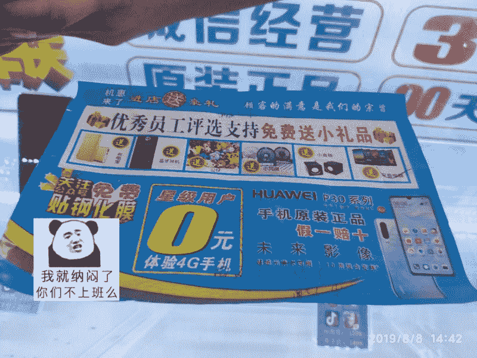

# 每日一点微营销：碰到个手机店免费送 ipad 的套路

我们知道一般的手机店免费送手机电脑需要绑定指定套餐，但是，这个不需要~

今天下午逛街，被小姐姐拦下，拿着一个评价表，可怜巴巴地问我可不可以帮她写个好评，因为要考核业绩，热心的俺，看着动人的你，帮你一把奸笑

写了好评后，小姐姐说为表示感谢，让我从六个礼物中选择一个送给我，我选了 ipad，让我意外的是，小姐姐立刻拿来 iap 问我喜不喜欢，喜欢的话就拿走…

我满脸疑惑地拿着平板准备出门时，被拦下说为了看我是不是第一次领取，需要登记身份证信息，俺立刻拒绝了，并质问为什么？

终于，禁不住我的死皮赖脸，他们告诉了我实情，因为登记之后，要保证我在 9 年内所用手机卡消费够 4800 元，如果不够，会每天从话费扣掉 7 块钱，直到扣够 4800！

回来问了朋友才知道，免费送平板的套路，就是用平板锁定你，手机号让你用九年，半年不到，这平板就该淘汰了，却锁定一个九年客户，这号还不能不用，否则违约，上征信的…

大写的 666666，俺农村来的，服了，分享出来，其他农村滴孩子也提防点，天下没有免费午餐，尤其是路边的小姐姐给的…

话说回来，这里面用到一些方法，我觉得还是蛮有意思的，比如说他在马路上面不会说，进店免费送礼品，而是用一种可怜的表情让路人帮忙对他做一个问卷评价，很多像我一样纯粹的爷们都会停下来帮帮她，于是，原本只是路过，现在主动进了店内~

赠品也不是免费送的，而是为了表示你对他帮忙而送给你的，让人有了一个接受“赠品”的理由~

进店之后不会先告诉条件，而是先把赠品给你，问你喜不喜欢，等你爱不释手准备拿走的时候，再突然提出条件…还好我一直在防备着，总感觉有蹊跷撇嘴撇嘴，所以果断拒绝并且质问到底~

套路

套路

**评论：**

旺小哥：这算不算不透明消费？有点诈骗的感觉~

Kosan：最近帮朋友的内衣店策划到店引流，用的技巧和这个有点类似，当然，不套路人。 具体的做法就是： 1.线上在种子用户群先发红包，造势，发通知； 2.告诉大家，只要你拉人进群，就送精美礼品（礼品名称和原价要标清楚）； 3.进群满 50，100…还发红包，抢到最大的那个，同样可以免费领取到精美礼品； 4.于是大家疯狂拉人； 5.拉人的，和进群的新人都有礼品，他们就会问，怎么领取； 6.然后再告诉他们，到店就能领取，半个月之内有效； 7.来店铺之后，马上进行留客升单，卖会员，因为朋友店铺会员体系和服务做得很不错，到店被转化的几率很大； 8.结果是第一天到店 25 人，13 人消费了 7000 多。这个效果他们很满意。 9.其实这里面就只做了一点：拉人进群，一起获得礼品。礼品成本 2 块钱，再加上红包成本，不到 100。

旺小哥 回复 Kosan：这个方法不错，但是怎么能保证他拉的是本地的人？

Kosan 回复 旺小哥：首先是种子用户都是门店附近的人，门店找他们推荐人，他们一般会拉附近的自己的朋友过来； 其次，进群就可领奖品，但是要真到手里，需要到店，没到店的人领取不到奖品；老用户需要到店，新用户也需要到店； 再次，即便是拉了外地的人，损失的也很少。而且，都是真实的用户，没有薅羊毛的，所以，这种损失很少，可以接受。

旺小哥 回复 Kosan：这个方法对实体门店是个很不错的方法

Kosan 回复 旺小哥：对，用户执行也特别简单，就两步：1.拉好友进群；2.领取奖品，到店领取。

旺小哥 回复 Kosan：很棒，谢谢