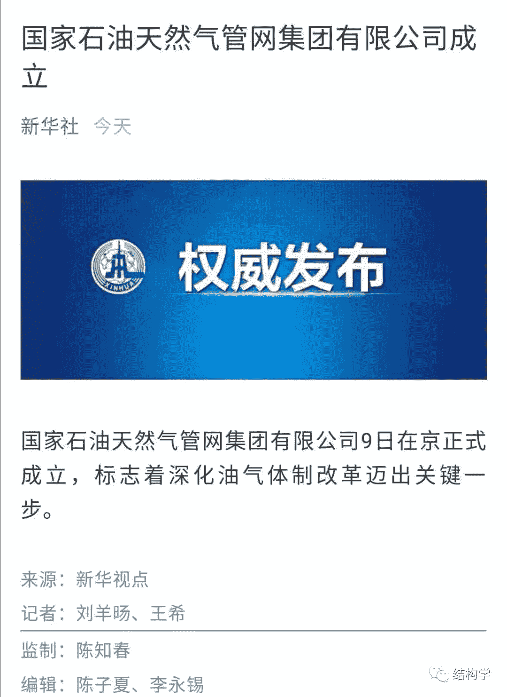

# [结构学] - 2019-12-09 昨天，一年前的预测被验证！

> 来源：[`www.yuque.com/books/share/641124b8-5f80-4d26-a995-cf244fceb154/ot1lw7`](https://www.yuque.com/books/share/641124b8-5f80-4d26-a995-cf244fceb154/ot1lw7)

昨天，一年前的预测被验证！ 

原创觉悟者结构学 

结构学 

微信号TransactionCosts 

功能介绍《结构学》：生命体在其生存结构中的求存之道！ 训练营：觉悟社 

2019-12-09[原文](https://mp.weixin.qq.com/s?__biz=MzIzMDYwOTM0Mg==&mid=2247484158&idx=1&sn=4d7eef21f730a7a27a3dabe01584c04a&chksm=e8b19a2fdfc61339f80e2277046b1446cc065a95d72e704e927bf052011e0557cadff235b54e#rd))发表于 

收录于合集 

昨天新华社发布官方权威消息，国家层面统一的天然气管道集团公司成立。一年前觉悟社中一位做管道业务的成员提了一个预测性的咨询问题。后来把对他的问题的回答整理了一下，写了这篇：[B3：油价会上涨吗？](http://mp.weixin.qq.com/s?__biz=MzAxNDk1NjI2Mw==&mid=2247484078&idx=1&sn=6eee861727c21eef764e35f2379d643d&chksm=9b8a2126acfda83052cc25adc2294b7e0ccbece32af96e58033b4e7febfbd9ef719bba384a87&scene=21#wechat_redirect) 它预言了国家会成立国家层面的统一天然气管道公司，然后争夺对流通的控制权。从成立到真正掌控流通并成为整个油气业务的核心部分还需要围绕人事权进行博弈。关于这一点，文中有详细阐述。 

  

除此之外，《[C12：务必要振兴建设兵团！](http://mp.weixin.qq.com/s?__biz=MzAxNDk1NjI2Mw==&mid=2247484193&idx=1&sn=88c86597191d0c97a411f9ea6f7b7c5d&chksm=9b8a20a9acfda9bfae819e8e42531fe6d523dd244ef0fc0c0787ab812540108c181f7ec2ffa9&scene=21#wechat_redirect)》中对西北社会治理政策的预判也在一步一步被现实验证。有人说：“你总是站在奴隶主的立场上，非常抱歉，您是对的！乌合之众从来都只是棋子和炮灰，它们任凭情绪的怂恿，被裹挟着投入一个又一个坑中"—— 这个世界上存在两种人，一种是试图解决问题，承担责任的人；另外一种是无法解决问题也不想承担责任，只想发泄情绪的人。结构学立足于传播一种强者文化，强调知行合一，以解决现实问题为出发点。即便是精神结构部分的研究，也不是为了安慰弱者。而是为了洞察个体和由个体构建而成的共同体的行为的轨迹和驱动力的形成机制。 

在《[A97：别找借口，远不到会猝死的程度！](http://mp.weixin.qq.com/s?__biz=MzAxNDk1NjI2Mw==&mid=2247484866&idx=1&sn=d93222730b1fd65cd31d270e54c91073&chksm=9b8a264aacfdaf5cf1d8eab64891b03e7b9966e887c9f512b7cb4a3f6cca04f1faa2c5da905d&scene=21#wechat_redirect)》中有这么一句多年亲身实践得出的结论：人最开始的优势是某种单一技能，其次是综合性的才能，最后是一种面对不确定的远见和定力——也就是洞察、判断和决策。筛选人的门槛，首先是技能，其次是才能，最后是远见和定力——越靠后就越艰难，所以，对于绝大多数人而言，遇到挫折马上会退缩，遇到困难就想躲起来，是一种再正常不过的本能行为。 

要找一年多前的那篇文章，可以发消息【觉悟社】或【守夜人总司令】，或扫码到防失联的【守夜人基地】里去看。在公众号上发消息【B13】也会有链接地址！ 

提问发消息：守夜人总司令 

《结构学》版权限制，觉悟社内部预定！ 

获取《结构学》发消息：觉悟社 

  

[关于美国的三篇！](http://mp.weixin.qq.com/s?__biz=MzIzMDYwOTM0Mg==&mid=2247484082&idx=1&sn=7f0efdc740505aeff41af3593c2c07d2&chksm=e8b19a63dfc613757721204eef321ddcad7ddc01dfc2076db117c37c0b37d75438f2e405c830&scene=21#wechat_redirect) 

[美国三篇：信仰的坍塌！](http://mp.weixin.qq.com/s?__biz=MzIzMDYwOTM0Mg==&mid=2247484086&idx=1&sn=84a690a2f2f277ffb97bd9ae9b8997b5&chksm=e8b19a67dfc61371cbaa58bdc4cf884dcb865ce62dc947cf1cf3e7653716339ff71d49c563bb&scene=21#wechat_redirect) 

[美国三篇：农场的衰落！](http://mp.weixin.qq.com/s?__biz=MzAxNDk1NjI2Mw==&mid=2247484839&idx=1&sn=ab17e9c4ae5af883a17a9c0fcafe94dd&chksm=9b8a262facfdaf399eab6252e9034d5a64a95f1c2575ed6570615dc11980d7d14b684341c22d&scene=21#wechat_redirect) 

[结构学目录和纲要！](http://mp.weixin.qq.com/s?__biz=MzIzMDYwOTM0Mg==&mid=2247484053&idx=1&sn=c1f5eab393cc4446a8289a6e25038b36&chksm=e8b19a44dfc613522c81444af83496ce9efdc9ad6c892fb4664d48d5a8c3d4281f0f94772c04&scene=21#wechat_redirect) 

[F3：结构力量](http://mp.weixin.qq.com/s?__biz=MzIzMDYwOTM0Mg==&mid=2247483942&idx=1&sn=53a6cd726a0ea5e93ef015690fa25d3b&chksm=e8b19af7dfc613e1f5509b8cebb677a6aa963a98b47438c54e89a8979374e794372cb1f0fe84&scene=21#wechat_redirect) 

[C29：中层与高层之别！](http://mp.weixin.qq.com/s?__biz=MzIzMDYwOTM0Mg==&mid=2247484061&idx=1&sn=6b5effaceec4ccea129b0b2c0ff9eb94&chksm=e8b19a4cdfc6135a82d4a79c2245a8efb5cea97135ffeef76afcdb0f1d23fc37408270b77ac3&scene=21#wechat_redirect) 

[C15：士大夫才是真正的统治者](http://mp.weixin.qq.com/s?__biz=MzIzMDYwOTM0Mg==&mid=2247483960&idx=1&sn=91978b70e123a7a6a57a3678d4b17e86&chksm=e8b19ae9dfc613ff1bd2aadb1504c0332942657d1fcb07f947b313ec1c123cc75b21b23f6e16&scene=21#wechat_redirect)

[我和我的祖国！](http://mp.weixin.qq.com/s?__biz=MzIzMDYwOTM0Mg==&mid=2247484115&idx=1&sn=e04f533c19139936604c97042b23ab88&chksm=e8b19a02dfc6131403531aa897c8c5c2e6881cb25262189d25ba73bf44039af2a4ed9dad3a6f&scene=21#wechat_redirect) 

[穷是万恶之源！](http://mp.weixin.qq.com/s?__biz=MzAxNDk1NjI2Mw==&mid=2247483823&idx=1&sn=e54ebe9891b302dc0bf1815c76ccf8b7&chksm=9b8a2227acfdab31a05e273addd9159d4b8263d58d3c58bf214841c8189157519719c3427306&scene=21#wechat_redirect) 

[B19：不动产的投资思路！](http://mp.weixin.qq.com/s?__biz=MzIzMDYwOTM0Mg==&mid=2247484069&idx=1&sn=a13a6e590a21b27fd1356718b3a2dcd3&chksm=e8b19a74dfc613622b23c7233732cbb1d499c75f9b7ac3047cdeaee3a34eeae7d3b4871429f1&scene=21#wechat_redirect) 

[A70：广州的黑人问题！](http://mp.weixin.qq.com/s?__biz=MzIzMDYwOTM0Mg==&mid=2247484073&idx=1&sn=3ffde794629bfd65117e0f4f589cc7fe&chksm=e8b19a78dfc6136e940b88d2e15d6e62b5fd657d5daa5182e9cdc73255788b995629b0c192f6&scene=21#wechat_redirect) 

[依依东望，望的是时间！](http://mp.weixin.qq.com/s?__biz=MzIzMDYwOTM0Mg==&mid=2247483860&idx=1&sn=b5b01ae82ff764ce2806251e3f2a809f&chksm=e8b19905dfc61013607735eb7782299c9a4d7a39a8b15a7b46182ef20eda3ffe9f6ed6337e1f&scene=21#wechat_redirect) 

[A84：改革的步骤！](http://mp.weixin.qq.com/s?__biz=MzIzMDYwOTM0Mg==&mid=2247484098&idx=1&sn=8a28fd5dce47b485ed38e4f3cfdb7d05&chksm=e8b19a13dfc61305fde13511d297aa1d6b59184825c7998f338e7d5f36742e3c06c717d78fe8&scene=21#wechat_redirect) 

[A86：女神的错觉！](http://mp.weixin.qq.com/s?__biz=MzAxNDk1NjI2Mw==&mid=2247484733&idx=1&sn=fab22e8ab3f80b78dab3d4e2e2716bfb&chksm=9b8a26b5acfdafa374df83506e5086a573169362877918977c08490b4e9747c45c99d1266e7f&scene=21#wechat_redirect) 

[A87：一个时代的终结！](http://mp.weixin.qq.com/s?__biz=MzIzMDYwOTM0Mg==&mid=2247484102&idx=1&sn=c0572fe89409ac0ef2d1468b8f81f130&chksm=e8b19a17dfc6130119eacf0492c237b5173f6f9c13265a36d7919e3132228f8c2d3306863c08&scene=21#wechat_redirect) 

[A91：被简化的主观世界！](http://mp.weixin.qq.com/s?__biz=MzIzMDYwOTM0Mg==&mid=2247484106&idx=1&sn=89ac1e2a068a9114c08822ed3a6a9916&chksm=e8b19a1bdfc6130d67743acf04c384cd66fa3d13b83614a9b3d70edda3290e8af9765c31b7d7&scene=21#wechat_redirect) 

[A100：跟你没关系，别瞎高潮！](http://mp.weixin.qq.com/s?__biz=MzAxNDk1NjI2Mw==&mid=2247484826&idx=1&sn=c2df87478a77eebf01085c7795424395&chksm=9b8a2612acfdaf04f9034241f17123b00853fb4fa0af799266ae01cdd7ce776318d0d88cde41&scene=21#wechat_redirect) 

[向正在坍塌的地方踹上一脚！](http://mp.weixin.qq.com/s?__biz=MzAxNDk1NjI2Mw==&mid=2247483789&idx=1&sn=5e44b7b524c3dc4bb7705f49ed0a44a3&chksm=9b8a2205acfdab139e4b1d44ef6702b09c9fbf79505340205d13fbdaa33207a997f54bee0e97&scene=21#wechat_redirect) 

[C29：中层与高层之别！](http://mp.weixin.qq.com/s?__biz=MzIzMDYwOTM0Mg==&mid=2247484061&idx=1&sn=6b5effaceec4ccea129b0b2c0ff9eb94&chksm=e8b19a4cdfc6135a82d4a79c2245a8efb5cea97135ffeef76afcdb0f1d23fc37408270b77ac3&scene=21#wechat_redirect) 

[A96：真的不是你的错！](http://mp.weixin.qq.com/s?__biz=MzAxNDk1NjI2Mw==&mid=2247484835&idx=1&sn=9f24aba2a2b22cf3033e76a5435e352e&chksm=9b8a262bacfdaf3d1cf1dabf21851d162769a2bcd6826d220efeee9e34c408950f56eadd0baf&scene=21#wechat_redirect) 

[C20：行为的内在驱动力！](http://mp.weixin.qq.com/s?__biz=MzIzMDYwOTM0Mg==&mid=2247484003&idx=1&sn=a62ddbccc64f9f19890c0dff9605b6f7&chksm=e8b19ab2dfc613a47b840d331bb9c43711798f5102681c0d1a06cb3996450c1d34bc8573b7e0&scene=21#wechat_redirect) 

[A34：烂父亲的危害到底有多大！](http://mp.weixin.qq.com/s?__biz=MzIzMDYwOTM0Mg==&mid=2247483986&idx=1&sn=984fbf5e696f7a3f34f25dcf93037cea&chksm=e8b19a83dfc61395d629a54503920505c42a73a62b9e72308ed4ea0d66c509ca66a1a3138ea5&scene=21#wechat_redirect) 

[B1：去不掉的中间环节](http://mp.weixin.qq.com/s?__biz=MzIzMDYwOTM0Mg==&mid=2247483903&idx=1&sn=e8a21cb816d6a27d869f81463805a208&chksm=e8b1992edfc610380f54d91f9acc9844820c77ce8a5bcedb4f36372c406647f45fd2514a6a77&scene=21#wechat_redirect) 

[C1：他们到底怕什么？](http://mp.weixin.qq.com/s?__biz=MzIzMDYwOTM0Mg==&mid=2247483830&idx=1&sn=b49870ee1ebbd5397ad409346c93b630&chksm=e8b19967dfc61071fc4a913312b8e255008adb24a32c745465d3da59e45465a9fdc0aa36bd8e&scene=21#wechat_redirect)

[B20：企业文化的本质！](http://mp.weixin.qq.com/s?__biz=MzIzMDYwOTM0Mg==&mid=2247484111&idx=1&sn=d6154ef03c3702d24ebbd49ec6d2544b&chksm=e8b19a1edfc61308357f4cc639a74339e18c1e7ea64e351a1d73fac03d82e0daa3d7cbd2b4f7&scene=21#wechat_redirect)[A93：如何不讨厌自己？](http://mp.weixin.qq.com/s?__biz=MzAxNDk1NjI2Mw==&mid=2247484783&idx=1&sn=08bb06c4b322311a9d08a0d67077b6ac&chksm=9b8a26e7acfdaff1fb664e30d3365b7405692c4c7e53b41d078052fcbd87faf8de05c04346ce&scene=21#wechat_redirect) 

[A94：巴基斯坦的选择！](http://mp.weixin.qq.com/s?__biz=MzAxNDk1NjI2Mw==&mid=2247484787&idx=1&sn=1e88f66866554dbb73e4fd4d7947be0d&chksm=9b8a26fbacfdafed9d52a547f2f4608ef001fa2b6a07ec62bb06c5df56b23b6bca3d7b26b6cf&scene=21#wechat_redirect) 

[胜天半子：凤凰男的悲剧性魔咒！](http://mp.weixin.qq.com/s?__biz=MzAxNDk1NjI2Mw==&mid=2247484459&idx=1&sn=3af333a7d8f81253f730e57ba86f6f11&chksm=9b8a27a3acfdaeb524c155bcc629f472e273558add2d9c91ca3295d08144bd6d7d26ed757e6c&scene=21#wechat_redirect) 

觉悟者 

喜欢你就转走吧！ 

微信扫一扫赞赏作者赞赏 

已喜欢，对作者说句悄悄话 

取消 

发送给作者 

发送 

最多 40 字，当前共字 

 人赞赏 

上一页 1/3 下一页 

长按二维码向我转账 

喜欢你就转走吧！ 

受苹果公司新规定影响，微信 iOS 版的赞赏功能被关闭，可通过二维码转账支持公众号。 

### 精选留言  

Liu 赞：9 

谢谢您[微笑]，知晓这么多[强]，且还愿意分享给大家[跳跳]。  

傅奇轩赞：1 

我在想书什么时候可以发[大哭] 

作者赞：5 

至少春节后，现在在抽空改草稿...  

王钊赞：3 

最近用结构学思维去分析问题，思路清晰了好多  

茹晴赞：3 

世界上其实🈶️三种人，一种人是解决问题并且承担责任的人，第二种人是不解决问题并且不承担责任的人。第三种人是自己制造问题，不仅不承担责任，并且让别人去承担责任解决问题的人。（并且解决不好还会怪罪于那些解决问题的人）。  

曾阿牛赞：2 

一定，一定，别失联  

但问耕耘赞：2 

司令大才高瞻远瞩运筹帷幄佩服佩服[强][抱拳]  

蓝于茗赞：0 

c12 也开始被证实了,12 月 6 日晚间，一座新的兵团城市，胡杨河市，正式诞生。原本驻扎在此的兵团就是新疆生产建设兵团第七师。具体的可以去看新闻。 其实要想让别人相信你。只要你说的话慢慢的成真，他们就会相信你。 

作者赞：2 

宗教才强调信不信，科学不需要信，而是要掌握深究其理的方法。我们研究的东西和做出判断是发端于微末之时。乌合之众才会是一切都到眼前了，看到了才相信。《结构学》是要提炼为研究现实问题解决自己问题的新学科，不适合那种人。  

壹生壹信赞：2 

厉害厉害，向你学习  

Wsw 赞：2 

司令牛逼  

船长赞：1 

[强][强][强] 

[阅读全文](https://t.zsxq.com/ImAq7qB)