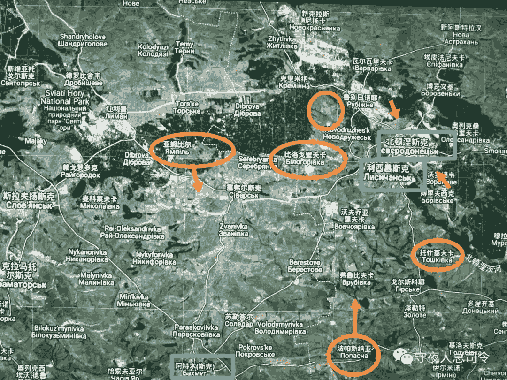

# [守夜人总司令] - 2022-05-13 乌东大局已定！

> 来源：[`www.yuque.com/books/share/97051b78-926c-43e6-b0aa-0b72ff163ac4/dlmzmi`](https://www.yuque.com/books/share/97051b78-926c-43e6-b0aa-0b72ff163ac4/dlmzmi)

乌东大局已定！ 

原创觉悟者守夜人总司令 

守夜人总司令 

微信号WatcherCommander 

功能介绍结构学：生命体在其生存结构中的求存之道！ 

2022-05-13[原文](https://mp.weixin.qq.com/s?__biz=MzAxNDk1NjI2Mw==&mid=2247488422&idx=1&sn=66114d6ac7e32fe5bb3823b428779f07&chksm=9b8a302eacfdb9389ec6633c5aea2841f2880268ce1b2110cb2f7a156af815f33eae73fa1852#rd))发表于 

收录于合集 

#人间正道是沧桑 21 个 

#统治机器 25 个 

#底层逻辑 86 个 

#流量明星 12 个 

#入戏太深 38 个 

读过《[A658：经济秩序！](http://mp.weixin.qq.com/s?__biz=MzIzMDYwOTM0Mg==&mid=2247487179&idx=1&sn=12ad76a2b6a86d4dc52eb515f2b00500&chksm=e8b1961adfc61f0c30f16b60b87e2fcd3142b4a788c2ae81604f02182574c50b54c1d9e2974d&scene=21#wechat_redirect)》、《[算账！](http://mp.weixin.qq.com/s?__biz=MzAxNDk1NjI2Mw==&mid=2247488259&idx=1&sn=2b72f3c0199cdacaa8e48eb9ad30f809&chksm=9b8a308bacfdb99d72ebcd3aaf0015c889b88f4598b093719ee8765aa8be3b3caaad95a445ae&scene=21#wechat_redirect)》和《[乌克兰的反攻！](http://mp.weixin.qq.com/s?__biz=MzAxNDk1NjI2Mw==&mid=2247488397&idx=1&sn=4761b8dad0f2071a7a5fd61e413bc1c7&chksm=9b8a3005acfdb9137967595d5f331ce6b0b3d94cd4b0153bc4083c4849934c9ea0e0930b27ef&scene=21#wechat_redirect)》之后，就会对扑朔迷离的复杂事务有个框架性的理解，继而就能理解某些关键性节点的决定性意义。棋在局之外，这场战争本来就是为了配合美元加息的收割周期！俄罗斯这次是不会被收割了，因为美元收割的核心源于大家的国际贸易对美元的依赖，而俄罗斯被彻底隔绝在美元贸易的体系之外了。整个欧洲之前是用欧元购买油气，现在改用卢布购买油气，欧元不仅兑换卢布跌了将近一半，欧元兑换美元也跌了 30%，换而言之，所有的欧元资产与同类美元资产比起来，两个月之间直接变成 7 折了。俄罗斯这两个月的财政盈余是 8000 亿卢布，换算成美元 120 亿美元。所谓盈余就是收入减去开支之后纯粹多出来的钱——包括战争费用、公共开支，额外发放的福利，以及用来稳定物价的补贴等所有支出。事实上，战争双方的军费都是欧洲给的！当然了，美国也没少给。加上新通过的 400 亿美元预算，美国今年的财政支出中为乌克兰提供了 540 多亿的预算，比年度预算中的白宫行政开支总额还要高，占乌克兰 GDP 的一半！ 

许多事不能算账，一算账就会发现别有洞天：乌克兰这两个月接收到的武器装备的总价绝对比自己十年的国防开支的预算还要高。从各个渠道接收到的援助款项和物资总额绝对比全国民众正儿八经干一年的 GDP 还高！这就如同一个乌克兰难民跑到德国去，什么都不干，就可以从德国政府获得 1700 欧生活补助外加 800 欧的交通燃料补助，而且不需要交税。如果他正儿八经在德国找份工作挣的钱交完税还没有躺着领取的救济金多！这个事情很魔幻，但它就是这样运转的。因为德国有一个救助产业链，从业人员高达 200 多万人——这个产业以救助难民来谋生！所以，他们的主张都很激进，巴不得制造动乱，然后产生更多需要救助的难民，他们的生意就来了。美国著名的武器公司雷神的 CEO 早两天发了一段视频，他在视频中公开说：我们的武器被运送到乌克兰肯定是用来捍卫自由和民主的，这一点毫无疑问。然而，它同时也是一个好生意。目前包括美国和北约各国的库存都被搬空了，他们肯定是需要补库存的，这对我们而言是一个巨大的机会！他说的一点都没错，对他们而言这确实是一个非常好的生意，战争持续的时间越长越好，战场消耗的武器弹药越多越好。这就如同国内有些单位突然发现原来检测可以日进斗金，于是，开始修改数据。只需要修改几十个人的数据，就能让整个城市都做好几次的全体检测。对他们而言，这也是一个非常好的生意。 

反攻 

乌军这两天在哈尔科夫郊区的外围发起了反攻，沿靠近边境地区的一个大型水库的西岸向北推进，占领四个村镇，没有遇到俄军的任何抵抗。俄军只是炸断了跨越水库的桥梁，让乌军的反攻无法威胁到水库的另一边。因为俄军从别尔哥罗德到库皮扬斯克的交通线在水库的东侧。哈尔科夫地区的俄军基本上都被抽调去攻打顿巴斯方向了。仅剩的 138 独立旅和一个炮营也都撤回别尔哥罗德去休整了。乌军的这支孤军一路向北推进都比较顺利，但也没有对伊久姆的补给线造成什么威胁。但乌军的火炮随机打死了俄罗斯境内靠近边境的一个村子里的 6 个平民。这让在别尔哥罗德休整的俄军开始进行集结。同时，伊久姆方向的俄军开始炮击这支孤军深入的乌军背后的阵地。会不会两路包抄把这支乌军压缩在水库西岸，需要过几天才能看到结果。 

  

顿巴斯形势图草稿 

另一个乌军获得战绩的地方在北顿涅茨河沿岸的一个叫“比洛戈里夫卡”的渡口。这个地方河流比较窄，俄军出动了一个营的先头部队两次试图在河流上搭建浮桥。但两次都被乌军击败，从损失的装备来看，至少一个机械化步兵连，一个坦克连被乌军歼灭，而且用来架设浮桥的工兵连也损失殆尽。估计俄军不会放弃这个渡口，应该还会组织起第三次。因为占领这个渡口，就能切断 T1302 公路，这是北顿涅茨克和利昌斯克两座城市中的守军唯一的退路。 

虽然俄军遭受了近期以来比较大的损失——4 辆坦克，8 辆步战车，还有一个工兵连的架桥设备，损失的士兵应该不少于 100 人。但他们还是从另外两个地方渡过了被顿涅茨河。一个地方就是红力曼的右后方的亚姆比尔，这个地方三天前占领了。另外一个地方就是克里米纳和鲁别日内之间的居民点有一条跨越北顿涅茨河的小路能够抵达对岸。这个居民点的名字太长，我不知道怎么翻译，它在俄军遭受损失的比洛戈里夫那个渡口的右边，距离连接鲁别日内的 T1302 公路很近，也是利昌斯克左上方的屏障。目前过河的俄军正在与利昌斯克赶过来的乌军进行争夺这个桥头堡。这个桥头堡有条无名公路沿着被顿涅茨河通向“比洛戈里夫卡”那个渡口。也就是说，右边过河的俄军可以沿这条公路在河这边占据”比洛里夫卡“，然后让对岸两次假设浮桥都失败的俄军顺利过河。与之同时，左边从亚姆比尔过河的俄军只需要攻克一个叫”塞弗尔斯克“的居民的点，就能沿 T1302 公路抵达”比洛戈里夫“这个渡口。简单的说，就是这个渡口左右两路已经过河的俄军可以夹击”比洛戈里夫“这个渡口。所以，这个渡口的俄军过河是没有太多悬念了。在这个渡口成功阻击俄军两次的乌军今晚应该会撤退到利昌斯克，避免被两路夹击。北顿涅茨河防御体系彻底破碎了，明天俄军就会兵分三路过河，然后切断 T1302 公路。另外一个方向的俄军已经进攻到利昌斯克外围的 T1303 公路上的“托什基夫卡”。南部早几天攻占了波帕斯纳亚的俄军正在北上，攻击退守“利昌斯克”南部郊外的“佛鲁比夫卡”这个居民点。从鲁别日内出发的俄军已经在进攻北顿涅茨市区了。守城的乌军炸断了鲁别日内通向北顿涅茨克市的高架桥，试图延缓俄军向市区推进的速度。但是，北顿涅茨市受到俄军攻击的不仅仅是鲁别日内方向，城市的另一个方向也在受另外一路俄军的攻击。另一个方向的俄军已经占据了市郊的直升机场，正在对角线的方向进攻市区。总之，顿巴斯地区的北顿城市群被彻底包围了！ 

乌军这 15000 多精锐本来是可以向西撤退保存下来的，基辅为了面子死活不让受军撤退。有消息称乌军的最高指挥官从军事角度考虑是准备撤出会陷入包围的乌东部队，但演员总统否定这个理性的决策，不顾现实的命令驻军死守！被困在红利曼的那三个旅也是如此——目前乌军试图派兵救援，但通往红利曼的桥梁已经被乌军自己炸毁了——公路和铁路桥都炸毁了！而且红利曼目前三面都出于俄军的包围之中，唯一通向斯拉维扬斯克的乌军的撤退、救援和补给通道被乌军自己切断了。可见乌军的指挥系统出现了混乱——下达命令的人对于是原地固守还是紧急撤退举棋不定。最后造成了前线的精锐陷入这种危险的境地！要知道，顿巴斯的守军都是打了八年的老兵，报销了这些老兵，那些临时征召的士兵可能枪都端不稳。这不是信口开河，而是有事实为依据：昨天基辅命令乌克兰国土防御部队中的 101 旅赶赴顿巴斯前线增援，结果 101 旅直接公然战场抗命！从开战以来，乌军最多发生过连级单位拒绝继续服役，从未有营级单位拒绝执行命令。这次是一个旅级单位直接公然抗命！抗命的理由是：部队没有重武器，士兵根本没有经过充分的训练，上去就是送死。 

重武器 

目前西方提供的进攻性重型武器 M777 榴弹炮已经全部交付，而且还培训出来了 310 名炮兵。M777 发射的时候需要 7 个人一组。6 门炮一个连队，18 门炮一个营再加上维修和运输等后勤人员，西方训练出来的乌军人员差不多能够武装起来两个满编的炮兵营。M777 榴弹炮的口径右 155 毫米，但它是牵引式的，没法打完马上跑，而且需要手动装填弹药。虽然可通过奴干支重型直升机吊装部署，但这种东西只有美国人有。乌克兰的部署必须要先用火车拉到前线，然后用履带车拉到炮兵阵地安装好。打完之后需要在对方的反炮兵雷达找到自己的坐标之前拆掉拉走，否则马上会招来对方的炮兵、火箭弹、导弹或空中飞机的攻击。 

武器的整体优势需要成体系的配合，M777 确实存在火力优势，但它的机动性不足需要用空军来弥补和配合。这 90 门 M777 榴弹炮总计交付了 11 万枚各种炮弹。按照目前俄乌两军在前线的炮击密度，这个弹药量差不多会在两个星期内耗光！印度曾向美国订购过 45 门 M777 榴弹炮，每一套的单价是 500 万美金，炮弹另算。美国军火好是好，就是特别贵，而且还需要许多更贵的先进玩意来配合才能发挥出优势。譬如这个 M777 榴弹炮就需要 C17 战略运输机或者奴干支重型直升机来快速部署。C17 类似于我们的运 20，奴干支就是前后有一对大螺旋桨的那种黑色直升飞机，我们至今都还未能研发出来。如果用飞机吊装部署和转移都非常快。但没有这些配套的东西，部署和拆走都非常麻烦，维护的成本也很高。开一炮就暴露位置了，还没拆下来装车拖走，对面就可能反击——这就是缺乏配套设施的劣势。所以，我们的 155 榴弹炮是车载的，直接架在车上开炮，开完炮直接开走不需要收起来。部署的时候也不需要挖坑、打桩、搬运弹药什么的。弹药都直接在车上，极端情况下一个人都完全能操作并转场。估计下一步乌克兰会要求西方提供这种车载的自动榴弹炮。 

一两件武器真的不会决定战场走势。当年全美械的新 1 军开进东北的时候也是各种无敌，携带了大量从美国采购的 105 榴弹炮。结果消耗太快很快打完了，打电话向南京要弹药，南京回电说，你们再坚持一下，已经向美国下订单采购了，他们很快就会生产，下下个月就可能运送过来！前线的新一军听到这个就开始骂娘了。因为美械的火力优势是建立在后勤供应源源不断地情况下。美军在伊拉克和阿富汗，平均 20 万发子弹才打死一个人，这种消耗是非常惊人的。俄军重开了 5 条导弹生产线，弹药补给会有所改善，目前俄军的补给线比较通畅。乌军的补给线变长了，而且运力慢慢成为了瓶颈。暂时还未能找到改进的有效办法。 

潜力 

战场上的进退必须与战略目标息息相关才有价值。否则，就只能用来鼓舞士气和振奋人心。然而，这种鼓舞也只是暂时的。这就如同我们的人生。出身底层家庭的人并非不努力，只是做事没有章法，许多时候做的事只是为了眼前争口气，或者试图向谁去证明什么。串起来缺乏连贯性也无法形成一种积累性的优势。这就好比一些小镇美女，工作了很久也挣了一点钱，甚至还与不同的人谈过很多次无疾而终的恋爱。但不管是花钱的方式，还是与人建立亲密关系的方式都是纯消耗式的，无法形成任何长期积累——也就是说不会随着时间的递增变得更加有优势。 

乌克兰目前全国只有 10%的加油站还有一点存油，剩下的 90%的加油站都已经完全没有油了。这仅剩的 10%的加油站即便排起长长的加油队伍，也只能提供汽油，因为柴油必须全部用来保障前线——因为所有的坦克、装甲车、履带式大炮牵引车都需要柴油。而且作为平原地区的农业大国，乌克兰所有农业生产的机械都需要柴油驱动。即便停止一切生产生活用油优先提供给前线，东部前线也如同西部一样出现燃料短缺。 

西方目前确实在提供武器，但他们始终无法提供燃料。事实上他们也极度缺乏燃料。乌克兰昨天把过境乌克兰向欧洲供应油气的阀门关闭了。这让已经全部同意用卢布购买油气的欧洲再遭受致命一击，欧洲的油气价格又涨了 6.8%，并且让欧元兑换卢布的汇率第一次跌破 70:1。泽连斯基也是着急了，因为德国和法国都组团忽悠他加入欧盟光走流程也需要 5-10 年，马克龙说的是几年甚至几十年！这等于明摆着拒绝乌克兰加入欧盟。给武器是可以的，但给油气就不行了，持续给钱养一个打的稀巴烂的国家就更不可能了——这个事大家都心知肚明，只有演员一厢情愿。 

演员最近确实有点急，开始外行指挥内行，一切为了宣传，到处插手瞎指挥。蛇岛的夺岛计划乌军的那位最高指挥官是不同意的，但演员听英国顾问的忽悠，强行下令不惜代价去夺岛。结果损失了西部军区仅有的 3 架苏 27、苏 34，还损失了 3 架米-8 直升机和 2 架无人机。这些装备还在其次，主要是损失了 50 多名特种兵，还误杀了自己的一个旅长，损失了一个中将——乌军负责海军航空兵的海军副总司令。最最重要的是，蛇岛没有能够夺回来，敖德萨港口的船依然没法开出去！ 

乌东的精锐目前是撤不出来了，包括红利曼的那三个旅一万五千人和北顿那两座城市里被包围的一万五千人。这三万人的命运就会像马里乌波尔被围困的乌军一样，但这些地方可没有亚速钢铁厂那样的堡垒。也没有那么多的食物和弹药。目前斯拉维扬斯克和克拉玛托尔斯克这两个堡垒中的乌军，包括巴文科沃的守军都还可以抓紧时间往西撤退。因为俄军攻克了波帕斯纳亚之后并没有向西去抢占阿特木斯克，把整个顿巴斯地区乌军西撤的大门彻底关上。而是追击从波帕斯纳亚溃逃的乌军 24 机步旅残部，一路北上去包围利昌斯克了。根据演员死要面子的尿性，肯定不会同意这斯拉维扬斯克的乌军西撤的。因为他的形象已经被捧的太高了，他不能容忍瞬间丢掉整个乌东地区这样的事实。这不仅会让自己绷不住，而且会极度影响争取外援。所以，他现在急需一些看得见摸得着的反攻行为来坚定西方金主们的信心。然而，打战必须要沉得住气，要遵守客观规律，等待时机，准备充分之后才有的放矢。演员如果能不那么情绪化，不去越俎代庖干扰乌军指挥官的战场指挥，反而会打的更好一些，他越是这样沉不住气瞎指挥乱干预，反而会把战场上仅剩的那点精锐全部断送掉！ 

[乌克兰的反攻！](http://mp.weixin.qq.com/s?__biz=MzAxNDk1NjI2Mw==&mid=2247488397&idx=1&sn=4761b8dad0f2071a7a5fd61e413bc1c7&chksm=9b8a3005acfdb9137967595d5f331ce6b0b3d94cd4b0153bc4083c4849934c9ea0e0930b27ef&scene=21#wechat_redirect) 

[锐气不再！](http://mp.weixin.qq.com/s?__biz=MzAxNDk1NjI2Mw==&mid=2247488391&idx=1&sn=f66462020de44e8aee5ad786bb7d4cc1&chksm=9b8a300facfdb919010a65d74fa80b7631cd3d3317004064c9e238791c90a70c8ce7aa5bc983&scene=21#wechat_redirect) 

[算账！](http://mp.weixin.qq.com/s?__biz=MzAxNDk1NjI2Mw==&mid=2247488259&idx=1&sn=2b72f3c0199cdacaa8e48eb9ad30f809&chksm=9b8a308bacfdb99d72ebcd3aaf0015c889b88f4598b093719ee8765aa8be3b3caaad95a445ae&scene=21#wechat_redirect) 

[A658：经济秩序！](http://mp.weixin.qq.com/s?__biz=MzIzMDYwOTM0Mg==&mid=2247487179&idx=1&sn=12ad76a2b6a86d4dc52eb515f2b00500&chksm=e8b1961adfc61f0c30f16b60b87e2fcd3142b4a788c2ae81604f02182574c50b54c1d9e2974d&scene=21#wechat_redirect) 

[A647：可怕的渗透！](http://mp.weixin.qq.com/s?__biz=MzAxNDk1NjI2Mw==&mid=2247488112&idx=1&sn=d2cdb1bbea5f7a7248e4ba132c2ad922&chksm=9b8a31f8acfdb8ee225327ff157e56571bbf63b8958ad6c47d7da000b5da90fa01379222c8e1&scene=21#wechat_redirect) 

[E35:我们在月之暗面发现了什么？！](http://mp.weixin.qq.com/s?__biz=MzIzMDYwOTM0Mg==&mid=2247486632&idx=1&sn=170aeff87eb36dce354c8b2437f4b27f&chksm=e8b19479dfc61d6f08e6492954a528f20387fe2fa925747cf2b504d2bc69084f24495e972e41&scene=21#wechat_redirect) 

[A539：京东为什么能绝地反击！](http://mp.weixin.qq.com/s?__biz=MzIzMDYwOTM0Mg==&mid=2247486752&idx=1&sn=3a967e3288db5b7d924e36914086e534&chksm=e8b195f1dfc61ce7c971386eb678d7da286167d0f52fdd51989049844b0a550cc58e00552d2e&scene=21#wechat_redirect) 

[A518：既双减又提高考试难度，要干啥？!](http://mp.weixin.qq.com/s?__biz=MzIzMDYwOTM0Mg==&mid=2247486528&idx=1&sn=837ef39e3c0b47ac84d5096690555ae7&chksm=e8b19491dfc61d87292daf575c1e7c95b3f0543f313b65c7ad4ab369603833704304ec7451d7&scene=21#wechat_redirect) 

[A311：要理解住房不炒的真正含义！](http://mp.weixin.qq.com/s?__biz=MzIzMDYwOTM0Mg==&mid=2247484959&idx=1&sn=090583ec50bfd9febec1de463c2672f6&chksm=e8b19ecedfc617d8629080f6745c8de013cfe875de26eef6767b2d5c10782650223ed15f807b&scene=21#wechat_redirect) 

[A496：为什么兔子在阿富汗很主动？](http://mp.weixin.qq.com/s?__biz=MzIzMDYwOTM0Mg==&mid=2247486278&idx=1&sn=40d09857088bebd3c70bec1c7a500f06&chksm=e8b19397dfc61a810125242c8e395330f934390eb50bd54053ecd3f31ddc91de4e429c0f693a&scene=21#wechat_redirect) 

[E44：情绪化的人为什么会克制不住？！](http://mp.weixin.qq.com/s?__biz=MzIzMDYwOTM0Mg==&mid=2247487062&idx=1&sn=c1af22f2f5d1e79f7245b826bfaf1f30&chksm=e8b19687dfc61f91468cf22b77c0e221d45054df37b2b602c331eb328b5d46802c69e0d87722&scene=21#wechat_redirect) 

[A525：你误会了男孩要穷养和女孩要富养！](http://mp.weixin.qq.com/s?__biz=MzIzMDYwOTM0Mg==&mid=2247486714&idx=1&sn=693d4c55ab2f0ecdebf06c4807848908&chksm=e8b1942bdfc61d3d1d76c11adb860b1b02f1ab58e48ba3349677a44a563764e09d7eb35f930d&scene=21#wechat_redirect) 

研习《[结构学](https://mp.weixin.qq.com/mp/appmsgalbum?action=getalbum&album_id=1318317199878225920&__biz=MzAxNDk1NjI2Mw==#wechat_redirect)》，加入觉悟社：付费和不公开内容都有，每天 25 块，还能挣回来，下注标的获取需满足条件及时查看更新。公众号发消息：觉悟社 

[结构学自序（新）！](http://mp.weixin.qq.com/s?__biz=MzIzMDYwOTM0Mg==&mid=2247485283&idx=1&sn=aa2b8554b8e5040f8f959636feaa06a3&chksm=e8b19fb2dfc616a430aa381b8da0815311244e694a69809cd92d0602ac34cfe5f1f419b3745e&scene=21#wechat_redirect) 

[穷是万恶之源！](http://mp.weixin.qq.com/s?__biz=MzAxNDk1NjI2Mw==&mid=2247483823&idx=1&sn=e54ebe9891b302dc0bf1815c76ccf8b7&chksm=9b8a2227acfdab31a05e273addd9159d4b8263d58d3c58bf214841c8189157519719c3427306&scene=21#wechat_redirect) 

[A335：必须与焦虑长期共存！](http://mp.weixin.qq.com/s?__biz=MzIzMDYwOTM0Mg==&mid=2247485165&idx=1&sn=f3f0957c63fa549b288f00c8b117162e&chksm=e8b19e3cdfc6172a188000afd2b522144a04ba774169824cad2067d93b5365537ff0644f6b9f&scene=21#wechat_redirect) 

[A376：要换种思维，你才能理解！](http://mp.weixin.qq.com/s?__biz=MzAxNDk1NjI2Mw==&mid=2247486529&idx=1&sn=3a50ada30a5ae0448d686c6a0c809919&chksm=9b8a2fc9acfda6df5e9243deb6e9df9a7cc0912eabd0a9c00322d42ed4c25c2daedc8de6b6ca&scene=21#wechat_redirect) 

[A377：为什么不买武汉的房？](http://mp.weixin.qq.com/s?__biz=MzIzMDYwOTM0Mg==&mid=2247485413&idx=1&sn=1f3339540496eb9e5ea109d8530f29dc&chksm=e8b19f34dfc6162225a694c1c2443d73b51bf6ca8dc53d4c18a30e6e2191e250967e711db589&scene=21#wechat_redirect) 

[A374：真正的大机会在这里！](http://mp.weixin.qq.com/s?__biz=MzIzMDYwOTM0Mg==&mid=2247485401&idx=1&sn=100967c02c0754759ec4ea0ef8706c29&chksm=e8b19f08dfc6161e92c7cc691f1a1fed9ff74c2b906529a8d42a7703a3c3a3c3a412903e12f7&scene=21#wechat_redirect) 

[A370：被删了，改后重发，欲看从速！](http://mp.weixin.qq.com/s?__biz=MzIzMDYwOTM0Mg==&mid=2247485388&idx=1&sn=a456e8ffdc8a16bb30263818dc86c6a3&chksm=e8b19f1ddfc6160bfd0fea09b006477a095662aa74ac7036fca621b2ef49dc59f4ad4a407eeb&scene=21#wechat_redirect) 

[E29：一眼看到底！](http://mp.weixin.qq.com/s?__biz=MzIzMDYwOTM0Mg==&mid=2247485301&idx=1&sn=dc6dd50c5d742ea51ce9e394de25351a&chksm=e8b19fa4dfc616b26734c3619c6fa664474fa478d2764c3370dde41d19f6035edc05f9f191e8&scene=21#wechat_redirect) 

[A357：利率！利率才是关键！](http://mp.weixin.qq.com/s?__biz=MzIzMDYwOTM0Mg==&mid=2247485288&idx=1&sn=4b9b12c3bc11bdcfd2529edd9ab9a92a&chksm=e8b19fb9dfc616afff8c46c46c2a61dea179cdd40a67ed931cae9d2762948e1ee2359d4037b5&scene=21#wechat_redirect) 

[A311：要理解住房不炒的真正含义！](http://mp.weixin.qq.com/s?__biz=MzIzMDYwOTM0Mg==&mid=2247484959&idx=1&sn=090583ec50bfd9febec1de463c2672f6&chksm=e8b19ecedfc617d8629080f6745c8de013cfe875de26eef6767b2d5c10782650223ed15f807b&scene=21#wechat_redirect) 

[A320：思路变了，可以加杠杆了！](http://mp.weixin.qq.com/s?__biz=MzIzMDYwOTM0Mg==&mid=2247485041&idx=1&sn=add2174fa42806f885a456a072ee4fee&chksm=e8b19ea0dfc617b6734e013f780112fdd88f28ad5312ce423fea1d75da4c3757660dab175208&scene=21#wechat_redirect) 

[A345：剥离学区控制贷款也没用！](http://mp.weixin.qq.com/s?__biz=MzIzMDYwOTM0Mg==&mid=2247485208&idx=1&sn=ac3653b56fc18a4a6a809139f935bc45&chksm=e8b19fc9dfc616dfa31b0baf15aa90d994ef8a1262e0fd515739c06698cd0673d1d46e6e4c4f&scene=21#wechat_redirect) 

[为富人办事，为穷人说话！](http://mp.weixin.qq.com/s?__biz=MzIzMDYwOTM0Mg==&mid=2247484462&idx=1&sn=195ebab17907fba73c69ae7a11bc40ad&chksm=e8b19cffdfc615e9b2f88327d492813afa3656859f4d67a6d831ac1cf684a54b760a8b8edcd6&scene=21#wechat_redirect) 

[A284：啊！万箭穿心！](http://mp.weixin.qq.com/s?__biz=MzAxNDk1NjI2Mw==&mid=2247486135&idx=1&sn=e950149b9b9147e9199cfc6093605950&chksm=9b8a293facfda029419b911d4b4fa91c73bbaf695b206df2cf15124d843f4bf4b80673baa394&scene=21#wechat_redirect) 

[梦醒之时，已经三十！](http://mp.weixin.qq.com/s?__biz=MzIzMDYwOTM0Mg==&mid=2247484378&idx=1&sn=e3a058584a13d7a5267315113964280d&chksm=e8b19b0bdfc6121df4af4b77d2d826fd0f4132ccfdee48132ce8cf86eb1ba45b898be83d1dc7&scene=21#wechat_redirect) 

[A245：北京有的小区涨了 20%！](http://mp.weixin.qq.com/s?__biz=MzIzMDYwOTM0Mg==&mid=2247485265&idx=1&sn=f4bce6f07805cba2db3a1a806215e45c&chksm=e8b19f80dfc616966666979063f2c9fce9fe20308538607cf90eac74f0db85c9adf79299f4b8&scene=21#wechat_redirect) 

[A294：一个执行多年的政策即将改变，它会创造一波机会！](http://mp.weixin.qq.com/s?__biz=MzIzMDYwOTM0Mg==&mid=2247484849&idx=1&sn=5485cd1d6c511e883e25b0c7dd9e2e3e&chksm=e8b19d60dfc614764ffc8405dccf5b8120b31988f3c1cee74e384c06f0e39c3c81bef8263c3d&scene=21#wechat_redirect) 

[A351：你不愿女儿嫁给和你一样的人！](http://mp.weixin.qq.com/s?__biz=MzIzMDYwOTM0Mg==&mid=2247485242&idx=1&sn=f4a01a5936322120b0b158f225bc78de&chksm=e8b19febdfc616fd2eb1558a3b7c748ecc497a3af00aec5b5c5ca8042cc52eb7d0af7befa399&scene=21#wechat_redirect) 

[A355：情人节，聊点俗的！](http://mp.weixin.qq.com/s?__biz=MzAxNDk1NjI2Mw==&mid=2247486442&idx=1&sn=2ed76ec8cb69dfe51023fb4f426eeb51&chksm=9b8a2862acfda17469215d16d6bfa7210211dfb0cf4418774fc0ea014de0f6184c9b01b82f70&scene=21#wechat_redirect) 

[父母挖的坑，别人挖的坑，自己挖的坑！](http://mp.weixin.qq.com/s?__biz=MzAxNDk1NjI2Mw==&mid=2247486426&idx=1&sn=8707934ad2fe2f8017d6b7810fd61c17&chksm=9b8a2852acfda1441fded7bab2456dd2493073ad3e5d541e1080d1739879b86c25a3a61df79a&scene=21#wechat_redirect) 

[A319：准备迎接一场屠杀！](http://mp.weixin.qq.com/s?__biz=MzIzMDYwOTM0Mg==&mid=2247485036&idx=1&sn=ff52df7559e0a6ed8230922ebd2af71a&chksm=e8b19ebddfc617ab0eca4ed1a66c5227d328155954d6704be456950fb3926e59e5288f7877cf&scene=21#wechat_redirect) 

[A315：认命吧，做个普通人也挺好的！](http://mp.weixin.qq.com/s?__biz=MzIzMDYwOTM0Mg==&mid=2247485008&idx=1&sn=bcaf70c42d4676c8f69de9f9ead1e495&chksm=e8b19e81dfc617973ba40200519407186760e32843fc6f379020da6160b0ba89870dadcae5fa&scene=21#wechat_redirect) 

[A289：蚂蚁金服只是蹲一下！](http://mp.weixin.qq.com/s?__biz=MzIzMDYwOTM0Mg==&mid=2247484822&idx=1&sn=ea2d818adee1bf400b0af9ed69bcd297&chksm=e8b19d47dfc61451b7291d6369b3391b9b8b06e08f9f5eed482a15c58075880a0029c50aed9a&scene=21#wechat_redirect) 

[C12：务必要振兴建设兵团！](http://mp.weixin.qq.com/s?__biz=MzAxNDk1NjI2Mw==&mid=2247484193&idx=1&sn=88c86597191d0c97a411f9ea6f7b7c5d&chksm=9b8a20a9acfda9bfae819e8e42531fe6d523dd244ef0fc0c0787ab812540108c181f7ec2ffa9&scene=21#wechat_redirect) 

[A87：一个时代的终结！](http://mp.weixin.qq.com/s?__biz=MzAxNDk1NjI2Mw==&mid=2247484762&idx=1&sn=d662f3af14db0c25fa540a7a2ddcd9c7&chksm=9b8a26d2acfdafc45a58be632dd4ca60b92b89f4863b60d6e1a8b6790ee3590878cb1669209a&scene=21#wechat_redirect) 

[A295：当代女性的两难！](http://mp.weixin.qq.com/s?__biz=MzIzMDYwOTM0Mg==&mid=2247484854&idx=1&sn=6851afe306f7b89d23728018ea32b7f2&chksm=e8b19d67dfc61471955b15021ac11c5fff9f1607977e9df1bd2bbfabc2deb3dea5c98e369c55&scene=21#wechat_redirect) 

[A316：一心搞钱的深圳女孩！](http://mp.weixin.qq.com/s?__biz=MzAxNDk1NjI2Mw==&mid=2247486289&idx=1&sn=9504efb0a54b228c61c928794417eaef&chksm=9b8a28d9acfda1cf65ca57c386f1c0a90c457c01d6d1f2ba222e38c2059ca3eb07c94252721f&scene=21#wechat_redirect) 

[A301：我生来就是高山而非溪流！](http://mp.weixin.qq.com/s?__biz=MzIzMDYwOTM0Mg==&mid=2247484895&idx=1&sn=241f68fd60c1b47239beef7573364ceb&chksm=e8b19d0edfc6141856def733b4a1fd20332b7083f1234182452387fcfe12cebb015db7bfbeec&scene=21#wechat_redirect) 

[E10：升级所需的密度！](http://mp.weixin.qq.com/s?__biz=MzAxNDk1NjI2Mw==&mid=2247485337&idx=1&sn=e93780b3d10de5b467e71f326eb12838&chksm=9b8a2411acfdad07d858079223ba3eda77fe88caa8d769030eb67c15f5511fab584f8d1244ca&scene=21#wechat_redirect) 

觉悟者 

喜欢你就转走吧！ 

微信扫一扫赞赏作者赞赏 

已喜欢，对作者说句悄悄话 

取消 

发送给作者 

发送 

最多 40 字，当前共字 

 人赞赏 

上一页 1/3 下一页 

长按二维码向我转账 

喜欢你就转走吧！ 

受苹果公司新规定影响，微信 iOS 版的赞赏功能被关闭，可通过二维码转账支持公众号。 

### 精选留言 

暂无... 

[阅读全文](https://mp.weixin.qq.com/s?__biz=MzIzMDYwOTM0Mg==\x26amp;mid=2247486752\x26amp;idx=1\x26amp;sn=3a967e3288db5b7d924e36914086e534\x26amp;chksm=e8b195f1dfc61ce7c971386eb678d7da286167d0f52fdd51989049844b0a550cc58e00552d2e\x26amp;scene=21#wechat_redirect)