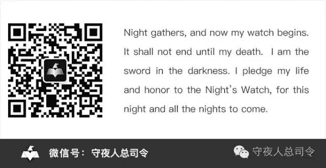

# [守夜人总司令] - 2022-04-19 能看到的只剩下扯淡了！

> 来源：[`www.yuque.com/books/share/97051b78-926c-43e6-b0aa-0b72ff163ac4/vqe4l3`](https://www.yuque.com/books/share/97051b78-926c-43e6-b0aa-0b72ff163ac4/vqe4l3)

能看到的只剩下扯淡了！ 

原创觉悟者守夜人总司令 

守夜人总司令 

微信号WatcherCommander 

功能介绍结构学：生命体在其生存结构中的求存之道！ 

2022-04-19[原文](https://mp.weixin.qq.com/s?__biz=MzAxNDk1NjI2Mw==&mid=2247488292&idx=1&sn=7e8f94b6f2bff7965e05d6982c2c22df&chksm=9b8a30acacfdb9ba72080fc40c8fd09e1e0c54e5138afe196fb300fe6de58d7929f1eee9aa16#rd))发表于 

收录于合集 #底层逻辑 86 个 

待在大城市中的许多普通女生被生存环境中高度内卷的节奏折磨的死去活来，于是，试图通过旅游来缓解——然而，事实反复证明：这种临时性的逃离并不能缓解各种让自己感到焦虑的现实问题，反而消耗掉了原本就不多的积累。让自身的处境变得更加艰难。古往今来，所有试图把自身问题往后拖延的逃避行为都只会让一切进一步恶化。 

十几年前的网络给人一种天高地阔的自由感觉。随着参与的人越来越多，各种限制越来越多，人与人之间的主动隔离也越来越与现实中的状况如出一辙。互联网并没有建立起一个平行的网状世界，反而将人与人之间的对立和撕裂变得更加尖锐。因为它本质上只是一个工具，就如同所谓的元宇宙一样，本质上也只是一个工具——一个可以搞出更多逃避空间的工具。就如同散落在群山之中千百年来一直相互隔绝的村落最终会被高速公路、高铁、手机等立体连接网络渗透并连接起来一样。任何一种可以暂时逃避的虚拟空间也并不会是世外桃源。 

所有对当下的自己感到不满的人，都会试图在记忆中营造出一个静态并唯美的场景作为自己精神上的最后避难所。譬如说你的家乡和青少年时代生活的环境并不像你现在想象的那样恬静祥和。你很清楚你记忆中的那个世外桃源从来就不曾存在过，它就如同网络空间和所谓的元宇宙下面衍生出来的某个虚拟空间一样——仅仅是自己为了暂时逃避构建出来的避难所。 

人的自我觉醒是一种幻觉，人总是试图将毫无意义的行为赋予各种各样自定义的价值和意义。只有如此才能自我麻痹，并对还未过完的生活心存一丝期待和幻想。 

人需要靠一点自欺欺人的精神支撑才能活下去，就如同一个独自在外面漂泊的人，经过生活反复揉捏，精疲力竭心力憔悴的时候会思念远方的家乡和亲人。然而，他或者她心里都很清楚：自己所有挣扎其实就是为了逃离那个家乡和亲人。他们在电影院里被各种煽情的亲情、友情、爱情感动的稀里哗啦！然而，当她们在这种情绪余波的推动下，试图打个电话给自己亲情、友情、爱情的承载对象的时候，对方往往不会按照电影中的桥段或者自己内心渴望的样子配合。于是，内心再一次幻灭，紧接着会迸发出一种被羞辱和被欺骗愤怒、压抑、痛苦、恐惧、绝望… 

崇高的道义，有可能只是更高一个层级的人用来驱动更底层的人群采取某种行为的工具。当你意识到自己置身于步步惊心的无形之阵，但你发现所有的常量都变成了变量。当你意识到你所接收的信息都是不完整的拼盘，你会感到不知所措。人最大的需要是安全感，从小没有获得足够安全感的人，往往会情绪不稳定并且终生叛逆——不管男女都是一样！ 

本来转了一篇半年前关于兔子对阿富汗的相关政策的预测，因为现实恰好验证了文中的预测。然而，之前还能发出去，现在转载都是违禁内容了！大门正在加速关闭，真正的思辨是不允许的，但允许人无脑的基于不同的立场进行情绪化的撕扯。这是谁的悲哀？反正不是我的悲哀。 

[A386：何必逼一个普通人！](https://mp.weixin.qq.com/s?__biz=MzIzMDYwOTM0Mg==&mid=2247486694&idx=1&sn=177767e47169a265e3e20c7251bab649&scene=21#wechat_redirect) 

[X11：不结婚才是时代的主流！](https://mp.weixin.qq.com/s?__biz=MzIzMDYwOTM0Mg==&mid=2247486675&idx=1&sn=3aa906957832fbb79029b88ca0ea691c&scene=21#wechat_redirect) 

[不要沉迷于抽象的东西！](https://mp.weixin.qq.com/s?__biz=MzIzMDYwOTM0Mg==&mid=2247486651&idx=1&sn=a4e4df668dc91b3022a2de6b49d335ac&scene=21#wechat_redirect) 

[E35:我们在月之暗面发现了什么？！](http://mp.weixin.qq.com/s?__biz=MzIzMDYwOTM0Mg==&mid=2247486632&idx=1&sn=170aeff87eb36dce354c8b2437f4b27f&chksm=e8b19479dfc61d6f08e6492954a528f20387fe2fa925747cf2b504d2bc69084f24495e972e41&scene=21#wechat_redirect) 

研习《[结构学](https://mp.weixin.qq.com/mp/appmsgalbum?action=getalbum&album_id=1318317199878225920&__biz=MzAxNDk1NjI2Mw==#wechat_redirect)》，加入觉悟社：付费和不公开内容都有，每天 25 块，还能挣回来，下注标的获取需满足条件及时查看更新。公众号发消息：觉悟社 

  

[结构学自序（新）！](http://mp.weixin.qq.com/s?__biz=MzIzMDYwOTM0Mg==&mid=2247485283&idx=1&sn=aa2b8554b8e5040f8f959636feaa06a3&chksm=e8b19fb2dfc616a430aa381b8da0815311244e694a69809cd92d0602ac34cfe5f1f419b3745e&scene=21#wechat_redirect) 

[穷是万恶之源！](http://mp.weixin.qq.com/s?__biz=MzAxNDk1NjI2Mw==&mid=2247483823&idx=1&sn=e54ebe9891b302dc0bf1815c76ccf8b7&chksm=9b8a2227acfdab31a05e273addd9159d4b8263d58d3c58bf214841c8189157519719c3427306&scene=21#wechat_redirect) 

[没有退路的一代人！](http://mp.weixin.qq.com/s?__biz=MzAxNDk1NjI2Mw==&mid=2247486533&idx=1&sn=a0d5cce0656aad467148e0642eb85a00&chksm=9b8a2fcdacfda6db79857186e953a089baf1fb678b2b071cf101c5a26e7fb9768474c94243ca&scene=21#wechat_redirect) 

[不要愤愤不平，都是好事！](http://mp.weixin.qq.com/s?__biz=MzAxNDk1NjI2Mw==&mid=2247487130&idx=1&sn=b21138d85455f5692aaf039038c78342&chksm=9b8a2d12acfda404a2b67fe4d446ee0f2805ad64a8b8004902934600fd731191e140df6ac19a&scene=21#wechat_redirect) 

[她都来相亲了，你还要怎么样！](http://mp.weixin.qq.com/s?__biz=MzAxNDk1NjI2Mw==&mid=2247486952&idx=1&sn=698aec6916d2eca5e758c25c4c634346&chksm=9b8a2e60acfda776b80a4f2f0d5c2fe4921fc821cdf029fa9d2fdc52fd708fc5a0b980d5d3d0&scene=21#wechat_redirect) 

[田园女权真正攻击的对象是女人！](http://mp.weixin.qq.com/s?__biz=MzIzMDYwOTM0Mg==&mid=2247486412&idx=1&sn=5dd3e8b2a759838d739e6d61ebab2eab&chksm=e8b1931ddfc61a0bf6f81cd2a9a9232ea8ce86528a8eea66c6635180e8678b819ebb38b4cb86&scene=21#wechat_redirect) 

[A542：抓紧手中的钱，会越来越紧俏！](http://mp.weixin.qq.com/s?__biz=MzIzMDYwOTM0Mg==&mid=2247486640&idx=1&sn=a96afa7d2b698e33240735ea8d7671f7&chksm=e8b19461dfc61d77a4afce11ecc7558b8d7ff5d495a78bcb609e3eed5c70bcbed5f3d6a66023&scene=21#wechat_redirect) 

[你敬的酒我怎能不喝！](http://mp.weixin.qq.com/s?__biz=MzIzMDYwOTM0Mg==&mid=2247486456&idx=1&sn=7d6377d84f511b80179c5e7648494d6e&chksm=e8b19329dfc61a3f9b91b5b43dbd1a6eea293a02cd80b96aeb6dd1930f7f2c93fd33c0e3b2f3&scene=21#wechat_redirect) 

[男人成长的最快方式！](http://mp.weixin.qq.com/s?__biz=MzIzMDYwOTM0Mg==&mid=2247486644&idx=1&sn=78264134c694bb81550f3da5114d8237&chksm=e8b19465dfc61d73da4c5e8241e473bc65ec3642af12191acd55416552a7ac7de2507bf6ed3a&scene=21#wechat_redirect) 

[E35:我们在月之暗面发现了什么？！](http://mp.weixin.qq.com/s?__biz=MzIzMDYwOTM0Mg==&mid=2247486632&idx=1&sn=170aeff87eb36dce354c8b2437f4b27f&chksm=e8b19479dfc61d6f08e6492954a528f20387fe2fa925747cf2b504d2bc69084f24495e972e41&scene=21#wechat_redirect) 

[A496：为什么兔子在阿富汗很主动？](http://mp.weixin.qq.com/s?__biz=MzIzMDYwOTM0Mg==&mid=2247486278&idx=1&sn=40d09857088bebd3c70bec1c7a500f06&chksm=e8b19397dfc61a810125242c8e395330f934390eb50bd54053ecd3f31ddc91de4e429c0f693a&scene=21#wechat_redirect) 

[A519：缺电不会改变之前的下注逻辑](http://mp.weixin.qq.com/s?__biz=MzIzMDYwOTM0Mg==&mid=2247486508&idx=1&sn=6fac0f23979fa74983528cb090ad205b&chksm=e8b194fddfc61deb6982573c047fb47cb7af702e87111a0498e1cdc4676b6baf3cc5143f9c92&scene=21#wechat_redirect) 

觉悟者 

喜欢你就转走吧！ 

微信扫一扫赞赏作者赞赏 

已喜欢，对作者说句悄悄话 

取消 

发送给作者 

发送 

最多 40 字，当前共字 

 人赞赏 

上一页 1/3 下一页 

长按二维码向我转账 

喜欢你就转走吧！ 

受苹果公司新规定影响，微信 iOS 版的赞赏功能被关闭，可通过二维码转账支持公众号。 

### 精选留言 

暂无...