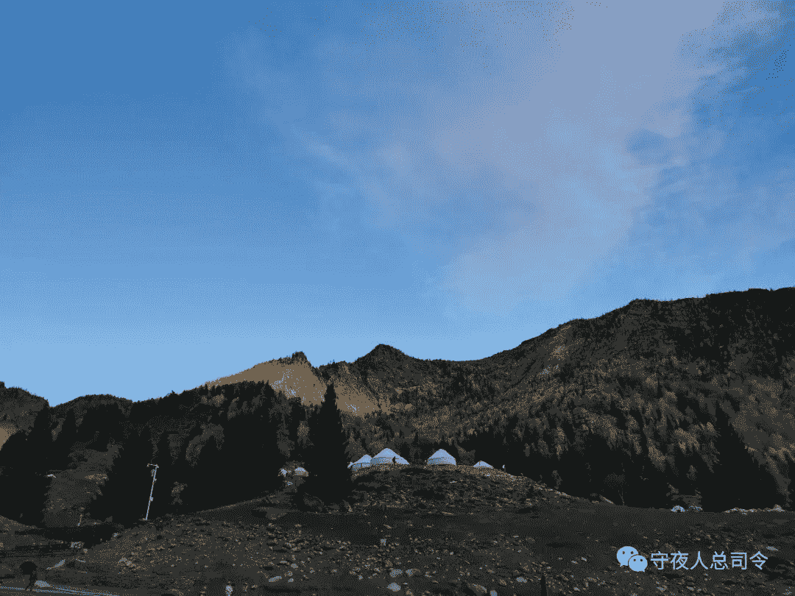
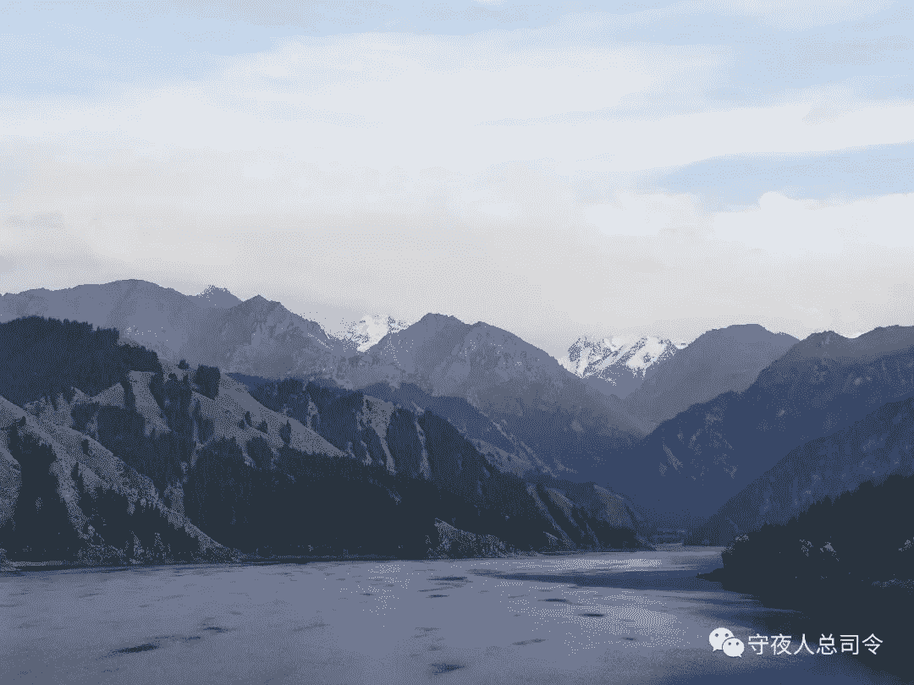

# [守夜人总司令] - 2021-10-07 累死了，腰痛！

> 来源：[`www.yuque.com/books/share/97051b78-926c-43e6-b0aa-0b72ff163ac4/zi3kh4`](https://www.yuque.com/books/share/97051b78-926c-43e6-b0aa-0b72ff163ac4/zi3kh4)

累死了，腰痛！ 

原创觉悟者守夜人总司令 

守夜人总司令 

微信号WatcherCommander 

功能介绍结构学：生命体在其生存结构中的求存之道！ 

2021-10-07[原文](https://mp.weixin.qq.com/s?__biz=MzAxNDk1NjI2Mw==&mid=2247487324&idx=1&sn=e83a09ad5c92d7c7c82505fb78a777e2&chksm=9b8a2cd4acfda5c25819331bf8a2410082a0bdc726d640adee14dc4d695b6880159ebcf82440#rd))发表于 

收录于合集 

#布尔津 3 个 

#戈壁滩 3 个 

#天池 5 个 

#乌鲁木齐 2 个 

#可可托海 7 个 

  

骑了一个半小时的马，才登上阿尔泰山。这些蒙古马虽然没有阿拉伯马那么高大，但耐力真好。不仅适合长途奔袭，也适合长期爬山。天生万物，相生相克，人与环境的相互雕塑既能造成一种优势叠加的效果，也能造成一种深度捆绑的死锁。一个物种在某个环境中越是如鱼得水，它往往对这个环境的依赖度也就越高！ 

这一趟走下来，与形形色色的人打交道，每一个人所呈现给你的世界都是完全不一样的——就如同一个水晶的不同侧面。在这些相互叠加在同一个物理空间中的不同世界中，我更立体的看清楚不同的人所感知到的世界的边界和他们所认定的运行规则。有一句话叫：未经他人苦，莫劝他人善。你不能理解一个人的精神结构，你就无法理解为什么在你看来无比荒唐的事在对方眼中却是那样的理所当然，甚至除此之外没有其它的选项。 

我以前不明白为什么东北人的父母会无比的痴迷于编制。在新疆转了一圈，深入到那些县城之后，就越发理解了：如果沙漠中存在一种稀有的资源，能够开采和利用它的只能是国企。为什么是国企呢？因为这些资源属于国家，能够代表国家这个抽象概念的具体对象是政府，而政府不是经济体系的参与者，能够代表政府意志的经济参与实体就是国企。 

当你试图在沙漠戈壁中造出一座城市的时候，这种投资和建设在最初未知成败的阶段是由权力驱动的，并不是由市场驱动的。正因为它的第一驱动力源于权力，所以，后续的一切都或多或少的被某种惯性裹挟着前行。 

这种路径依赖作用于人群的时候，与普通人生活息息相关的内容就是工作岗位。所有的岗位都源于某种需要，而这种需要由牵引力来决定。如果这个牵引力是权力，那么，它的意志就决定是否设定某个岗位。这种地方最好的工作就是体制内的工作，因为体制内的岗位是在贯彻权力的意志，具有持续且稳定的驱动力。 

当年的东北就是这样的一种发展路径。当某个城市的 70%的人口都在国企上班的时候，不管是市场经济还是市场本身都不存在！为什么呢？因为交易需要对手盘，没有对手盘的交易是无法存在的。所以，问题的关键是为什么 70%的人会在国企中讨生活。 

一种资源被广泛应用的时候，围绕着对这种资源的利用，会构建起一个产业，这个产业的最初形态是从无到有，无比艰苦并极具开拓性。关于这一点，我在可可托海的 3 号矿和周围的环境中感受非常深刻。大屏幕上放映着第一代人的开拓、第二代人的建设、第三代人的回忆。它就如同一棵小树从戈壁沙漠中艰难的生长出来，长成一篇胡杨林。筚路蓝缕的背后是一种由信仰和权力驱动的行为。 

随着对资源利用的日益成熟，在最初的基础之上逐渐衍生出配套的产业。然而，这些配套设施也是服务于这个主题的，并不存在除此之外的市场——我在克拉玛依住的酒店，从装修风格和建筑布局，以及服务人员的行为特征就能明显的发现：所有的一切都与真正面向市场的酒店行业不同，它的一切都紧紧围绕着接待这个主题在建设——即便它的功能已经开始延申到市场活动之后依然被最初的惯性所裹挟着。关于这一点，我与这家酒店的总经理聊了半个小时，他的许多反馈验证了我的观察和结论。 

  

这只是一个缩影，它其实呈现出来的是许多三四五线城市和县城的产业状况和就业状况：所有的产业都是围绕一种非市场因素的资源衍生出来的，最初的驱动力来自于政府的权力！在这样的环境中，凡是能做点事的人都必须要跟权力有各种拐弯抹角的关系，否则，就打不上这根线，也承接不了某种配套服务的业务。当社会资源的流动呈现出这样的结构，人员的分布状态就如同覆盖在骨架上的肌肉，一开始就被决定了：进入体制内是最有保障的，其实才是与政府存在紧密关系的事业单位和国有企业。再不济就是国有企业的子公司或者服务于国企的次级单位。当资源高度集中之后，人情世故就会变得越来越重要。当交易不存在其它能够养活自己的对手盘之时，那个唯一的交易对象就是所有人都需要争夺的稀缺资源。 

任何生存结构其实都存在一条主线，所有的成员都不约而同的围绕在这条主线上扮演着整个链条中不同的角色。人在一个生存环境中，前半部分的时间主要是在拼命抢位置——证明自己配扮演整个链条中的某个角色。后半部分主要时间是用于突破这个角色在环境中的先天性限制。  

曾经提前两年预言过国家层面的管道公司会成立，并且最终会发展成为拥有成品油定价权的决定性角色。当年油气产业处于从无到有的开拓时期，各搞各的，每一个油气公司既负责开采，也负责提炼，还自己铺设管道搞输送。这样的发展轨迹就决定了大家各有各的利益。也就会造成各霸一块的局面。这种局面并不有利于整体利益，因此，就必然要进行剥离，让前端竞争，后端整合。竞争能在前端提供更好的服务，整合能够在后端提高综合性的效率，并强化对全局的供给、定价和调控的能力。 

许多事都存在它的路径依赖，人自身也是如此。就如同一盘棋，你看到的那一刻所呈现出来的态势，并不是棋子摆在棋盘上所呈现出来的强弱格局，而是一步一步走成这种局面的轨迹。置身于棋局之中的人，许多事都由不得自己。就如同那些跟我交流的人，他们的视角编织出他们所置身的棋局，在那个棋局中有他所理解的运行规则和既定的轨迹… 

骑马上阿尔泰山的时候，一路非常陡峭，有的地方呈现出 70 多度的坡度，还好这些蒙古马很给力。大眼睛姑娘真不错，第一次骑这种蒙古马，居然能连续骑一个多小时的山路。她说她一直用力抓住马鞍，把手都磨出水泡了。随行的巴图大叔用他并不标准的国语夸奖了她，说她已经很厉害了！ 

穿过一片小树林的时候，我在马背上转头往后看，看到了不一样的风景，忍不住掏出手机拍了封面上的这张照片——这是一个从高处向下俯视的独特视角，当我处于山谷之中的时候，想都想不到这样的景象，只有等山巍峨的阿尔泰山之巅，才能看到它的全貌，看到那些让人惊叹不已的美！ 

连续骑马那么长时间走山路挺累的，为了拍照和装逼，我一直单手拉着缰绳，时不时的往后仰。刚开始还没感觉，第二天睡觉醒来之后，发现不仅仅是腿有点僵硬，腰也有点痛。 

研习《[结构学](https://mp.weixin.qq.com/mp/appmsgalbum?action=getalbum&album_id=1318317199878225920&__biz=MzAxNDk1NjI2Mw==#wechat_redirect)》，加入觉悟社：付费和不公开内容都有，每天 20 块，还能挣回来，下注标的获取需满足条件及时查看更新。公众号发消息：觉悟社  

[结构学自序（新）！](http://mp.weixin.qq.com/s?__biz=MzIzMDYwOTM0Mg==&mid=2247485283&idx=1&sn=aa2b8554b8e5040f8f959636feaa06a3&chksm=e8b19fb2dfc616a430aa381b8da0815311244e694a69809cd92d0602ac34cfe5f1f419b3745e&scene=21#wechat_redirect) 

[不要愤愤不平，都是好事！](http://mp.weixin.qq.com/s?__biz=MzAxNDk1NjI2Mw==&mid=2247487130&idx=1&sn=b21138d85455f5692aaf039038c78342&chksm=9b8a2d12acfda404a2b67fe4d446ee0f2805ad64a8b8004902934600fd731191e140df6ac19a&scene=21#wechat_redirect) 

[她都来相亲了，你还要怎么样！](http://mp.weixin.qq.com/s?__biz=MzAxNDk1NjI2Mw==&mid=2247486952&idx=1&sn=698aec6916d2eca5e758c25c4c634346&chksm=9b8a2e60acfda776b80a4f2f0d5c2fe4921fc821cdf029fa9d2fdc52fd708fc5a0b980d5d3d0&scene=21#wechat_redirect) 

[田园女权真正攻击的对象是女人！](http://mp.weixin.qq.com/s?__biz=MzIzMDYwOTM0Mg==&mid=2247486412&idx=1&sn=5dd3e8b2a759838d739e6d61ebab2eab&chksm=e8b1931ddfc61a0bf6f81cd2a9a9232ea8ce86528a8eea66c6635180e8678b819ebb38b4cb86&scene=21#wechat_redirect) 

[穷是万恶之源！](http://mp.weixin.qq.com/s?__biz=MzAxNDk1NjI2Mw==&mid=2247483823&idx=1&sn=e54ebe9891b302dc0bf1815c76ccf8b7&chksm=9b8a2227acfdab31a05e273addd9159d4b8263d58d3c58bf214841c8189157519719c3427306&scene=21#wechat_redirect) 

[没有退路的一代人！](http://mp.weixin.qq.com/s?__biz=MzAxNDk1NjI2Mw==&mid=2247486533&idx=1&sn=a0d5cce0656aad467148e0642eb85a00&chksm=9b8a2fcdacfda6db79857186e953a089baf1fb678b2b071cf101c5a26e7fb9768474c94243ca&scene=21#wechat_redirect) 

[可可托海的牧羊人！](http://mp.weixin.qq.com/s?__biz=MzAxNDk1NjI2Mw==&mid=2247487232&idx=1&sn=b6960f8a48871772d4b404a83cb5c7e0&chksm=9b8a2c88acfda59efdc4f5818b75ef13f4b04754440e16d1670baef9041a20b80fdf8a817540&scene=21#wechat_redirect) 

[十八年后的天池！](http://mp.weixin.qq.com/s?__biz=MzAxNDk1NjI2Mw==&mid=2247487257&idx=1&sn=27c585c94b09c0a57fcc8212468c8021&chksm=9b8a2c91acfda587d85c71de190b0168caed45a6296d84d71800adeaa01aa2d986e9247d03a4&scene=21#wechat_redirect) 

[可可托海没有牧羊人！](http://mp.weixin.qq.com/s?__biz=MzAxNDk1NjI2Mw==&mid=2247487272&idx=1&sn=8f44fbf66bf8e0f27a9d1fdfeb82a146&chksm=9b8a2ca0acfda5b68763a03b7aa206e852180f5de8083d1909228b008fe8484bd5f2f38e3812&scene=21#wechat_redirect) 

[报告，我部已集结完毕！](http://mp.weixin.qq.com/s?__biz=MzAxNDk1NjI2Mw==&mid=2247487319&idx=1&sn=d9e72f8c527d2e8e4f922b6e93e883b4&chksm=9b8a2cdfacfda5c931083f655f3fc18dd6637a904955c7a19037f63840673459d0376f99ad65&scene=21#wechat_redirect) 

[A304：为啥会拉闸限电，心里没点数吗？](http://mp.weixin.qq.com/s?__biz=MzAxNDk1NjI2Mw==&mid=2247487279&idx=1&sn=e990e3f48d017a0401536073f1824ef6&chksm=9b8a2ca7acfda5b1d73eb8ec445b0f93386f82d2ee28482af93dc74ed7987fff766a2a534c3c&scene=21#wechat_redirect) 

[A517：从酒肉朋友到酒肉情侣！](http://mp.weixin.qq.com/s?__biz=MzAxNDk1NjI2Mw==&mid=2247487217&idx=1&sn=5defa9de19a22d6bea269defa65b4b91&chksm=9b8a2d79acfda46fa1fe57755d52f85dba61aa31fdeed8e400ef0f92459388da9ae86b7b6273&scene=21#wechat_redirect) 

[A510：努力没结果，被人顶替，怎么办！](http://mp.weixin.qq.com/s?__biz=MzAxNDk1NjI2Mw==&mid=2247487202&idx=1&sn=c4c18c5c793a47e31cd7267152a78d1f&chksm=9b8a2d6aacfda47c47394eb5cbb97fc6233fb7258c0408026e518018a6af33da141b1b0a2bfa&scene=21#wechat_redirect) 

[A518：法国之事只是几百亿欧元的事吗？](http://mp.weixin.qq.com/s?__biz=MzIzMDYwOTM0Mg==&mid=2247486440&idx=1&sn=5f04c2242b53a3f7d3deacdbfa4fab19&chksm=e8b19339dfc61a2fad7247d7e60502508f330e9721943077c715de77bd240be910edc9c1f724&scene=21#wechat_redirect) 

[A507：这篇不让发，再试试！](http://mp.weixin.qq.com/s?__biz=MzIzMDYwOTM0Mg==&mid=2247486381&idx=1&sn=ff54feb308d92ab0329957d3b1e6ffe0&chksm=e8b1937cdfc61a6a551fd5459a063cf08ee00693e3d52e5691d3df22e0bbc5b91618b9ead52e&scene=21#wechat_redirect) 

[A514：鹰酱分化毛熊和兔子，并精确阻击！](http://mp.weixin.qq.com/s?__biz=MzIzMDYwOTM0Mg==&mid=2247486421&idx=1&sn=c114599b4fd1016c7f539fca526fe91c&chksm=e8b19304dfc61a127301df6303aedbeace66275a179f7db025e56f2326917c273d443eab53e6&scene=21#wechat_redirect) 

[A496：为什么兔子在阿富汗很主动？](http://mp.weixin.qq.com/s?__biz=MzIzMDYwOTM0Mg==&mid=2247486278&idx=1&sn=40d09857088bebd3c70bec1c7a500f06&chksm=e8b19397dfc61a810125242c8e395330f934390eb50bd54053ecd3f31ddc91de4e429c0f693a&scene=21#wechat_redirect) 

[不上进的男人和太上进的女人！](http://mp.weixin.qq.com/s?__biz=MzIzMDYwOTM0Mg==&mid=2247486430&idx=1&sn=7f5bc0b0990883a4e2fb5b7206bec905&chksm=e8b1930fdfc61a190d76241bf61a10a6a911a18c1dd3e7636ad78e4373d683a94e91b7e7ce7d&scene=21#wechat_redirect) 

[没有信仰的中国人？](http://mp.weixin.qq.com/s?__biz=MzIzMDYwOTM0Mg==&mid=2247486407&idx=1&sn=9a80a9025d4d375b279e55be877a62d8&chksm=e8b19316dfc61a00b5b914a5a63d952874bd62283d40c73574940eb7bfb73a25be2e8f2d82b3&scene=21#wechat_redirect) 

[可可托海的牧羊人！](http://mp.weixin.qq.com/s?__biz=MzAxNDk1NjI2Mw==&mid=2247487232&idx=1&sn=b6960f8a48871772d4b404a83cb5c7e0&chksm=9b8a2c88acfda59efdc4f5818b75ef13f4b04754440e16d1670baef9041a20b80fdf8a817540&scene=21#wechat_redirect) 

[A504：6 天撤出 12.9 万人，这个能力我们还不具备！](http://mp.weixin.qq.com/s?__biz=MzIzMDYwOTM0Mg==&mid=2247486364&idx=1&sn=c54714ffeaa4122f08d8ec0c2decb740&chksm=e8b1934ddfc61a5b943cbe55dfc7211561e7d78f163246c3dcfd08325b004bc6d9ee6efbaebf&scene=21#wechat_redirect) 

[A504：当男人不再大男子主义！](http://mp.weixin.qq.com/s?__biz=MzAxNDk1NjI2Mw==&mid=2247487148&idx=1&sn=5151b292f8f882fe9f87aabf52be08df&chksm=9b8a2d24acfda432b5803c25c0c83a4cbfc80a7c83ffd044b72bedc5e32d9670054d861705cf&scene=21#wechat_redirect) 

[A491：塔利班接下来的两个核心问题！](http://mp.weixin.qq.com/s?__biz=MzIzMDYwOTM0Mg==&mid=2247486219&idx=1&sn=8f77517f0244ba31f7eb28e2676e17cd&chksm=e8b193dadfc61acc6d9e6029653aac696f132efc24d3b28f983ba8e4ada269ac887e6165d837&scene=21#wechat_redirect) 

[A499：如何控制一个老实人！](http://mp.weixin.qq.com/s?__biz=MzIzMDYwOTM0Mg==&mid=2247486301&idx=1&sn=f4bfec024d8688c8555dd21b85deea31&chksm=e8b1938cdfc61a9a1e2d8a8fa37d495cf337bc34215939caced14a58dd32b46ad59646d0e928&scene=21#wechat_redirect) 

[来来来，我教你怎么攻击我！](http://mp.weixin.qq.com/s?__biz=MzIzMDYwOTM0Mg==&mid=2247486306&idx=1&sn=f48e33b5940f74a11011debfe3e5c8a2&chksm=e8b193b3dfc61aa53a82eeb81220ce252b0667925a9479e4d6a215e2b43244ba91c58e934264&scene=21#wechat_redirect) 

[A494：对企业财税政策的预判！](http://mp.weixin.qq.com/s?__biz=MzIzMDYwOTM0Mg==&mid=2247486230&idx=1&sn=5fa67e9065c3feae6264765838772136&chksm=e8b193c7dfc61ad15311f10ab8265d667f31cc2e11e404476afbc0310d6ee71e5f1167faf78f&scene=21#wechat_redirect) 

[A474：箭在弦上，不得不发！](http://mp.weixin.qq.com/s?__biz=MzIzMDYwOTM0Mg==&mid=2247486092&idx=1&sn=d93b0ab35ba2828a708658dbd2e5ad9b&chksm=e8b1925ddfc61b4b12bc1b6a7e7e25a2fe7ff149b1c4f64810b2a5eefa97b8dc1bd1899dcf00&scene=21#wechat_redirect) 

[A328：2021 年必须加杠杆！](http://mp.weixin.qq.com/s?__biz=MzIzMDYwOTM0Mg==&mid=2247485087&idx=1&sn=24d72f6a71bddb8954a03be5db246538&chksm=e8b19e4edfc617587a8ae645885a89ab8c3c6f67730a026d9c7c9a94ab3051ca480302147fc0&scene=21#wechat_redirect) 

[A361：人成长的三个关键时刻！](http://mp.weixin.qq.com/s?__biz=MzAxNDk1NjI2Mw==&mid=2247486472&idx=1&sn=8b46d73659ff81e3d7bd544e1718a94f&chksm=9b8a2f80acfda69601b059cb0180f8841eda098200c32c84ad6430bb8fbe33a9021fa7890344&scene=21#wechat_redirect) 

[A311：要理解住房不炒的真正含义！](http://mp.weixin.qq.com/s?__biz=MzIzMDYwOTM0Mg==&mid=2247484959&idx=1&sn=090583ec50bfd9febec1de463c2672f6&chksm=e8b19ecedfc617d8629080f6745c8de013cfe875de26eef6767b2d5c10782650223ed15f807b&scene=21#wechat_redirect) 

[A394：要理解扶贫政策的真正意图！](http://mp.weixin.qq.com/s?__biz=MzIzMDYwOTM0Mg==&mid=2247485502&idx=1&sn=fffb9911cefa626e6fbcb9c416c1eb98&chksm=e8b190efdfc619f9b0e42f3c3d5d79c17df1619bad2b1bddd6a482242b583ee46d8a79a245e6&scene=21#wechat_redirect) 

[A388：用鲜血开路获得的投名状！](http://mp.weixin.qq.com/s?__biz=MzIzMDYwOTM0Mg==&mid=2247485591&idx=1&sn=a8443453e3caf1f201006eeec8e6e539&chksm=e8b19046dfc61950e63e29bb93049ce90b3228913e9ecee99a2f01b8fdda7cd8966a054241a9&scene=21#wechat_redirect) 

[A405：养老对普通人将会是一个深渊！](http://mp.weixin.qq.com/s?__biz=MzIzMDYwOTM0Mg==&mid=2247485587&idx=1&sn=f00402b3fdc5062ee5c5382295ac4dcb&chksm=e8b19042dfc619546bf0a0905d2733d900b7594f1564f1fa7528399053b93dc53f4d14c009fb&scene=21#wechat_redirect) 

[A300：这是投机的大机会还是大陷阱？！](http://mp.weixin.qq.com/s?__biz=MzIzMDYwOTM0Mg==&mid=2247484882&idx=1&sn=b103029f41e3aede94e1a45d035cd9ac&chksm=e8b19d03dfc614153863f37ca3f9204b451e2c02ad5ca8680c120e2458e628e5329c76b2d42c&scene=21#wechat_redirect) 

[A366：从货币驱动到财政驱动的转变！](http://mp.weixin.qq.com/s?__biz=MzIzMDYwOTM0Mg==&mid=2247485347&idx=1&sn=a916df57ddc7230366719fbecc6c1704&chksm=e8b19f72dfc61664fd99844bfe3ffffb5d6f088807c84d99f11ddbc7410b2eed67bc4c615d53&scene=21#wechat_redirect) 

[A376：要换种思维，你才能理解！](http://mp.weixin.qq.com/s?__biz=MzAxNDk1NjI2Mw==&mid=2247486529&idx=1&sn=3a50ada30a5ae0448d686c6a0c809919&chksm=9b8a2fc9acfda6df5e9243deb6e9df9a7cc0912eabd0a9c00322d42ed4c25c2daedc8de6b6ca&scene=21#wechat_redirect) 

[A377：为什么不买武汉的房？](http://mp.weixin.qq.com/s?__biz=MzIzMDYwOTM0Mg==&mid=2247485413&idx=1&sn=1f3339540496eb9e5ea109d8530f29dc&chksm=e8b19f34dfc6162225a694c1c2443d73b51bf6ca8dc53d4c18a30e6e2191e250967e711db589&scene=21#wechat_redirect) 

[A295：当代女性的两难！](http://mp.weixin.qq.com/s?__biz=MzIzMDYwOTM0Mg==&mid=2247484854&idx=1&sn=6851afe306f7b89d23728018ea32b7f2&chksm=e8b19d67dfc61471955b15021ac11c5fff9f1607977e9df1bd2bbfabc2deb3dea5c98e369c55&scene=21#wechat_redirect) 

[A375：你修炼错了方向！](http://mp.weixin.qq.com/s?__biz=MzIzMDYwOTM0Mg==&mid=2247485407&idx=1&sn=9febe7868b7205ac865541d88423d9b9&chksm=e8b19f0edfc61618c7f22fb7bf48181c5f974463c5d3a8849b0f76b96eeac73b0dd074ea4737&scene=21#wechat_redirect) 

[E29：一眼看到底！](http://mp.weixin.qq.com/s?__biz=MzIzMDYwOTM0Mg==&mid=2247485301&idx=1&sn=dc6dd50c5d742ea51ce9e394de25351a&chksm=e8b19fa4dfc616b26734c3619c6fa664474fa478d2764c3370dde41d19f6035edc05f9f191e8&scene=21#wechat_redirect) 

[向下兼容是种自我消耗！](http://mp.weixin.qq.com/s?__biz=MzAxNDk1NjI2Mw==&mid=2247486535&idx=1&sn=e87304f3a33f1cd0425186362901eb04&chksm=9b8a2fcfacfda6d92af7f3b026ef129368c01361e40f2db3be32500a1e68fb99f1f35ec22a6b&scene=21#wechat_redirect) 

[A284：啊！万箭穿心！](http://mp.weixin.qq.com/s?__biz=MzAxNDk1NjI2Mw==&mid=2247486135&idx=1&sn=e950149b9b9147e9199cfc6093605950&chksm=9b8a293facfda029419b911d4b4fa91c73bbaf695b206df2cf15124d843f4bf4b80673baa394&scene=21#wechat_redirect) 

[梦醒之时，已经三十！](http://mp.weixin.qq.com/s?__biz=MzIzMDYwOTM0Mg==&mid=2247484378&idx=1&sn=e3a058584a13d7a5267315113964280d&chksm=e8b19b0bdfc6121df4af4b77d2d826fd0f4132ccfdee48132ce8cf86eb1ba45b898be83d1dc7&scene=21#wechat_redirect) 

[五年感情，八万块钱！](http://mp.weixin.qq.com/s?__biz=MzIzMDYwOTM0Mg==&mid=2247484317&idx=1&sn=b22f9fb2e3c084e427a5e3e9895be99a&chksm=e8b19b4cdfc6125adf3ea3b0d2b72a121f38e8ba26e43abc48edff900327ce3e7464b944cafb&scene=21#wechat_redirect) 

[赶紧看，待会儿又没了！](http://mp.weixin.qq.com/s?__biz=MzAxNDk1NjI2Mw==&mid=2247486485&idx=1&sn=59010caa3e68d45d1ae578d4ab76a4db&chksm=9b8a2f9dacfda68b06ee592a02eead0f174b54fa7501f4c0f4221f3c6fff0c625e90a7675460&scene=21#wechat_redirect) 

[依依东望，望的是时间！](http://mp.weixin.qq.com/s?__biz=MzIzMDYwOTM0Mg==&mid=2247483860&idx=1&sn=b5b01ae82ff764ce2806251e3f2a809f&chksm=e8b19905dfc61013607735eb7782299c9a4d7a39a8b15a7b46182ef20eda3ffe9f6ed6337e1f&scene=21#wechat_redirect) 

[A374：真正的大机会在这里！](http://mp.weixin.qq.com/s?__biz=MzIzMDYwOTM0Mg==&mid=2247485401&idx=1&sn=100967c02c0754759ec4ea0ef8706c29&chksm=e8b19f08dfc6161e92c7cc691f1a1fed9ff74c2b906529a8d42a7703a3c3a3c3a412903e12f7&scene=21#wechat_redirect) 

[关注自己的人，才会活的不错！](http://mp.weixin.qq.com/s?__biz=MzIzMDYwOTM0Mg==&mid=2247485305&idx=1&sn=c719ea57e5c3320c2e2629dd9a7b44e9&chksm=e8b19fa8dfc616be5fa3f8141ea0aa63d5e1335657ed97e62c1086c41eba29effe58e0c8e9dc&scene=21#wechat_redirect) 

[A294：快快下注，开始挣钱了！](http://mp.weixin.qq.com/s?__biz=MzIzMDYwOTM0Mg==&mid=2247484849&idx=1&sn=5485cd1d6c511e883e25b0c7dd9e2e3e&chksm=e8b19d60dfc614764ffc8405dccf5b8120b31988f3c1cee74e384c06f0e39c3c81bef8263c3d&scene=21#wechat_redirect) 

[A370：被删了，改后重发，欲看从速！](http://mp.weixin.qq.com/s?__biz=MzIzMDYwOTM0Mg==&mid=2247485388&idx=1&sn=a456e8ffdc8a16bb30263818dc86c6a3&chksm=e8b19f1ddfc6160bfd0fea09b006477a095662aa74ac7036fca621b2ef49dc59f4ad4a407eeb&scene=21#wechat_redirect) 

[E26：自卑的形成和自信的重建！](http://mp.weixin.qq.com/s?__biz=MzIzMDYwOTM0Mg==&mid=2247485311&idx=1&sn=28f827c212f9a1ac53e73986742ca5aa&chksm=e8b19faedfc616b8d527f328c2ad55dca966707c8813ceaa5b7c0daee3432edeec88744d842c&scene=21#wechat_redirect) 

[A318：为何搞银行房产贷款配额？！](http://mp.weixin.qq.com/s?__biz=MzIzMDYwOTM0Mg==&mid=2247485031&idx=1&sn=c4af23061445755fdb12f1196c108b1d&chksm=e8b19eb6dfc617a015821fd94ff2d8f51a2cb8fb456ddd907206b615bf3240c1597d3618609c&scene=21#wechat_redirect) 

[A311：要理解住房不炒的真正含义！](http://mp.weixin.qq.com/s?__biz=MzIzMDYwOTM0Mg==&mid=2247484959&idx=1&sn=090583ec50bfd9febec1de463c2672f6&chksm=e8b19ecedfc617d8629080f6745c8de013cfe875de26eef6767b2d5c10782650223ed15f807b&scene=21#wechat_redirect) 

[A320：思路变了，可以加杠杆了！](http://mp.weixin.qq.com/s?__biz=MzIzMDYwOTM0Mg==&mid=2247485041&idx=1&sn=add2174fa42806f885a456a072ee4fee&chksm=e8b19ea0dfc617b6734e013f780112fdd88f28ad5312ce423fea1d75da4c3757660dab175208&scene=21#wechat_redirect) 

[A345：剥离学区控制贷款也没用！](http://mp.weixin.qq.com/s?__biz=MzIzMDYwOTM0Mg==&mid=2247485208&idx=1&sn=ac3653b56fc18a4a6a809139f935bc45&chksm=e8b19fc9dfc616dfa31b0baf15aa90d994ef8a1262e0fd515739c06698cd0673d1d46e6e4c4f&scene=21#wechat_redirect) 

[A365：他妈一年挣的比你妈 50 年都多！](http://mp.weixin.qq.com/s?__biz=MzIzMDYwOTM0Mg==&mid=2247485336&idx=1&sn=2fba7786d5102be1d639bfdd138185db&chksm=e8b19f49dfc6165f4a1e07062ca1414d977f1a6c15d797233e36f7dec3b27c28b0ed72667f5f&scene=21#wechat_redirect) 

[E18：你想的不够简单！](http://mp.weixin.qq.com/s?__biz=MzIzMDYwOTM0Mg==&mid=2247484775&idx=1&sn=2a8e810e281cd7fe5a4db49002b193d2&chksm=e8b19db6dfc614a0e3360f0d54949c40138c27b184c114a44feaa394bd4400073dbbedf6a049&scene=21#wechat_redirect) 

[为富人办事，为穷人说话！](http://mp.weixin.qq.com/s?__biz=MzIzMDYwOTM0Mg==&mid=2247484462&idx=1&sn=195ebab17907fba73c69ae7a11bc40ad&chksm=e8b19cffdfc615e9b2f88327d492813afa3656859f4d67a6d831ac1cf684a54b760a8b8edcd6&scene=21#wechat_redirect) 

[A284：啊！万箭穿心！](http://mp.weixin.qq.com/s?__biz=MzAxNDk1NjI2Mw==&mid=2247486135&idx=1&sn=e950149b9b9147e9199cfc6093605950&chksm=9b8a293facfda029419b911d4b4fa91c73bbaf695b206df2cf15124d843f4bf4b80673baa394&scene=21#wechat_redirect) 

[梦醒之时，已经三十！](http://mp.weixin.qq.com/s?__biz=MzIzMDYwOTM0Mg==&mid=2247484378&idx=1&sn=e3a058584a13d7a5267315113964280d&chksm=e8b19b0bdfc6121df4af4b77d2d826fd0f4132ccfdee48132ce8cf86eb1ba45b898be83d1dc7&scene=21#wechat_redirect) 

[父母挖的坑，别人挖的坑，自己挖的坑！](http://mp.weixin.qq.com/s?__biz=MzAxNDk1NjI2Mw==&mid=2247486426&idx=1&sn=8707934ad2fe2f8017d6b7810fd61c17&chksm=9b8a2852acfda1441fded7bab2456dd2493073ad3e5d541e1080d1739879b86c25a3a61df79a&scene=21#wechat_redirect) 

[A245：北京有的小区涨了 20%！](http://mp.weixin.qq.com/s?__biz=MzIzMDYwOTM0Mg==&mid=2247485265&idx=1&sn=f4bce6f07805cba2db3a1a806215e45c&chksm=e8b19f80dfc616966666979063f2c9fce9fe20308538607cf90eac74f0db85c9adf79299f4b8&scene=21#wechat_redirect) 

[A351：你为什么也不愿意？！](http://mp.weixin.qq.com/s?__biz=MzIzMDYwOTM0Mg==&mid=2247485242&idx=1&sn=f4a01a5936322120b0b158f225bc78de&chksm=e8b19febdfc616fd2eb1558a3b7c748ecc497a3af00aec5b5c5ca8042cc52eb7d0af7befa399&scene=21#wechat_redirect) 

[A335：必须与焦虑长期共存！](http://mp.weixin.qq.com/s?__biz=MzIzMDYwOTM0Mg==&mid=2247485165&idx=1&sn=f3f0957c63fa549b288f00c8b117162e&chksm=e8b19e3cdfc6172a188000afd2b522144a04ba774169824cad2067d93b5365537ff0644f6b9f&scene=21#wechat_redirect) 

[A315：认命吧，做个普通人也挺好的！](http://mp.weixin.qq.com/s?__biz=MzIzMDYwOTM0Mg==&mid=2247485008&idx=1&sn=bcaf70c42d4676c8f69de9f9ead1e495&chksm=e8b19e81dfc617973ba40200519407186760e32843fc6f379020da6160b0ba89870dadcae5fa&scene=21#wechat_redirect) 

[E15：老洋房的生意没法学！](http://mp.weixin.qq.com/s?__biz=MzAxNDk1NjI2Mw==&mid=2247485113&idx=1&sn=4fc868bf65d5f2ca6eb4d9b776c004ec&chksm=9b8a2531acfdac27c57da12097dfe850ba55cdfd447e35c19df3819bdf4051694bc49f0a218d&scene=21#wechat_redirect) 

[B19：不动产的投资思路！](http://mp.weixin.qq.com/s?__biz=MzAxNDk1NjI2Mw==&mid=2247484650&idx=1&sn=36687887ab7cd444fd324c3906b8d54a&chksm=9b8a2762acfdae74b83a146bdd8994b81cb9879b3de5caa870c13c6253ad22b2f5c42b0fe59a&scene=21#wechat_redirect) 

觉悟者 

喜欢你就转走吧！ 

微信扫一扫赞赏作者赞赏 

已喜欢，对作者说句悄悄话 

取消 

发送给作者 

发送 

最多 40 字，当前共字 

 人赞赏 

上一页 1/3 下一页 

长按二维码向我转账 

喜欢你就转走吧！ 

受苹果公司新规定影响，微信 iOS 版的赞赏功能被关闭，可通过二维码转账支持公众号。 

### 精选留言 

暂无... 

[阅读全文](https://mp.weixin.qq.com/s/nIdk03JhgbTU-TDXQQQ39A#rd)