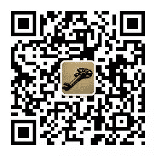
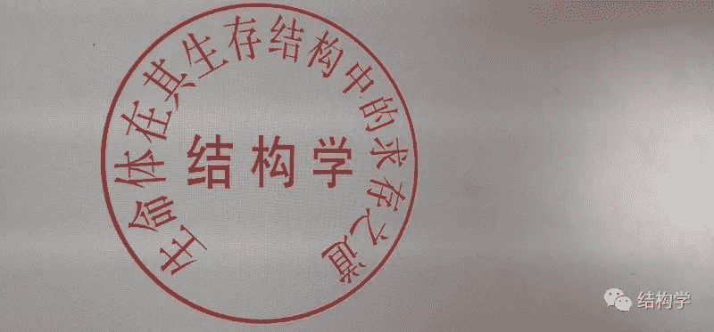

# [守夜人总司令] - 2019-10-12 祸事了！祸事了！

> 来源：[`www.yuque.com/books/share/97051b78-926c-43e6-b0aa-0b72ff163ac4/gbrtx6`](https://www.yuque.com/books/share/97051b78-926c-43e6-b0aa-0b72ff163ac4/gbrtx6)

祸事了！祸事了！ 

原创觉悟者守夜人总司令 

守夜人总司令 

微信号WatcherCommander 

功能介绍结构学：生命体在其生存结构中的求存之道！ 

2019-10-12[原文](https://mp.weixin.qq.com/s?__biz=MzAxNDk1NjI2Mw==&mid=2247484799&idx=1&sn=1abc235be63ea8ba0684b369239765da&chksm=9b8a26f7acfdafe1f24dba6862e246adc006ae9a0f7259b8a4115f4b87057f5a5e99e5e5aa4c&scene=27#wechat_redirect&cpage=315) 

收录于话题 

A87：一个时代的终结  被删除了！ 

A71：香江之滨的走势  也被删除了！ 

A70：广州的黑人问题  之前没删，刚被删了！ 

C25：精神结构的形成机制  也被删，这都删！ 

不知道这篇一年多前预测贸易战不可避免的《[向正在坍塌的地方踹上一脚！](http://mp.weixin.qq.com/s?__biz=MzAxNDk1NjI2Mw==&mid=2247483789&idx=1&sn=5e44b7b524c3dc4bb7705f49ed0a44a3&chksm=9b8a2205acfdab139e4b1d44ef6702b09c9fbf79505340205d13fbdaa33207a997f54bee0e97&scene=21#wechat_redirect)》还能存活多久。也不知道预见供销社体系会再次被激活的那篇《[严重打脸：刘士余自首了！](http://mp.weixin.qq.com/s?__biz=MzAxNDk1NjI2Mw==&mid=2247484521&idx=1&sn=11873ca4c05d3ca82f6ecaaf75896186&chksm=9b8a27e1acfdaef7698d6d01312f3e3960aa41fb4ab58884b351aeb3127affa92609588a2d60&scene=21#wechat_redirect)》还能存活多久。更不知道预见西北政策的《[C12：务必要振兴建设兵团！](http://mp.weixin.qq.com/s?__biz=MzAxNDk1NjI2Mw==&mid=2247484193&idx=1&sn=88c86597191d0c97a411f9ea6f7b7c5d&chksm=9b8a20a9acfda9bfae819e8e42531fe6d523dd244ef0fc0c0787ab812540108c181f7ec2ffa9&scene=21#wechat_redirect)》犯不犯忌讳。好像越来越不允许公开结合现实问题来谈应用了。[关于美国的三篇！](http://mp.weixin.qq.com/s?__biz=MzIzMDYwOTM0Mg==&mid=2247484082&idx=1&sn=7f0efdc740505aeff41af3593c2c07d2&chksm=e8b19a63dfc613757721204eef321ddcad7ddc01dfc2076db117c37c0b37d75438f2e405c830&scene=21#wechat_redirect)还有两篇没完成。下一秒这种题材会不会也慢慢不允许了：[C9：教育是最高的门槛！](http://mp.weixin.qq.com/s?__biz=MzAxNDk1NjI2Mw==&mid=2247484066&idx=1&sn=e394d22ec0f989b141fd07650d135f0d&chksm=9b8a212aacfda83c7391343fb6def9c792717291512ef0f31934f472d9ad68416579489f571f&scene=21#wechat_redirect)[A84：为何买深圳的房？](http://mp.weixin.qq.com/s?__biz=MzAxNDk1NjI2Mw==&mid=2247484708&idx=1&sn=c4a8ffe14b1ea0579e0005119094ca23&chksm=9b8a26acacfdafba18b302d996afe0251fe92e695dde593e623f32be05c31d020aad6aafa541&scene=21#wechat_redirect)、[B1：去不掉的中间环节](http://mp.weixin.qq.com/s?__biz=MzAxNDk1NjI2Mw==&mid=2247484061&idx=1&sn=1209c5618c7a801825c4d601715c442d&chksm=9b8a2115acfda803a021253d6a306e6c95fffb1fdfae4daedf94c8f602c7d2c9e52452759093&scene=21#wechat_redirect) 、[B9：总部该如何管控分支？](http://mp.weixin.qq.com/s?__biz=MzAxNDk1NjI2Mw==&mid=2247484145&idx=1&sn=41c6886b25339836dfde91b10a40fc77&chksm=9b8a2179acfda86f79a66c7e938f8422d5d3d2de33d3ba41431663493fc11020da7e7d964ff7&scene=21#wechat_redirect) 

 

罢了，还是挤时间先把书的内容完成，这两天晚上加点班，把《结构学》中的正式内容《C2：共识的形成》完成，这是这本书第一部分的内容。第一部分是底层逻辑，第二部分是精神结构，第三部分是结构力量。此三部分构建起结构学的整个体系。根据版权协议，《结构学》的内容不能对外发布。以后要传播的话也沿续官方授权的内部模式。《C2：共识的形成》的动员令已经发布，老规矩！《C4：道德与宗教》、《C5：文化的本质》的草案已经在觉悟社更新，第一部分的目录基本不会变更了，详情读：[《结构学》的目录和纲要！](http://mp.weixin.qq.com/s?__biz=MzAxNDk1NjI2Mw==&mid=2247484593&idx=1&sn=5ec84d78201320511260f18a170dd539&chksm=9b8a2739acfdae2f3f64efc39512bdba6569eb8ebbe4da30839c1116ed7f9e2e6ffcad864cc2&scene=21#wechat_redirect)另外，为了防止突然失联系，有一个叫“结构学”的公众号是这个公众号的唯一备胎。二维码就放下面了： 

  

除此之外，还有一个官方的防失联的方式：觉悟社。当然了，觉悟社是海天盛筵，不是为普罗大众准备的。我们终究要把《结构学》发扬光大，希望选择觉悟社的人不是为了看热闹，不要以吃瓜的心态，而是以立足于解决问题的决策者心态参与研究现实问题的应用并参与讨论。我们先立足于把一个学问提炼并发扬光大，再建立组织，最后再有组织的做事。觉悟社是 2019 年建立的，非常巧合的是，历史上的觉悟社诞生于 1919 年！这个阶段的主要任务是：传播一种强者文化，作为独立的学科来研究和提炼《结构学》，以生命体在其生存结构中的求存为核心内容，追求阳谋取胜，阴谋只能临时应急。 

《结构学》觉悟社内部资料！ 

获取《结构学》发消息：觉悟社 

  

觉悟者 

喜欢你就转走吧！ 

微信扫一扫赞赏作者赞赏 

已喜欢，对作者说句悄悄话 

取消 

发送给作者 

发送 

最多 40 字，当前共字 

 人赞赏 

上一页 1/3 下一页 

长按二维码向我转账 

喜欢你就转走吧！ 

受苹果公司新规定影响，微信 iOS 版的赞赏功能被关闭，可通过二维码转账支持公众号。 

### 精选留言 

用户设置不下载评论 

[阅读全文](https://t.zsxq.com/QzVrFEM)