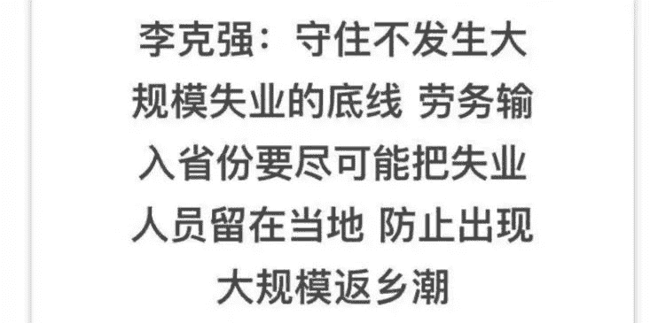
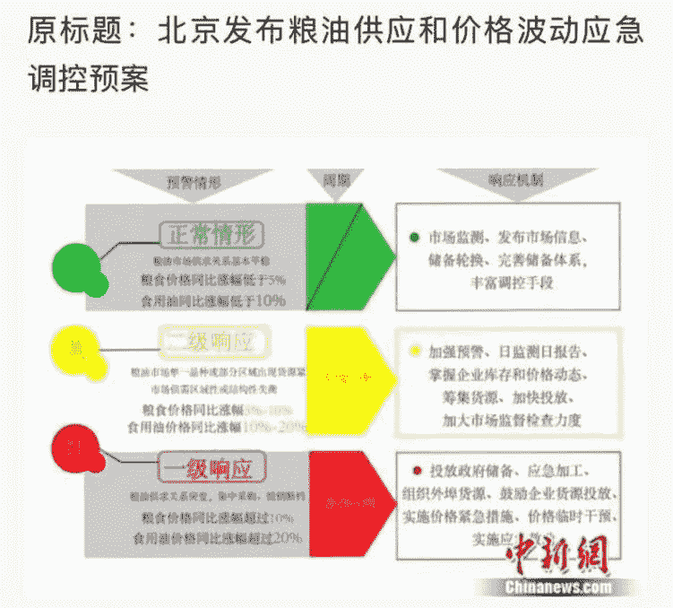

# [守夜人总司令] - 2019-05-17 A50：为啥又谈崩了！

> 来源：[`www.yuque.com/books/share/97051b78-926c-43e6-b0aa-0b72ff163ac4/xm8ybg`](https://www.yuque.com/books/share/97051b78-926c-43e6-b0aa-0b72ff163ac4/xm8ybg)

<ne-p id="520f42f3293818f927861ebbd5b15da4_p_0" data-lake-id="520f42f3293818f927861ebbd5b15da4_p_0"><ne-text id="u4dafe65c" style="color: rgb(51, 51, 51);">A50：为啥又谈崩了！</ne-text></ne-p> <ne-p id="074a0c94ec29bbdd632694514d951f5b" data-lake-id="074a0c94ec29bbdd632694514d951f5b"><ne-text id="uc252668e" ne-fontsize="12" style="color: rgb(255, 255, 255);">原创</ne-text><ne-text id="uf1a71f7a" ne-fontsize="14">觉悟者</ne-text><ne-text id="u01b47f05" ne-fontsize="14">守夜人总司令</ne-text></ne-p> <ne-p id="d5eb76750068a0347407007f3d297c15" data-lake-id="d5eb76750068a0347407007f3d297c15"><ne-text id="u3667c076" ne-fontsize="14" ne-bold="true" style="color: rgb(51, 51, 51);">守夜人总司令</ne-text></ne-p> <ne-p id="4028f52cf9b5cb13e3c1024464bb136c" data-lake-id="4028f52cf9b5cb13e3c1024464bb136c"><ne-text id="u1bac794c" ne-fontsize="14" style="color: rgb(51, 51, 51);">微信号</ne-text><ne-text id="u1fd7645d" ne-fontsize="14" style="color: rgb(51, 51, 51);">WatcherCommander</ne-text></ne-p> <ne-p id="10abc4b9d01bef8aff1ad8bd26dbba06" data-lake-id="10abc4b9d01bef8aff1ad8bd26dbba06"><ne-text id="u8d932f24" ne-fontsize="14" style="color: rgb(51, 51, 51);">功能介绍</ne-text><ne-text id="u7a0e2ae6" ne-fontsize="14" style="color: rgb(51, 51, 51);">结构学：生命体在其生存结构中的求存之道！</ne-text></ne-p> <ne-p id="023cb1fc381b396c7038a5e598b9a0cb" data-lake-id="023cb1fc381b396c7038a5e598b9a0cb"><ne-text id="u218781c5" style="color: rgb(140, 140, 140);">2019-05-17</ne-text>[<ne-text id="u5b5c73cc" ne-fontsize="14">原文</ne-text>](https://mp.weixin.qq.com/s?__biz=MzAxNDk1NjI2Mw==&mid=2247484515&idx=1&sn=d5912e7e1901f7fae49d39a99d8e3b6a&chksm=9b8a27ebacfdaefde82ea607527b72552b9bca352e99f6f0875ba5b7beeddd16879b85802bde&scene=27#wechat_redirect&cpage=375)</ne-p> <ne-p id="870a0bead68031ae4ef6250cfb817178" data-lake-id="870a0bead68031ae4ef6250cfb817178"><ne-text id="u14af2b5e" style="color: rgb(51, 51, 51);">收录于话题</ne-text></ne-p> <ne-p id="950ea782cae0c0c3011c6e9fa10b7511" data-lake-id="950ea782cae0c0c3011c6e9fa10b7511"><ne-text id="u5d85d966" style="color: rgb(51, 51, 51);">美国人真正要打击我们的还不完全是科技。科技及其背后的产业升级虽然是远处的威胁，眼下有一个更迫在眉睫的危险威胁到他们当下的命脉。</ne-text><ne-text id="uad935609" ne-bold="true" style="color: rgb(51, 51, 51);">今年我们的股市拉起来的根本原因，就是统治机器急需解决两个迫在眉睫的危机。一是上市公司的质押爆雷风险。另一个就是出口和投资的锐减会制造出就业危机和社会问题。</ne-text><ne-text id="u114a39f4" style="color: rgb(255, 76, 65);">每一个上市公司都是自己行业里面的龙头。龙头如果崩溃了就会引发连锁反应——因为任何行业都是一种伴生型的上下游结构。毁掉龙头会拖垮一大片，就等于毁掉一个行业。所以行业内的龙头企业必须拉住，不能大批量倒下。</ne-text><ne-text id="u225a95e3" style="color: rgb(51, 51, 51);">任何事情都有成本，成本只能转移不会消失。政府只能分配资源不能产生资源，它不可能掏出真金白银去强拉。即便像深圳市这种有余粮过冬的政府可以拿出 460 多亿的救助金，但全国很多地方是拿不出这个钱的。所以，唯一的办法就是股市——上市公司都在股市，把股市拉起来以后让上市公司可以减持，也能解决质押的爆雷风险。</ne-text><ne-text id="uc5eb9389" ne-bold="true" style="color: rgb(51, 51, 51);">如果你去看那些公告，你就会发现最近几个月存在密集的减持行为。这一波龙头质押的风险已经在这一波“牛市”中解决的差不多了，所以绝大多数散户基本上都是亏钱的！</ne-text><ne-text id="uca2919b7" style="color: rgb(51, 51, 51);">谢谢韭菜们，你们是这个社会最坚固的磐石。</ne-text></ne-p> <ne-p id="e5ab505e13376acacfa62c16b1ccc34e" data-lake-id="e5ab505e13376acacfa62c16b1ccc34e"><ne-text id="u8179f9b1" style="color: rgb(51, 51, 51);">第二个迫在眉睫的问题就是就业问题。我们每一年 5000 亿的顺差反映出来什么问题呢？它最直观的反映出产业结构的问题。具体来说，这些顺差是由中低端的出口所获取的。换而言之，我们需要这么大体量的外部拉力，才能保住内部相关产业的运营和从业人员的就业！</ne-text><ne-text id="u66b6869d" ne-bold="true" style="color: rgb(51, 51, 51);">一个产业的结构性状况，决定了它的从业人员的状况。无论产业结构也好，人员也罢，即便转行也是陷在那个层级里面轮换，很难去从事更高级别的营生，所以才造成淤积！</ne-text><ne-text id="u1652cea3" style="color: rgb(51, 51, 51);">知道这意味着什么吗？</ne-text></ne-p> <ne-p id="04e7803d327daf00ffdfe46b21fb6e57" data-lake-id="04e7803d327daf00ffdfe46b21fb6e57" ne-alignment="center"><ne-card data-card-name="image" data-card-type="inline" id="ZDbJ4" data-event-boundary="card" style="color: rgb(51, 51, 51);">  <ne-p id="9f16d381b58e43d76456335fee3613d8" data-lake-id="9f16d381b58e43d76456335fee3613d8"><ne-text id="ue9e08038" ne-bold="true" style="color: rgb(51, 51, 51);">从年初开始，政府一直在加大内部的投资力度，释放流动性资金，并打通内部的流通体系，包括重新激活供销社体系，搞物资和金融的下沉，把更多的人接入内部消费市场。</ne-text><ne-text id="uf3c7dcc6" style="color: rgb(51, 51, 51);">我们在《</ne-text>[<ne-text id="u390edaa5" style="color: rgb(87, 107, 149);">A24：刘士余去供销社干什么?</ne-text>](http://mp.weixin.qq.com/s?__biz=MzAxNDk1NjI2Mw==&mid=2247484249&idx=1&sn=b8af24c3440b291292b1ed4eddfcfaec&chksm=9b8a20d1acfda9c79045cf72415a403a655fcbcc03483c9b2970fd289e28f7c18a998142039c&scene=21#wechat_redirect)<ne-text id="uf95a2bfd" style="color: rgb(51, 51, 51);">》中做了预判性的阐述。释放给金融机构的资金，被大量用来购买地方债，这些钱被用于扩大基建。这所有的求生动作都是在做准备，都是在激活内部的市场，创造内生的拉动力，为稳定现有产业和人员结构下的就业岗位提供内生的拉动力。接下来还会对具体行业进行定向的降准，为推进行业的结构升级提供资金。所有这一切都是未雨绸缪为最坏的情况做准备，防止外面的拉动力突然消失之后，能够比较稳定的维持住现有产业结构下的经济稳定和社会稳定。同时在加大打击有组织犯罪和黑社会的力度。就是为了杜绝在失业率升高的情况下，底层人员为了生计形成社会瘤毒！</ne-text></ne-p> <ne-p id="a1589bba4810e9cdb4a07b0934630610" data-lake-id="a1589bba4810e9cdb4a07b0934630610" ne-alignment="center"><ne-card data-card-name="image" data-card-type="inline" id="TiGP0" data-event-boundary="card" style="color: rgb(51, 51, 51);">  <ne-p id="98b5f040f0104a6bae429b0019e5e446" data-lake-id="98b5f040f0104a6bae429b0019e5e446"><ne-text id="u74183a53" style="color: rgb(51, 51, 51);">鉴于这样迫在眉睫的现实威胁，一方面加大力度向东南亚转移低端产业，另一方面也在尽最大努力，促成交易的达成，以保住外部的拉动力。所以，我们主动去平衡贸易顺差。说白了就是自己掏钱给你去拉我的出口，解决我现行产业结构下的人员就业问题，为产业结构调整赢得时间。我们小心翼翼的对付，该花钱的地方花钱，能让步的地方也做了让步。这事本来向着达成各取所需的临时协议的方向而去。就在即将收官之时，突然一个事件挑动了对方过于敏感的神经。</ne-text></ne-p> <ne-p id="955b4ab2def106004036f9a4f5425f76" data-lake-id="955b4ab2def106004036f9a4f5425f76"><ne-text id="udfa417f5" style="color: rgb(51, 51, 51);">上个季度的数据出来以后，我们看到了内部经济状况触底反弹，开始呈现出乐观的走势。加上年初拉起的这一波牛市，一直在打一巴掌给两颗糖的可控节奏内按计划解决上市公司质押的问题。两把悬在头上的剑，一个已经基本解决，另外一个也开始有了一定的缓解。更可喜的是，去年 10 月份在上海设立的人民币期货交易市场，在短短的时间内分到了全球原油期货交易 10%的份额，在人民币国际金融体系的建设中开局不错。</ne-text></ne-p> <ne-p id="5cab914dbc2757e01e4302ebb1249d11" data-lake-id="5cab914dbc2757e01e4302ebb1249d11"><ne-text id="u1601e2a3" style="color: rgb(51, 51, 51);">然而，最近一带一路有了进展，甚至开始在西方社会成为热点，这个进展最大的威胁是对美元体系的釜底抽薪。进展得越顺利，对美元的依赖度就会降得越低。我们正在加大力度向非洲和东南亚转移产业链的下游，特别是东南亚，基础建设、流通管道、贸易通路、金融贷款、产业转移、技术收入、人员跟进，这一套组合拳在一带一路的大旗下向章鱼的触角一样逐渐延伸过去。</ne-text><ne-text id="u548b123b" ne-bold="true" style="color: rgb(51, 51, 51);">这意味着它逐渐可以形成一个不需要美元的自循环体系——做过供应链的人都清楚，哪怕纯粹靠给帐期的方式也能让行业上下游运转起来。货币是交易的媒介，没有了交易，货币也就没有了价值。就如同没有了执行单位法律也就没有效力一样！</ne-text><ne-text id="udfd447e5" style="color: rgb(51, 51, 51);">这些低端的过剩产能是社会产业结构中错配的资源，是一种纯粹的浪费，不仅仅无法创造增量，还会造成更多的附带消耗。淤积的过剩产能和下游配套如果能转移除去，并在合理成本的产业辐射范围之内，反而能更有利于产业升级并创造新的增量。</ne-text></ne-p> <ne-p id="306ff3a7f5deb25a27d3e670a86c8d9e" data-lake-id="306ff3a7f5deb25a27d3e670a86c8d9e"><ne-text id="ucb0f6990" style="color: rgb(51, 51, 51);">奥观海同志在 8 年之内让美国社会的债务翻了一倍。它们就是一个超过 20 万亿美金的债务堰塞湖，完全靠美元全球体系在支撑。不管美国社会是维系现状，还是要搞新的东西，都需要钱，而且是需要大把的钱。</ne-text><ne-text id="u68dabdcc" ne-bold="true" style="color: rgb(51, 51, 51);">川普修个墙居然沦落到挪用 15 亿美元军费的地步！为什么急于从阿富汗撤军？因为他消减了数亿用于阿富汗驻军所需的军费。没钱维持自身的存在，能不撤走么？总而言之，美国人不管是搞自己的产业重建，或者搞基础设施，或者搞科技产业的突破都需要钱，这种长期投资只能靠发债！</ne-text></ne-p> <ne-p id="286cc87f03b25aaf0709181b6a4339c1" data-lake-id="286cc87f03b25aaf0709181b6a4339c1"><ne-text id="uecfc299f" ne-bold="true" style="color: rgb(51, 51, 51);">在美元体系控制全球的情况下，它们在上游发债，全世界都在下游，其实是把债务转移给全世界其它国家，所以它们的债务能够越堆越高</ne-text><ne-text id="u08d5f23d" style="color: rgb(51, 51, 51);">。就如同一些风光的龙头企业，明明内部已经极度亏空，但是外面有人做信用担保，就能不断从银行搞到钱维持自己风光的外表。糊弄一堆不明真相的吃瓜群众。现在的问题是，一带一路推进的太顺利就形成另外一套物资的流通体系，继而会压缩美元在全球贸易体系中的有效控制范围和深度。</ne-text><ne-text id="u6cf00467" ne-bold="true" style="color: rgb(51, 51, 51);">任何信用货币要有价值，首先要有暴力压轴，其次要必须在现实交易中占据流通领域。如果这二者都萎缩，这对信用货币是致命的威胁！</ne-text></ne-p> <ne-p id="93a85821ef0401be71c72a757a6cb502" data-lake-id="93a85821ef0401be71c72a757a6cb502"><ne-text id="ua9f081e3" style="color: rgb(51, 51, 51);">前段时间一带一路在欧洲有了突破，各种高调，刺激到华尔街那根一直绷得很紧的弦了。何况美股在高位，大家都怕怕，最新统计数据显示今年做风险对冲的华尔街机构比任何时候都多，可见是一种普遍的心理预期。真是树欲静而风不止呀！美国需要通过这套体系来继续发债维系自身的存在。这就好比你用很多倍的杠杆买了一些房子，一旦提高利用杠杆的利率，收紧你利用杠杆的规模，你就很容易出现现金流断裂的危险。现在美国就是一个这样的状况：</ne-text><ne-text id="uca024388" style="color: rgb(255, 76, 65);">美元如果在全球贸易流通体系覆盖的范围缩小了，它发的债就更加没有人去买。何况它做任何事情所需要的资金量都那么大，要有人接盘吃下，也需要找大胖子才吃得下。小鱼小虾吃那么一点也不顶事儿。你觉得当今能吃得下它们给的大力丸的胖子是谁？！</ne-text></ne-p> <ne-p id="774b2993a3f0695642b6da20c9a896f5" data-lake-id="774b2993a3f0695642b6da20c9a896f5"><ne-text id="u5077e9f0" style="color: rgb(51, 51, 51);">适当的吃一点，维持一个临时性的各取所需是可以的。你让我全部吃下为你续命，把我锁死在结构性的困境之中，这也忒不地道了吧？我做不到，也不能做到！您这不是要逼死我呀！不管它狗急跳墙，突破底线拿台湾搞什么小动作，无非都是在创造筹码，逼着吃下大力丸。</ne-text></ne-p> <ne-p id="0fc6fbd79d59c727b071c7caee2f4204" data-lake-id="0fc6fbd79d59c727b071c7caee2f4204"><ne-text id="u41b4c46d" style="color: rgb(51, 51, 51);">可以吃一点，但不会太多。吃的多和少取决于一带一路的推进状况和国内经济结构的调整状况。如果这二者都向好，吃的会非常少，甚至不管你怎么喂都死活不吃。如果这二者都不太好，就会被迫吃一些。不管吃还是不吃，都需要防止资金外流，扩大内部投资。</ne-text><ne-text id="u7d92ba29" ne-bold="true" style="color: rgb(51, 51, 51);">接下来会看到两点：内部适度的推高通胀，并在自己的贸易体系下对外发行更多大额主权债务。</ne-text><ne-text id="uf72cfe29" style="color: rgb(51, 51, 51);">棉花这样的大宗商品会跌，一线的不动产和物价则会适度上涨。我已建仓，你随意！</ne-text></ne-p>  <ne-p id="4149007c5eedc58d03118e926b8cb9b3" data-lake-id="4149007c5eedc58d03118e926b8cb9b3" ne-alignment="center"><ne-card data-card-name="image" data-card-type="inline" id="qA4GO" data-event-boundary="card" style="color: rgb(51, 51, 51);"><ne-p id="475f73331cde17dde8907fd85feda9f5" data-lake-id="475f73331cde17dde8907fd85feda9f5" ne-alignment="center"><ne-text id="u63351bd3" ne-fontsize="13" style="color: rgb(0, 82, 255);">《结构学》仅 1000 本，觉悟社内部培训专用！</ne-text></ne-p> <ne-p id="5d353194e6597298b8767ec4bde77812" data-lake-id="5d353194e6597298b8767ec4bde77812" ne-alignment="center"><ne-text id="uf62b34f2" style="color: rgb(255, 0, 0);">《结构学》发消息</ne-text><ne-text id="u90b97bfe" ne-bold="true" style="color: rgb(255, 0, 0);">：觉悟社</ne-text></ne-p> <ne-p id="de52927ddd22d2fc2e25853865961215" data-lake-id="de52927ddd22d2fc2e25853865961215" ne-alignment="center"><ne-text id="udc050747" style="color: rgb(255, 0, 0);">提问发消息</ne-text><ne-text id="ufec2d7c4" ne-bold="true" style="color: rgb(255, 0, 0);">：守夜人总司令</ne-text></ne-p>  <ne-p id="fcd71cbe581c1e8d1bdec2bd4e7f288a" data-lake-id="fcd71cbe581c1e8d1bdec2bd4e7f288a" ne-alignment="center"><ne-card data-card-name="image" data-card-type="inline" id="ZFiSL" data-event-boundary="card" style="color: rgb(51, 51, 51);"><ne-p id="0c2ca8af80787ec0bb5e2d90aa5c8233" data-lake-id="0c2ca8af80787ec0bb5e2d90aa5c8233"><ne-text id="u4e4f67fd" ne-fontsize="13" ne-bold="true" style="color: rgb(51, 51, 51);">点击下列连接阅读更多精彩：</ne-text></ne-p> <ne-p id="242002053fdc6d6bde5e18bac9dc0b1f" data-lake-id="242002053fdc6d6bde5e18bac9dc0b1f">[<ne-text id="ue8934d3d" ne-fontsize="13" ne-bold="true" style="color: rgb(87, 107, 149);">F3：结构力量</ne-text>](http://mp.weixin.qq.com/s?__biz=MzAxNDk1NjI2Mw==&mid=2247484256&idx=1&sn=f10d9c530bfd6ea08b25d4bec657c13a&chksm=9b8a20e8acfda9fee057f2df26790f905c898132cac91d833d14e636edb00c20514d63189a88&scene=21#wechat_redirect)</ne-p> <ne-p id="eb785ff054a267168932d0361710f765" data-lake-id="eb785ff054a267168932d0361710f765">[<ne-text id="u9860104b" ne-fontsize="13" ne-bold="true" style="color: rgb(87, 107, 149);">《结构学》宣言</ne-text>](http://mp.weixin.qq.com/s?__biz=MzAxNDk1NjI2Mw==&mid=2247484505&idx=1&sn=95b4424393e36eda97e76284318a3f38&chksm=9b8a27d1acfdaec7c00ce60807bd673a33454adf9b992a8ef9b44687a93b333dcf676d0b77c3&scene=21#wechat_redirect)</ne-p> <ne-p id="82062bfb110aa34604ce8183cfcd1168" data-lake-id="82062bfb110aa34604ce8183cfcd1168">[<ne-text id="uef115f22" ne-fontsize="13" ne-bold="true" style="color: rgb(87, 107, 149);">C20：法律的本质！</ne-text>](http://mp.weixin.qq.com/s?__biz=MzAxNDk1NjI2Mw==&mid=2247484501&idx=1&sn=00f288fe79db79413d6d0f42fb029fbb&chksm=9b8a27ddacfdaecbe8bd5ec9e67fcc5197aafb097acee930c82706f7bb282071824e0508b4f7&scene=21#wechat_redirect)</ne-p> <ne-p id="ecc90484c5ffb58268db62e17faa2b2f" data-lake-id="ecc90484c5ffb58268db62e17faa2b2f">[<ne-text id="uf20ac219" ne-fontsize="13" ne-bold="true" style="color: rgb(87, 107, 149);">C1：他们到底怕什么？</ne-text>](http://mp.weixin.qq.com/s?__biz=MzAxNDk1NjI2Mw==&mid=2247483898&idx=1&sn=1b0a50386e9e89d2750dec717236f0aa&chksm=9b8a2272acfdab64235b35ee5e91b8cac6172144207251636e1345fc570aa1601f59eff7f442&scene=21#wechat_redirect)</ne-p> <ne-p id="ad9f97370eac10488838f3cd99f4694a" data-lake-id="ad9f97370eac10488838f3cd99f4694a">[<ne-text id="u7fa9d794" ne-fontsize="13" ne-bold="true" style="color: rgb(87, 107, 149);">B4：你不必为华为担心！</ne-text>](http://mp.weixin.qq.com/s?__biz=MzIzMDYwOTM0Mg==&mid=2247483951&idx=1&sn=7850925e07db502ec2116efe0211318f&chksm=e8b19afedfc613e816bdef573343dbe2127c92d828c071510a8a8b9cb98384cdc7a6dbf8fbdd&scene=21#wechat_redirect)</ne-p> <ne-p id="3a4e1d003af78fafc53592f5c588b479" data-lake-id="3a4e1d003af78fafc53592f5c588b479">[<ne-text id="u6b0678f7" ne-fontsize="13" ne-bold="true" style="color: rgb(87, 107, 149);">几次成功的结构学预判</ne-text>](http://mp.weixin.qq.com/s?__biz=MzAxNDk1NjI2Mw==&mid=2247484266&idx=1&sn=02ab915e029cbe24d91712f741b3f37c&chksm=9b8a20e2acfda9f4498a5c76204c101ab26e7311f2fb7d3043de108d4ff6e18d72a1c889a569&scene=21#wechat_redirect)</ne-p> <ne-p id="6ad6838a336d494a7f16b3a11b4d5d1d" data-lake-id="6ad6838a336d494a7f16b3a11b4d5d1d">[<ne-text id="u867b56e5" ne-fontsize="13" ne-bold="true" style="color: rgb(87, 107, 149);">C17：来自底层的约束力！</ne-text>](http://mp.weixin.qq.com/s?__biz=MzAxNDk1NjI2Mw==&mid=2247484360&idx=1&sn=a833473eb3a45e0c0aecf4acfcfd87f3&chksm=9b8a2040acfda9566605a3e4ec4640b1fc591a3b848f869a7ce6ebaf7cd06bc75cd184004041&scene=21#wechat_redirect)</ne-p> <ne-p id="4e739232671ecb85737038daecae2092" data-lake-id="4e739232671ecb85737038daecae2092">[<ne-text id="ub0209f34" ne-fontsize="13" ne-bold="true" style="color: rgb(87, 107, 149);">C21：遍地的豪宅是香港的墓群！</ne-text>](http://mp.weixin.qq.com/s?__biz=MzAxNDk1NjI2Mw==&mid=2247484408&idx=1&sn=f6d2373a67b2e0cf10f5240bd0d64b69&chksm=9b8a2070acfda966dd729b703680a29ae2cfd1ccb1838f38031e8aa003ee6c4fcf72a7990b0a&scene=21#wechat_redirect)</ne-p> <ne-p id="7eca9a110a0427e30fc7f2732b46b748" data-lake-id="7eca9a110a0427e30fc7f2732b46b748">[<ne-text id="u0914d333" ne-fontsize="13" ne-bold="true" style="color: rgb(87, 107, 149);">C12：务必要振兴建设兵团！</ne-text>](http://mp.weixin.qq.com/s?__biz=MzAxNDk1NjI2Mw==&mid=2247484193&idx=1&sn=88c86597191d0c97a411f9ea6f7b7c5d&chksm=9b8a20a9acfda9bfae819e8e42531fe6d523dd244ef0fc0c0787ab812540108c181f7ec2ffa9&scene=21#wechat_redirect)</ne-p> <ne-p id="952c712506c89b5c323d5fdf82a96a98" data-lake-id="952c712506c89b5c323d5fdf82a96a98">[<ne-text id="u9823c75f" ne-fontsize="13" ne-bold="true" style="color: rgb(87, 107, 149);">C20：行为的内在驱动力！</ne-text>](https://mp.weixin.qq.com/s?__biz=MzIzMDYwOTM0Mg==&mid=2247484003&idx=1&sn=a62ddbccc64f9f19890c0dff9605b6f7&scene=21#wechat_redirect)</ne-p> <ne-p id="c118563e53044a4dcd7c47c4a44fe8c2" data-lake-id="c118563e53044a4dcd7c47c4a44fe8c2">[<ne-text id="u7a5e0233" ne-fontsize="13" ne-bold="true" style="color: rgb(87, 107, 149);">向正在坍塌的地方踹上一脚！</ne-text>](http://mp.weixin.qq.com/s?__biz=MzAxNDk1NjI2Mw==&mid=2247483789&idx=1&sn=5e44b7b524c3dc4bb7705f49ed0a44a3&chksm=9b8a2205acfdab139e4b1d44ef6702b09c9fbf79505340205d13fbdaa33207a997f54bee0e97&scene=21#wechat_redirect)</ne-p> <ne-p id="b28dc013237ea4e78be56c7765b9e224" data-lake-id="b28dc013237ea4e78be56c7765b9e224">[<ne-text id="uef8c9b59" ne-fontsize="13" ne-bold="true" style="color: rgb(87, 107, 149);">A32：为什么有些人特别喜欢“作”？</ne-text>](http://mp.weixin.qq.com/s?__biz=MzAxNDk1NjI2Mw==&mid=2247484403&idx=1&sn=a291e8322913517a91725b82912a804f&chksm=9b8a207bacfda96d339c5a416fe350e324cfb86c0f0d90c25418967230097892bb8be32eb5ff&scene=21#wechat_redirect)</ne-p> <ne-p id="29b67b6a6ba46cfa0c8193c6eeb7a781" data-lake-id="29b67b6a6ba46cfa0c8193c6eeb7a781">[<ne-text id="u3694b250" ne-fontsize="13" ne-bold="true" style="color: rgb(87, 107, 149);">A28：40 年前的今天改变了世界！</ne-text>](http://mp.weixin.qq.com/s?__biz=MzAxNDk1NjI2Mw==&mid=2247484305&idx=1&sn=34b19d12210bf9f765c6eb615b787ac6&chksm=9b8a2019acfda90fff45ea8c17ccb37c75e04c7420ad9b303a0fb0069110cee644e6f592d95f&scene=21#wechat_redirect)</ne-p> <ne-p id="c7bbe90fb5e15bec70377f83783540e2" data-lake-id="c7bbe90fb5e15bec70377f83783540e2">[<ne-text id="u40fd5bd0" ne-fontsize="13" ne-bold="true" style="color: rgb(87, 107, 149);">书读得比你少，为何混的比你好？</ne-text>](http://mp.weixin.qq.com/s?__biz=MzAxNDk1NjI2Mw==&mid=2247484296&idx=1&sn=b0e0f11f50023aa8a20e8eeb51d39e10&chksm=9b8a2000acfda916885455b30687e2f18099abba31c78b2fabb95ca1b89ddc40f2415317d368&scene=21#wechat_redirect)</ne-p> <ne-p id="b9c288431874cd77b042e3e48ee4fba4" data-lake-id="b9c288431874cd77b042e3e48ee4fba4">[<ne-text id="ua135caed" ne-fontsize="13" ne-bold="true" style="color: rgb(87, 107, 149);">A34：烂父亲的危害到底有多大！</ne-text>](http://mp.weixin.qq.com/s?__biz=MzAxNDk1NjI2Mw==&mid=2247484348&idx=1&sn=944a6aac1e8035011b56508ea74fb48e&chksm=9b8a2034acfda922b803681a568bf7b75ce8342cf507080d2e636098b7ee9dfc1391836f7341&scene=21#wechat_redirect)</ne-p> <ne-p id="c103dbc3002b9999b53f102713d7ace2" data-lake-id="c103dbc3002b9999b53f102713d7ace2">[<ne-text id="ub6e6d357" ne-fontsize="13" ne-bold="true" style="color: rgb(87, 107, 149);">胜天半子：凤凰男的悲剧性魔咒！</ne-text>](http://mp.weixin.qq.com/s?__biz=MzAxNDk1NjI2Mw==&mid=2247484459&idx=1&sn=3af333a7d8f81253f730e57ba86f6f11&chksm=9b8a27a3acfdaeb524c155bcc629f472e273558add2d9c91ca3295d08144bd6d7d26ed757e6c&scene=21#wechat_redirect)</ne-p> <ne-p id="73c12cbba13a1c55c495add32f53179a" data-lake-id="73c12cbba13a1c55c495add32f53179a"><ne-text id="u1229db71" style="color: rgb(51, 51, 51);">觉悟者</ne-text></ne-p> <ne-p id="cbffe23054ef63fff0c695e6a3346fa2" data-lake-id="cbffe23054ef63fff0c695e6a3346fa2"><ne-text id="u0c0dddd3" style="color: rgb(51, 51, 51);">喜欢你就转走吧！</ne-text></ne-p> <ne-p id="a9b7fd9abb757bc5d1f7a087f1929f36" data-lake-id="a9b7fd9abb757bc5d1f7a087f1929f36"><ne-text id="ua1ef612e" ne-bold="true" style="color: rgb(51, 51, 51);">微信扫一扫赞赏作者</ne-text><ne-text id="ue99977ac" ne-bold="true" style="color: rgb(255, 255, 255);">赞赏</ne-text></ne-p> <ne-p id="28fd84e5c1b17e41babcd0a4d20c6f79" data-lake-id="28fd84e5c1b17e41babcd0a4d20c6f79"><ne-text id="u1bef592d" style="color: rgb(51, 51, 51);">已喜欢，</ne-text><ne-text id="u7a5b275b">对作者说句悄悄话</ne-text></ne-p> <ne-p id="b27130a8896728d4abb9025e93cc0a40" data-lake-id="b27130a8896728d4abb9025e93cc0a40"><ne-text id="ub72f8918" style="color: rgb(51, 51, 51);">取消</ne-text></ne-p> <ne-p id="4606f3adaf4e39b274e4bc65479dcc19" data-lake-id="4606f3adaf4e39b274e4bc65479dcc19"><ne-text id="u124542a1" ne-fontsize="14" ne-bold="true" style="color: rgb(51, 51, 51);">发送给作者</ne-text></ne-p> <ne-p id="c03bd70cdddb45656b06244b6e5f47d4" data-lake-id="c03bd70cdddb45656b06244b6e5f47d4"><ne-text id="udc6c8d41" ne-bold="true" style="color: rgb(255, 255, 255);">发送</ne-text></ne-p> <ne-p id="05ee2cf9cc50614b6c71a6439e54bbca" data-lake-id="05ee2cf9cc50614b6c71a6439e54bbca"><ne-text id="ub938137e" ne-fontsize="13" style="color: rgb(250, 81, 81);">最多 40 字，当前共字</ne-text></ne-p> <ne-p id="4ae87470f43a25c4f5575dda23f257b9" data-lake-id="4ae87470f43a25c4f5575dda23f257b9"><ne-text id="ud9273fba" style="color: rgb(136, 136, 136);"> 人赞赏</ne-text></ne-p> <ne-p id="71297fce47ba992ff26bc6fea4222d8d" data-lake-id="71297fce47ba992ff26bc6fea4222d8d"><ne-text id="u3c559f76" style="color: rgb(51, 51, 51);">上一页</ne-text> <ne-text id="u206c9010">1</ne-text><ne-text id="ucce0fa7d" style="color: rgb(51, 51, 51);">/3 下一页</ne-text></ne-p> <ne-p id="bca1d0892e64b6e6516d5ada9e04f6f1" data-lake-id="bca1d0892e64b6e6516d5ada9e04f6f1"><ne-text id="u480d1c8e" style="color: rgb(51, 51, 51);">长按二维码向我转账</ne-text></ne-p> <ne-p id="b0cb5b383be0382f000c8d0350678db7" data-lake-id="b0cb5b383be0382f000c8d0350678db7"><ne-text id="ubf5c0c00" style="color: rgb(51, 51, 51);">喜欢你就转走吧！</ne-text></ne-p> <ne-p id="8f1f3bd09b8cc1480d773ec934c396dc" data-lake-id="8f1f3bd09b8cc1480d773ec934c396dc"><ne-text id="ub8237642" style="color: rgb(51, 51, 51);">受苹果公司新规定影响，微信 iOS 版的赞赏功能被关闭，可通过二维码转账支持公众号。</ne-text></ne-p> <ne-h3 id="QKgU5" data-lake-id="QKgU5"><ne-heading-ext><ne-heading-anchor></ne-heading-anchor><ne-heading-fold></ne-heading-fold></ne-heading-ext><ne-heading-content><ne-text id="u0e083f76" ne-fontsize="16" style="color: rgb(51, 51, 51);">精选留言</ne-text></ne-heading-content></ne-h3> <ne-p id="2133937222f45401ad274ee55c35f9c3" data-lake-id="2133937222f45401ad274ee55c35f9c3"><ne-text id="u70b9beed" style="color: rgb(51, 51, 51);">用户设置不下载评论</ne-text></ne-p> <ne-p id="16a2d5ca2df030661718abbc3022d9b5" data-lake-id="16a2d5ca2df030661718abbc3022d9b5">[<ne-text id="ud68376a6">阅读全文</ne-text>](https://t.zsxq.com/IYzr7UB)</ne-p> 来源：[`www.yuque.com/books/share/97051b78-926c-43e6-b0aa-0b72ff163ac4/kbmdr1`](https://www.yuque.com/books/share/97051b78-926c-43e6-b0aa-0b72ff163ac4/kbmdr1)</ne-card></ne-p></ne-card></ne-p></ne-card></ne-p></ne-card></ne-p>