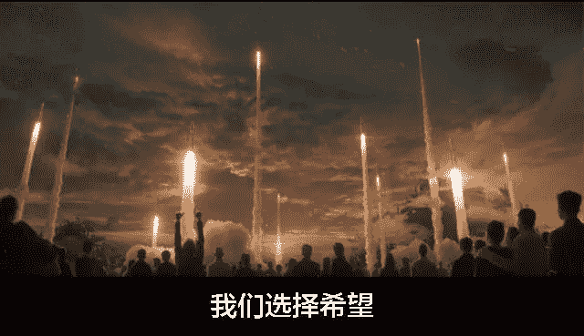

# [守夜人总司令] - 2019-02-07 C15：真正的力量及非理性求存！

> 来源：[`www.yuque.com/books/share/97051b78-926c-43e6-b0aa-0b72ff163ac4/gbeuwp`](https://www.yuque.com/books/share/97051b78-926c-43e6-b0aa-0b72ff163ac4/gbeuwp)

C15：真正的力量及非理性求存！ 

原创觉悟者守夜人总司令 

守夜人总司令 

微信号WatcherCommander 

功能介绍结构学：生命体在其生存结构中的求存之道！ 

2019-02-07[原文](https://mp.weixin.qq.com/s?__biz=MzAxNDk1NjI2Mw==&mid=2247484284&idx=1&sn=61a563a70fd5f39ba955a07f47f6d2f8&chksm=9b8a20f4acfda9e295184b0e990ebd790f71d19a25b88d9a238b777934322c96c4ff70749982&scene=27#wechat_redirect&cpage=409) 

收录于话题 

  

为了看《流浪地球》我买了早上 10：30 的票，结果睡过头了，又买了张晚上 10：44 分的票。走出电影院的时候快凌晨 1 点了，再加上过年，路上一辆车都没有。虽然影片存在一堆宣泄情绪的逻辑缺陷，但我看到了两个核心点： 

1.  什么是真正的力量？ 

2.  求存永远是非理性的！ 

真正的力量 

如果一个人的块头比你大，他就会比你有力量。如果另外一个人手上拿了把刀，他又会变得更有力量。如果再出现一个人拿着枪的人，他的力量也就更大。以此类推，工具的威力在持续赋予人更强大的力量！除了具象的物质工具，由人构建而成的组织也是工具，而且是聚集力量和释放力量的工具。谁能搭建结构并运用结构力量，他也就拥有更强大的力量：一个国家的领导者也和你一样只有 100 多斤，但是他所拥有的工具能赋予他更大的力量，能决定千万人的生死祸福——他可以凭空造出一座城市，也可以瞬间毁灭一个国家。这些都是力量最直观的感受！ 

万里长城万里长，不见当年秦始皇。昔日的秦砖汉瓦都变成了废墟，昔日的秦皇汉武都变成了历史名词——如果没有了传承的载体，文明只能剩下一堆尘封的记忆。人之所研究历史正是为了从中找出蛛丝马迹的规律来为未来提供指引的依据，如果没有了未来，历史也就无人在意——我们回顾过去恰恰是为了未来的存续！ 

一个身残志坚的人，一个出身于社会底层却实现逆袭的人，一个在无法存活的环境下奇迹般的生存下来的人！这样的人，这样的生命体，这样的族群，不仅让人会发自内心的敬畏，而且会让其它的同类由衷的感到恐惧！这是一种顽强的生命力，一种生生不息的存续能力，存续才是真正的力量之源！ 

所有工具性的力量都只能呈一时之能。生命体的力量来自内部，而非外部。真正的力量，是无论在什么情况下都能存续下去的生生不息！ 

非理性求存 

这个电影的很多情节都非常的扯淡，完全经不起逻辑的推敲。巧妙的利用音乐、台词、素材、构图等综合元素铺设成一种点燃情绪、带节奏的套路。以至于整个影院里的人几乎都泪流满面——他们有的可能是在经济寒冬中坚守的企业主，有的可能是严谨理性的工程师，有的是背负债务的老板，有的是冷漠的父亲，有的是对生活绝望的人——我相信影院中的人群里什么样的人都有。然而，他们都被影片感动的热泪盈眶，泪流满面！我自认为自己比较理性，而且我看清楚了影片逻辑上的突兀和点燃情绪、带节奏的套路——包括画面，音乐，素材，对白等等，但是，我依然被“千万辆车同时掉头去做最后的救援”那个镜头所打动。当吴京为了点燃木星，开着空间站，带着人类文明最后的火种去自我牺牲的时候，空间站的人工智能控制系统叹息地说：永远别指望人类会理性行事！它无意中说出了一个底层逻辑：生命体的求存之道是非理性的！ 

生命体存在一个能被唤醒的底层共识——这种共识蕴藏在每个生命体的基因之中——就如同各种量化对比会暗示人的优劣，从而唤醒生命体作为基因载体的求存本能——对于基因的载体而言，淘汰意味着死亡。 

无论流程梳理的多么清晰，控制和反馈多么高效，AI 如何发达，都无法解决由生命体构建而成的复杂系统的根本问题！人工智能永远只是增强结构力量的工具，是生命体提高能量转化能力的工具。“基因传递对能量的无限需求和其载体对能量转化的有限能力之间的终极矛盾”，是生命体非理性求存的源头——并发的压力源于共享的规模，工具越强大，这个终极矛盾就越突出。 

无论是科技树升级还是组织度跃升，都是为了让结构力量的构建和维护成本更低。从而在体系与体系的对抗中获得优势。领导力永远不可替代，它是一种能化腐朽为神奇的艺术。最优秀的领导者不是去压制人性中非理性的部分，恰恰是充分的激发人心中非理性的部分！所有的激励机制都是通过在人心之中制造优劣的暗示，去激活生命体求存的底层逻辑。所有领导力都不是控制，而是通过指引有利于存续的目标，并唤醒生命体的底层逻辑，激活生命体非理性的求存本能。利用结构力量去对抗结构力量，以非理性战胜非理性，以群体行为制约群体行为，从而实现一种有序的动态平衡！ 

结构学进阶：觉悟社 

[F3：结构力量](http://mp.weixin.qq.com/s?__biz=MzAxNDk1NjI2Mw==&mid=2247484256&idx=1&sn=f10d9c530bfd6ea08b25d4bec657c13a&chksm=9b8a20e8acfda9fee057f2df26790f905c898132cac91d833d14e636edb00c20514d63189a88&scene=21#wechat_redirect) 

[B4：你无需为华为担心！](http://mp.weixin.qq.com/s?__biz=MzAxNDk1NjI2Mw==&mid=2247484272&idx=1&sn=b63b21dd8e2aec97201f452c0efd7175&chksm=9b8a20f8acfda9eeb379304169ddf23955b121150036cd27ea282a67cf52c9226120b51a5c96&scene=21#wechat_redirect) 

[几次成功的结构学预判](http://mp.weixin.qq.com/s?__biz=MzAxNDk1NjI2Mw==&mid=2247484266&idx=1&sn=02ab915e029cbe24d91712f741b3f37c&chksm=9b8a20e2acfda9f4498a5c76204c101ab26e7311f2fb7d3043de108d4ff6e18d72a1c889a569&scene=21#wechat_redirect) 

[A26：中导条约被废除之后！](http://mp.weixin.qq.com/s?__biz=MzAxNDk1NjI2Mw==&mid=2247484277&idx=1&sn=d8ab9b4b84cbc35b890bb468b0f0afd2&chksm=9b8a20fdacfda9eb6b00d830680d3dd3f7cad33fe6b391d238e3ada16cf858da5cb12b0ecd1b&scene=21#wechat_redirect) 

[向正在坍塌的地方踹上一脚！](http://mp.weixin.qq.com/s?__biz=MzAxNDk1NjI2Mw==&mid=2247483789&idx=1&sn=5e44b7b524c3dc4bb7705f49ed0a44a3&chksm=9b8a2205acfdab139e4b1d44ef6702b09c9fbf79505340205d13fbdaa33207a997f54bee0e97&scene=21#wechat_redirect) 

结构学应用去：觉悟社 

提问到知识星球：守夜人总司令  

觉悟者 

喜欢你就转走吧！ 

微信扫一扫赞赏作者赞赏 

已喜欢，对作者说句悄悄话 

取消 

发送给作者 

发送 

最多 40 字，当前共字 

 人赞赏 

上一页 1/3 下一页 

长按二维码向我转账 

喜欢你就转走吧！ 

受苹果公司新规定影响，微信 iOS 版的赞赏功能被关闭，可通过二维码转账支持公众号。 

### 精选留言 

用户设置不下载评论 

[阅读全文](https://t.zsxq.com/juj2rjM)