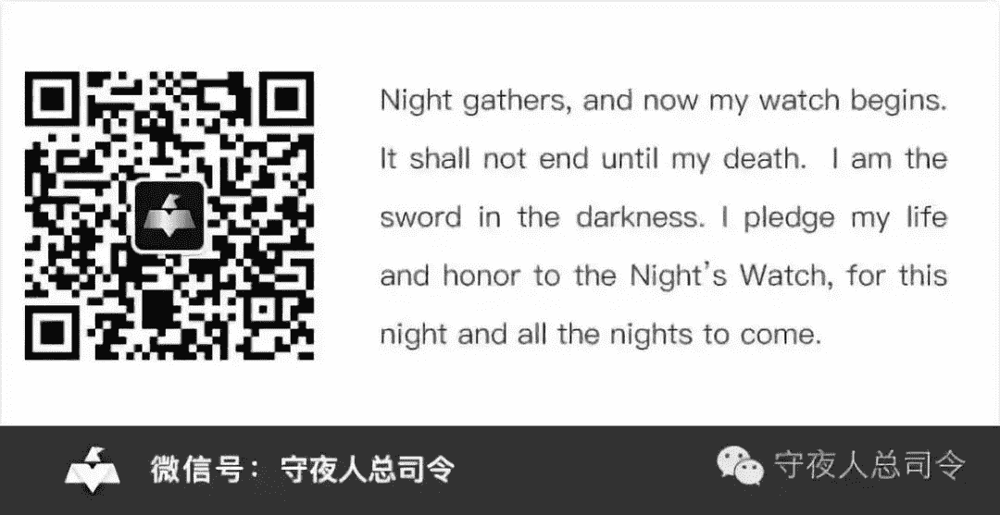

# [守夜人总司令] - 2019-01-02 2019：是福不是祸，是祸躲不过！

> 来源：[`www.yuque.com/books/share/97051b78-926c-43e6-b0aa-0b72ff163ac4/xm2af1`](https://www.yuque.com/books/share/97051b78-926c-43e6-b0aa-0b72ff163ac4/xm2af1)

2019：是福不是祸，是祸躲不过！ 

原创觉悟者守夜人总司令 

守夜人总司令 

微信号WatcherCommander 

功能介绍结构学：生命体在其生存结构中的求存之道！ 

2019-01-02[原文](https://mp.weixin.qq.com/s?__biz=MzAxNDk1NjI2Mw==&mid=2247484162&idx=1&sn=40447a5d8c0803b91846f28938270900&chksm=9b8a208aacfda99c6dc115209a12d9c033173e0ee0028a438c0eb8e45f0d378880a5da19d941&scene=27#wechat_redirect&cpage=441) 

收录于话题 

大家新年好！ 

此时此刻已正式进入 2019 年。2019 年会是一个充满挑战的年份。我们正是在各种挑战中变得更加的强大，更加的睿智，更加的淡定——成长就是一个把哭闹调到静音的过程。没有人回望过去的时候不觉得以前的自己很傻逼。正因为如此，我们才感受到实实在在的成长。很多东西不是想要就能要的到，首先自己得配得上——这也是为什么必须自我修炼的原因。 

四个多月前，一个机缘巧合，我为一个做投资的朋友写了一篇预判贸易战是否会发生的文章《[向正在坍塌的地方踹上一脚！](http://mp.weixin.qq.com/s?__biz=MzAxNDk1NjI2Mw==&mid=2247483789&idx=1&sn=5e44b7b524c3dc4bb7705f49ed0a44a3&chksm=9b8a2205acfdab139e4b1d44ef6702b09c9fbf79505340205d13fbdaa33207a997f54bee0e97&scene=21#wechat_redirect)》被转发出去引来很多人，从此一发不可收拾，需要每天花点时间来输出内容。黄河 提议我注册一个知识星球，我就注册了知识星球：守夜人总司令。当我没去与这个世界沟通的时候，我是我；当我通过文字与这个世界沟通以后，我依然是我。我写的实践总结和观察研究不管有没用，对我而言，它就是零散的手稿。如果碰巧还对你有点用，那就是额外的价值了！ 

我无意向谁传播什么，更无意说服任何人接受我的东西。结构学是一种社会应用之学——我认为这个世界不管多么的繁杂，归根结底都是生命体在其生存结构中，为自我存续所采取的各种策略。个体的精神结构决定了每个生命体都对外部世界进行了筛选和抽象，并活在自己的抽象之中。由个体组成的群体，也就是更大的生命体。个体精神结构中的共识部分形成了整个生命体的意识形态，从而确定整体的立场——文化天然有其自我遮蔽性正源于此！ 

当生命体处于某种立场之中，不管是浑然不觉，还是被相互约束裹挟着，其行为轨迹和思维方式都必然在这种内在制约的束缚下沿着某种轨迹前行... 人所有的智慧都是在不确定中寻找确定，人所有的安全都源于有章可循——如果历史不能为当下和未来的困惑提供决策的依据，没有人会在乎历史。博弈中最大的弱点正是行为可被预测——无论是个人、组织、社会，概莫如此！ 

生命体陷在自己的精神结构之中，必然不断的自我强化，这种强化会让认知、行为、目标、约束条件和检测标准，都越来越偏离事实。因此你可以看到很多陷入逻辑自洽模型中的聪明人犯愚蠢的错误。因缺有需，故而造出万千幻像；能量守恒，必然反朴归真！所谓创造奇迹，无非就是能跳出各种具有自我遮避的立场，以冷眼旁观的理性去思考和行动！我不奉任何一种学问为唯一真理，任何学科都是认知生命体在生存结构中寻找出口的工具！ 

东方文明过于强调高度概括的哲理性格言。这格言虽然放之四海皆准，但无法用它对具体的问题做判断。结构学的立论之点也只有一句话：生命体在生存结构中的存续之道！驱动这一切的是“基因传递对能量的无限需求与能量的有限转化之间的终极矛盾”。 

哲学家确立法理原则，法理和事实之间存在着演化过程——律师、政治家，企业家所做的事，就是通过观察、思考和实践，构建并验证连接二者的规则——整个人类社会和所有资源配置就在这些规则之中运转。在核心原理和对现实问题的判断和决策之间，存在一个传导体系——它就是结构学！ 

2019 年，我会花些时间把它逐一展开，搭建出逻辑严密的完整体系，并以直观的形式呈现出来。然后会围绕框架补充更多维度的工具，让它应用于现实问题，比如投资，营销，管理及生活中的取舍等。再次祝大家新年快乐！ 

结构学应用去小红圈：觉悟社 

提问到知识星球：守夜人总司令 

  

觉悟者 

喜欢你就转走吧！ 

微信扫一扫赞赏作者赞赏 

已喜欢，对作者说句悄悄话 

取消 

发送给作者 

发送 

最多 40 字，当前共字 

 人赞赏 

上一页 1/3 下一页 

长按二维码向我转账 

喜欢你就转走吧！ 

受苹果公司新规定影响，微信 iOS 版的赞赏功能被关闭，可通过二维码转账支持公众号。 

### 精选留言 

用户设置不下载评论