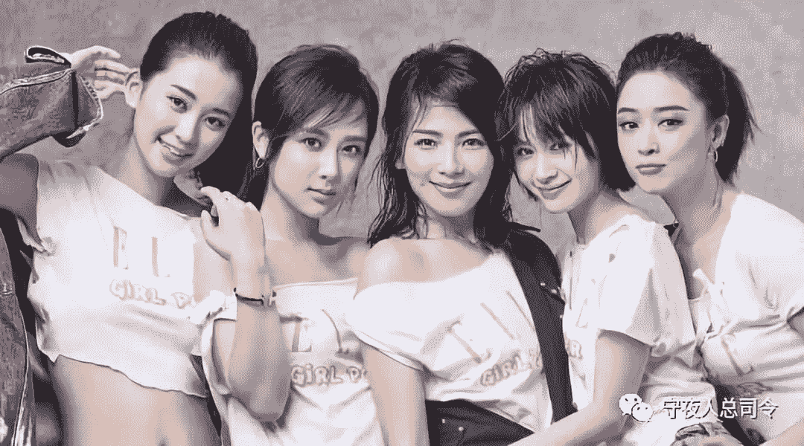

# [守夜人总司令] - 2018-08-07 欢乐颂中的阶层

> 来源：[`www.yuque.com/books/share/97051b78-926c-43e6-b0aa-0b72ff163ac4/ihog6t`](https://www.yuque.com/books/share/97051b78-926c-43e6-b0aa-0b72ff163ac4/ihog6t)

欢乐颂中的阶层 

原创觉悟者守夜人总司令 

守夜人总司令 

微信号WatcherCommander 

功能介绍结构学：生命体在其生存结构中的求存之道！ 

2018-08-07[原文](https://mp.weixin.qq.com/s?__biz=MzAxNDk1NjI2Mw==&mid=2247483834&idx=1&sn=a5b52ae1fab80319d06d39779dceaca0&chksm=9b8a2232acfdab24e70145a5e69d1fb978a368f1dcc8f5fc95625ec5d0439d3de2a8f9bfb93e&scene=27#wechat_redirect&cpage=497) 

收录于话题 

那些自己都无法察觉的特征，会从细节中溢出，流得满地都是… 

如果你在小区里遇到一个比你挣得多的多的人，你们依然是属于同一阶层的人，真正与你不是同一个阶层的人，根本不会出现在你经常出现的环境中。这才是现实生活正常的样子！所以，在欢乐颂中的情况不会在现实生活中发生：安迪、小曲与关关、樊胜美、小邱她们完全不是同一个阶层的人，各自的认知层次和活动轨迹也完全没有交集。 

一线城市的房价其实就如同高考一样——是一种人群的筛选工具！虽然我们生活在同一个物理空间中，但不同阶层的人是被一些无形的东西互相隔绝的——你没有见过，甚至无法想象和你不同阶层的人的生活方式和思考问题的方式。这是事实！ 

  

家庭出身带来的认知局限，在很大程度上影响一个人看人看事的态度和能力，影响一个人的生活状况。在那些没有信心靠自己的奋斗找到前途的人群当中，你很难找到独立的精神和坚强的个体——樊胜美、关关和小邱无不例外：她们会放大自己内心的恐惧和焦虑并转嫁给别人，樊胜美真的是被原生家庭拖累的吗？其实，她和原生家庭中的人没有任何区别。她吸附他人的程度丝毫不亚于原生家庭对她的程度。她一直没有自我的目标设定，所有关注力都集中在吸附目标身上。她貌似精通人情世故，但所有的“智慧”也仅仅止步于小心翼翼的抓住依附目标而已，这和她家的人在本质上是一致的。小邱以另外一种面目出现，貌似狂热而单纯，但骨子里也是把所有的未来寄希望于他人，而不是自己。这种“真情”不管以什么形式出现，都是一种模糊了边界的深度介入——阶层惯性决定了这样的心态和认知方式。而关关总像一个路人甲，她来自城市中产家庭，什么事都是父母安排好的，因为不能自我设定目标，存在感一直缺失，她做事永远瞻前顾后，脱离不了依附的母体。这些群体统统缺乏目标感，搞不清楚自己到底是谁，自己与外部的关系的边界在哪里。她们彼此之间的温情只是这个群体自我麻痹的幻觉。为什么越贫穷的地区越喜欢讲究礼数？为什么越贫瘠的土地，宗教越盛行？ 

  

王柏川的一切都是自找的，他对自我目标设定不清晰，目标感模糊，他的所有真诚、聪明、担当都是在一个必然坍塌的结构中做一些让自己感动的表演。他不能用理性的认知去决策，搞不清楚事情的先后顺序和轻重缓急。这是区分樊胜美阶层和小曲阶层的分界线！王百川没有能够进入小曲那个阶层的根本原因不是他破产，而是他的认知及行为都不是从理性出发的！ 

安迪受的是美式教育，她的自我目标设定非常清楚，事情的界限非常分明，能够理性的看待人和事。她的独立性源于她的自我认知和生活态度——财富、地位、人脉是果不是因！当她要阻止小包总的妈妈调查她弟弟的时候，她没有歇斯底里，没有哀求，而是立刻找到小包总的妈妈最在乎钱这个关键点做文章，逼其就范。小包总的父母都以小包总与她的关系来威胁，她很洒脱的告诉对方，她可以放弃！一个非常清楚自我目标设定的人，很多事会拧得非常清。这是一个阶层看待自己和外部关系的方式，一个阶层思考和处理问题的方式。你不可否定她对小包总的真情，你同样不用低估她理性的决绝——看似南辕北辙的矛盾就是能够如此完美的统一。这在小邱那个阶层无法理解的！ 

小曲和安迪其实不是同一个阶层，她介于安迪和樊胜美之间的阶层。她清楚自己是谁，知道自己要什么，而且有行动力，善于打造工具去借力解决问题；同时，心中潜伏着某种恐惧，对自己和他人都充满了怀疑。小曲和魏渭属于同一阶层——她们对外界和自己的认知都是将信将疑的，对自己与外界的关系也是如此。她们的认知和心态在樊胜美的阶层和安迪的阶层之间摇摆，这两个阶层的特征都会在这种摇摆中流露出来…  

谭宗明是“扫地僧”级别的存在，他对任何事情都能掌控全局。对人性和世事都洞若观火，能够在只言片语中直击问题要害。你能在他身上找到各阶层最闪亮的点，他是超越一切的存在，是顶级社会精英的状态——是编剧和导演合谋捏造出来的！ 

提问到知识星球：守夜人总司令  

觉悟者 

喜欢你就转走吧！ 

微信扫一扫赞赏作者赞赏 

已喜欢，对作者说句悄悄话 

取消 

发送给作者 

发送 

最多 40 字，当前共字 

 人赞赏 

上一页 1/3 下一页 

长按二维码向我转账 

喜欢你就转走吧！ 

受苹果公司新规定影响，微信 iOS 版的赞赏功能被关闭，可通过二维码转账支持公众号。 

### 精选留言 

用户设置不下载评论