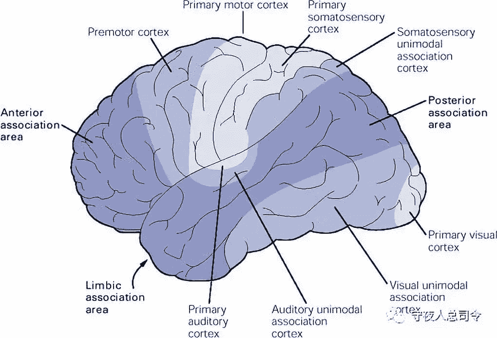

# [守夜人总司令] - 2018-07-13 那些爆款文章的套路

> 来源：[`www.yuque.com/books/share/97051b78-926c-43e6-b0aa-0b72ff163ac4/lnc7td`](https://www.yuque.com/books/share/97051b78-926c-43e6-b0aa-0b72ff163ac4/lnc7td)

那些爆款文章的套路 

原创觉悟者守夜人总司令 

守夜人总司令 

微信号WatcherCommander 

功能介绍结构学：生命体在其生存结构中的求存之道！ 

2018-07-13[原文](https://mp.weixin.qq.com/s?__biz=MzAxNDk1NjI2Mw==&mid=2247483792&idx=1&sn=aad67ba1785c2f2ea2131b80820edc42&chksm=9b8a2218acfdab0e4175f4ffe882793f423afbf3f619309e6ee9e7f86b6f2760ea844c47308f&scene=27#wechat_redirect&cpage=514) 

收录于话题 

细节里藏着真相，你所深信的全是错的！ 

冲突与反转 

引人入胜的文章、广告和演说都善于渲染冲突，利用冲突激发情绪，甚至故意制造冲突，再循循诱导，展开解决冲突的方案，给人一种豁然开朗的畅快感… 

人的大脑由三层构成：表皮层负责语言和逻辑，中间层负责情绪，本能层直接触发行为。为什么很多人分析来计划去就是没有行动呢？因为这类思考没能激发情绪，无法通过大脑的情绪层传递到能触发行动的大脑本能层——人在情绪激动的状态下很容易采取行动，也是基于大脑的这种结构！ 

冲突容易激发情绪，情绪则容易触发行动。所以要渲染冲突、利用冲突，甚至制造冲突！冲突从哪里来？冲突源于人心中相互矛盾的诉求：价廉物美，这就是一个冲突：俗话说一分钱一分货——价格和成本需要匹配——其实大家都清楚这一点。但是，人性天然的占有欲和支付不起的现状，就自然而然制造了内在的冲突！缓解这个冲突的方法有两种：1\. 营造幻觉；2.降低成本。为什么越是悲惨的弱者越容易被骗呢？因为对方营造的幻觉恰好能解决他内在的冲突！ 

大脑的构造决定了情绪一旦传递到本能层就会触发行为。为了避免过于频繁的触发行为引起混乱，人类的大脑进化出了一套被称之为“预期管理”的缓冲机制：有了这套机制之后，就不是任何情绪都会马上被传递，只有突破预期阈值的情绪才会被传递到本能层，并触发行为。所谓自制力，控制情绪，其实就是提高这种预期的临界值——小镇青年刚来到花花世界随便遇到一个姑娘都会要死要活；而见多识广的老司机，在任何深情款款的套路下都坐怀不乱——这正是预期被不断拔高的结果。战场上新兵很容易崩溃，但老兵都非常淡定，因为啥情况都见识过，预期较高，能够临危不乱。 

鉴于这样的大脑和心理机制，高手们在写作、宣传和演讲的时候，用充分利用这样一种技巧：反转！创造一种完全出乎意料之外的场景，瞬间击碎人们的心理预期，让情绪立刻传到本能层并触发行为！伴随着这一过程会瞬间释放血清素，造成神经系统瞬间被清洗了一遍的兴奋感。每当这个时候你会拍着大腿，击节赞叹：妈的，说的太对了！ 

反转的常规套路是：作者会先提出一个充满哲理的结论，继而是有理有据的逐一论证，当你渐入佳境逐步认同——真相呼之欲出之时，作者突然打出四个大字：以上全错！然后，他再逐条驳斥，层层推进，让真相慢慢图穷匕见——直至真相大白高潮迭起！这种感觉就如同你沉浸于即将高潮的瞬间，突然有人冲了进来——结果发现：冲进来的是一个更加热情奔放的参与者！！ 

  

营造画面感 

婴幼儿对形状和颜色的辨别，远远的走在语言前面——在人脑的进化中：图像识别和空间感知是生存之道，它较容易产生情绪并立刻触发行为——兴奋得扑上去或恐惧得撒腿就跑！语言、逻辑、抽象都处于表皮层，有时候你能感知对方的情绪，却无法用语言表达清楚。因此，让表达呈现立体的画面感，大脑就会立刻记住，印象深刻！ 

最让人击节赞叹的文章善于营造更高层次的画面感：通过细节呈现出镜头之外波澜壮阔的立体时代画面——它往往透过城市角落的变迁、时代生活的侧影，个人命运的门缝逐一展现出来… 

从云端俯视的镜头首先框住的是夜幕下被红色尾灯塞满的高架桥，以及桥两侧正拔地而起的高楼和灯火通明的大厦——随后，镜头聚焦于大桥下将被拆迁的小店里一群举杯相庆憧憬未来的少年——他们脸上洋溢的乐观和对未来充满琥珀色的美好憧憬正是这座城市生生不息的燃料！就在不远处，一群正在抽烟的人席地而坐，目光呆滞的看着彼此，工地之外的整座城市他们都毫无感知… 

三段式结构 

一篇好文章大多由三块主体内容构成——人的潜意识对三这个数字较敏感：事不过三；道生一，一生二，二生三，三生万物；一而再，再而三；三人行，必有我师——三似乎是某种边界，在左右两个针锋相对又势均力敌的平衡中，一锤定音的指引着方向！ 

无论演讲、广告还是文章，气势如虹的排比句一般都是连续三句——两句显得底气不足，四句又显得拖泥带水，三句刚刚好！这是一种结构性的力量，与大脑中某种潜意识的偏好恰好契合。因此，顺着这一结构就能恰到好处的借用这股力量！ 

爆款文章的套路：首先，勾勒一幅微观的立体画面来描述现象，引出问题、制造冲突、诱发情绪。继而，在解剖问题的过程中，逐渐切换到宏观视角，把问题的本质和关键要素逐一展开，并加以提炼和论证，期间还会突然制造一些反转。最后，再切回微观视角，让读者潜移默化的把自己代入场景之中…  

觉悟者 

喜欢你就转走吧！ 

微信扫一扫赞赏作者赞赏 

已喜欢，对作者说句悄悄话 

取消 

发送给作者 

发送 

最多 40 字，当前共字 

 人赞赏 

上一页 1/3 下一页 

长按二维码向我转账 

喜欢你就转走吧！ 

受苹果公司新规定影响，微信 iOS 版的赞赏功能被关闭，可通过二维码转账支持公众号。 

### 精选留言 

用户设置不下载评论