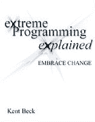

# 企业家书籍:极限编程讲解

> 原文：<https://web.archive.org/web/venturehacks.com/extreme-programming-explained>

#### [Nivi](/web/20221208085102/https://venturehacks.com/about)2008 年 12 月 1 日

“我们在 Heroku 确实使用了敏捷方法——我在自己创办的上一家公司开发了自己的(非正式)敏捷风格，并将它带到了这个项目中。”

–[亚当·威金斯](https://web.archive.org/web/20221208085102/http://adam.blog.heroku.com/)，创始人， [Heroku](https://web.archive.org/web/20221208085102/http://heroku.com/)

我第一次了解到[精益创业](/web/20221208085102/https://venturehacks.com/articles/lean-startups)是在一本名为[敏捷软件开发](https://web.archive.org/web/20221208085102/http://www.amazon.com/gp/product/0135974445?ie=UTF8&tag=httpventureco-20&linkCode=as2&camp=1789&creative=390957&creativeASIN=0135974445)的优秀书中——在我们的[评论](/web/20221208085102/https://venturehacks.com/articles/agile-software-development)中了解更多。

我精益之旅的第二步是一本叫做[极限编程的书讲解](https://web.archive.org/web/20221208085102/http://www.amazon.com/gp/product/0201616416?ie=UTF8&tag=httpventureco-20&linkCode=as2&camp=1789&creative=390957&creativeASIN=0201616416)。它非常便宜(你可以花一便士买到第一版)，而且整本书对非程序员来说都是可以阅读的。如果买的话，尽量拿[第一版](https://web.archive.org/web/20221208085102/http://www.amazon.com/gp/product/0201616416?ie=UTF8&tag=httpventureco-20&linkCode=as2&camp=1789&creative=390957&creativeASIN=0201616416)——[第二版](https://web.archive.org/web/20221208085102/http://www.amazon.com/gp/product/0321278658?ie=UTF8&tag=httpventureco-20&linkCode=as2&camp=1789&creative=390957&creativeASIN=0321278658)不如第一版。

这本书的副标题是“拥抱变化”——下面是一些摘录，可以吊起你的胃口…

### 驱动隐喻

> “驾驶不是让汽车朝着正确的方向行驶。开车就是要不断的注意，这边一点点修正，那边一点点修正。
> 
> “这是极限编程(XP)的范例。保持警惕。适应。改变。
> 
> “软件中的一切都在变化。需求发生了变化。设计改变了。生意变了。技术在变化。团队会改变。团队成员会发生变化。**问题不在于改变，因为改变即将发生；相反，问题在于我们无力应对变化。**

### 什么是 XP？

> “对一些人来说，XP 似乎只是一个很好的常识。那么为什么名字中有“极端”这个词呢？ **XP 将常识性的原则和实践发挥到极致**。
> 
> *   如果代码审查很好，我们将一直审查代码(结对编程)。
> *   如果测试很好，每个人都会一直测试(单元测试)，甚至是客户(功能测试)。
> *   如果设计是好的，我们会让它成为每个人日常工作的一部分(重构)…
> *   如果集成测试很重要，那么我们将一天集成和测试几次(持续集成)。
> *   如果短迭代是好的，我们将使迭代非常非常短——几秒、几分钟、几小时，而不是几周、几个月、几年(计划游戏)。
> 
> “当我第一次阐述 XP 时，我的脑海中有一幅控制板旋钮的图像。每个旋钮都是一种实践，从我的经验来看，效果很好。我会把旋钮调到 10，看看会发生什么。我有点惊讶地发现，整套实践是稳定的、可预测的和灵活的。”

### XP 承诺了什么

> 对程序员来说，XP 承诺他们将能够每天从事真正重要的事情。他们不必独自面对可怕的情况。他们将会竭尽全力使他们的系统成功。他们会做出他们能做得最好的决定，而不会做出他们没有资格做出的决定。
> 
> "**对于客户和经理，XP 承诺他们将从每个编程周中获得最大可能的价值**。每隔几周，他们就能看到他们关心的目标的具体进展。他们将能够在开发过程中改变项目的方向，而不会产生过高的成本。”

如果你已经读过这本书，请告诉我们你是如何喜欢它的。如果你没有，你还在等什么？