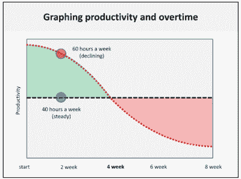

# 生产力法则

> 原文：<https://web.archive.org/web/venturehacks.com/laws-of-productivity>

[生产力法则](https://web.archive.org/web/20221128042622/http://lostgarden.com/2008/09/rules-of-productivity-presentation.html)是想要更有生产力的创业公司的必读报告。这里有一个[到 pdf 的直接链接](https://web.archive.org/web/20221128042622/http://lostgarden.com/Rules%20of%20Productivity.pdf)。这是我对这次演讲的总结:

> **个人**
> 
> 1.  每周工作 40 小时。(工作多了感觉做的多了，其实做的少了。)
> 2.  在那 40 个小时里，低于能力工作(比如 80%)。
> 3.  考虑将 40 小时分配在 4 天而不是 5 天。
> 4.  获得你需要的睡眠；分配 8 小时。
> 5.  如果你需要短期的生产力提升，那就多工作 3 周。但预计之后生产率会相应下降。
> 
> **团队**
> 
> 1.  在小型跨职能团队中工作(< 10 people).
> 2.  Put team members in a dedicated and closed room.
> 3.  Try not to split people’s time across multiple teams at once.

感谢[丹·库克](https://web.archive.org/web/20221128042622/http://www.lostgarden.com/)制作了这个演示文稿，感谢[陈楚翔](https://web.archive.org/web/20221128042622/http://andrewchenblog.com/)让我注意到它。

**话题** [精益](https://web.archive.org/web/20221128042622/https://venturehacks.com/topics/lean)