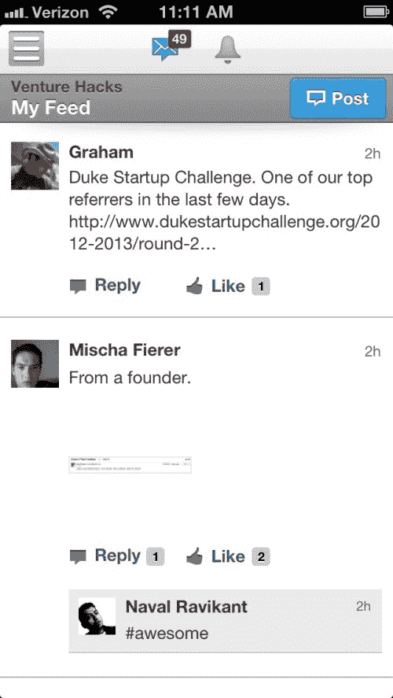
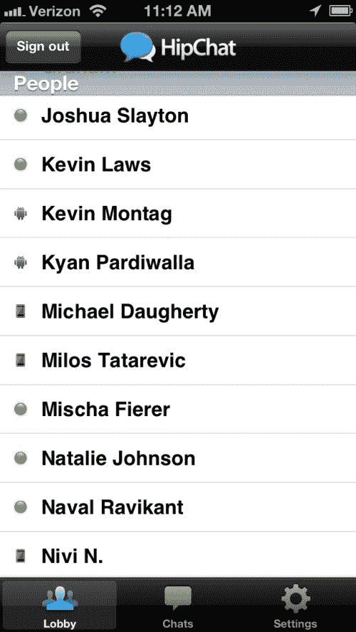
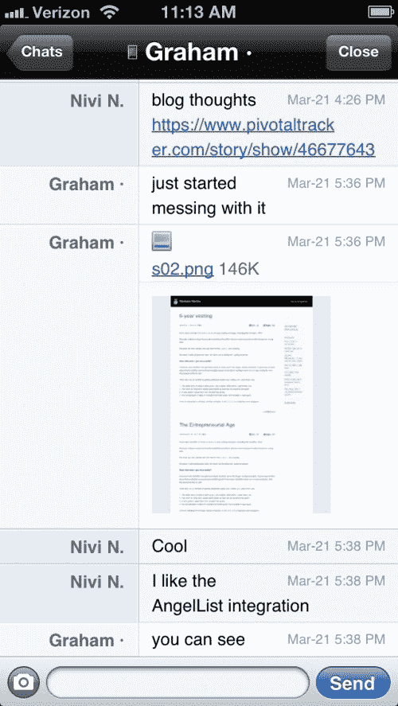
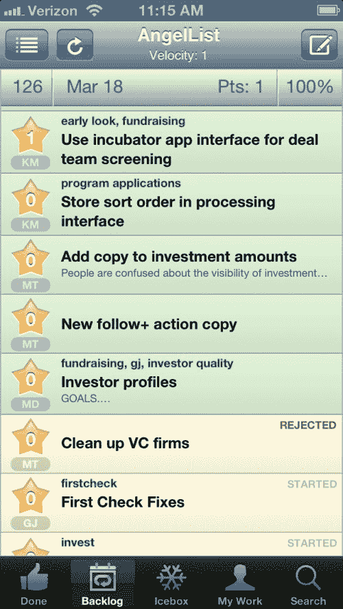
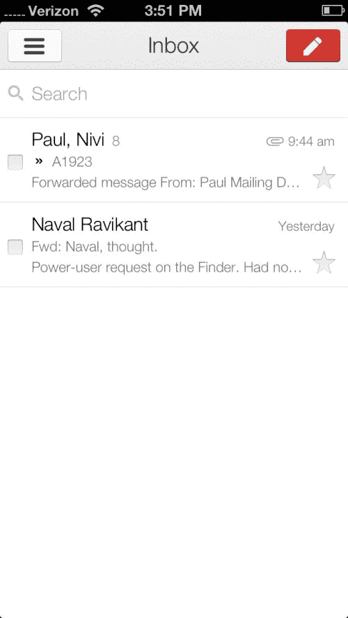

# AngelList 没有邮件

> 原文：<https://web.archive.org/web/venturehacks.com/no-email-at-angellist>

我们在 AngelList 很少使用电子邮件。我们大部分的交流发生在 Yammer，HipChat，Tracker 和面对面。这可能会让我们减少 90%的电子邮件。

如果你通过电子邮件经营你的公司，你就错过了更新、更有效的通信技术。

**Yammer 是我们公司的邮件列表**

[Yammer](https://web.archive.org/web/20221006052707/https://www.yammer.com/) 有嵌套对话、搜索、内嵌图片和赞。这也是我们公司的目录。他们有一个移动应用程序。

我们用它在全公司范围内进行异步通信。最重要的是，它将我们公司的“邮件列表”排除在电子邮件之外。

Yammer、HipChat 和 Tracker 都有电子邮件、手机和桌面通知。你不需要每 5 分钟检查一次。

**HipChat 是 IM 的**

HipChat 是一款桌面和移动的 IM 应用。它有内嵌图片、在线状态、搜索和公司目录。当你不在办公室时，这个(有缺陷的)iPhone 应用程序可以让你随时联系到你。

它还支持多人房间(我们为工程师准备了一个房间)，并且它有一个 API，我们用它来为其他房间提供异常、GitHub 通知和部署。

我们使用 HipChat 进行同步一对一和群组交流。

如果您使用 Skype 进行即时通讯，请尝试 HipChat。备选方案包括 Yammer，它有基本的 IM。或者有墙和基本 IM 的脸书组。但是我推荐 HipChat。

**跟踪器用于产品规格**

我们使用[追踪器](https://web.archive.org/web/20221006052707/http://www.pivotaltracker.com/)为新特性制定目标和任务。每个规范都有自己的待办事项列表、图像附件、注释和状态。还可以很容易地重新划分功能的优先级，并将它们分配给不同的人。有些人更喜欢 [Asana](https://web.archive.org/web/20221006052707/http://asana.com/) 或 [Trello](https://web.archive.org/web/20221006052707/https://trello.com/) 的规格。

**面对面是为了其他一切事情**

最大的公司不是远程建立的。家庭不是住的很远。运动队不会远程训练。

面对面是为了高带宽的交流，亚交流(肢体语言和面部表情)，留下印象，新的想法，偷听别人的谈话，与你的同事建立联系，白板，扔椅子，以及其他一切你需要说的建立一个大企业。

**当我们使用电子邮件的时候**

我不鼓励新团队成员使用电子邮件，但我们在一些地方会使用电子邮件。

第一，当我们需要和公司以外的人交流的时候。

第二，当我们需要与公司内部的一群人交谈时。HipChat 不太适合只需要讨论单一任务的特设小组，比如“我们应该如何协商这笔交易。”

第三是懒惰和愚蠢(有罪)。

**更新**:在 [Quibb](https://web.archive.org/web/20221006052707/http://quibb.com/links/no-email-at-angellist) 上有一个关于替代方法的精彩讨论。

**截图**

以下是手机应用的截图。他们也都有桌面应用程序。

**Yammer**

【T8

**HipChat**

**跟踪器**

【T8

**我的收件箱**

[评论黑客新闻→](https://web.archive.org/web/20221006052707/https://news.ycombinator.com/item?id=5424672)