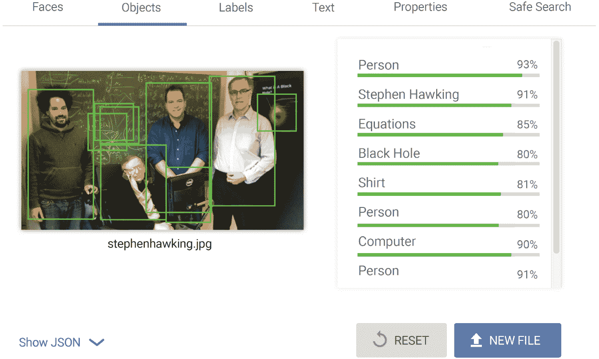

# 第一部分：平台

# 1 尝试、失败、分析、调整：YouTube 的历史课

你有没有看过上传到 YouTube 的第一个视频？

这是一个重要的问题。真的，这很重要。我认为这不仅仅因为我是 YouTube 专家，认为这是高质量的内容（剧透：不是）。我认为这很重要，因为这是历史，我们可以从历史中学到很多东西。作为一个视频制作人，我喜欢纪录片和传记片。它们让我着迷，因为了解过去帮助我们理解和应对当下的世界。当我们探索历史，我们看到决策和事件如何影响人们，无论是好是坏，以及它们如何影响人们的家庭、社区，最终影响整个世界。

但是我为什么要在一本关于 YouTube 和赚钱的书中谈论历史对世界的影响呢？我告诉你为什么：研究任何事物的历史都可以使想要了解更多并在该领域取得成功的人受益。显然，这同样适用于 YouTube 创作者。我真心相信，如果创作者和企业花时间从 YouTube 的历史中学习——它是如何成为基于失败和成功的决策而成为巨大平台的——他们将成为更好的内容创作者和企业，并更有能力在平台上取得成功。

那么 YouTube 是如何开始的，这对你和你的内容有什么影响呢？

2002 年 7 月，备受尊敬的初创公司 PayPal 刚刚被 eBay 以 15 亿美元收购。这在硅谷引起了很大轰动。人们开始讨论可能能带来大量利润并将世界变成数字赚钱巨头的网站、应用和平台的想法。三名 PayPal 员工 Jawed Karim、Chad Hurley 和 Steven Chen 就是这些创意的提出者之一。他们很快想出了 YouTube 网站的主意，但它与我们今天熟悉的网站完全不同——他们最初将其作为一个约会网站。

从他们在车库里临时搭建的办公室，域名“[YouTube.com](http://youtube.com)”于 2005 年 2 月 14 日情人节启用，这是一年中开始约会网站的完美日子。4 月 23 日，他们上传了 YouTube 的第一个视频，名为“我在动物园”。这是 Karim 在圣地亚哥动物园谈论大象的 19 秒视频。如果你现在去看，你会笑，因为你知道他当时试图让网站成为约会的地方，他对大象的解剖做了暗示。那时的视频对非专业人士来说实际上是相当高质量的。

现在他们已经开始了，服务器也在运行，这些人需要活跃的网站用户。谁是寻找爱情的人群？大学生。所以他们去了最近的斯坦福大学校园，进行了相当大规模的宣传，向每个愿意接受的人发放传单。他们的口号是“收听，约会”。网站上几乎没有视频，所以他们上传了 747 飞机起飞和降落的视频。没有任何意义；他们只是想在网站上放些视频。“整件事情毫无意义，”Karim 说。“我们非常渴望一些真正的约会视频，不管那意味着什么，所以我们转向了任何绝望的人都会转向的网站：Craigslist。”他们在洛杉矶和拉斯维加斯发布了广告，向女性提供 20 美元/视频的报酬来上传自己的视频。他们一共收到了零回应。

这里变得有趣和适用：一旦人们开始使用他们的“约会”网站，这三人在最初的几周和几个月里查看了数据，他们意识到网站的少数用户根本不是来约会的；他们是来自我广播的。他们上传了自己和朋友做有趣、尴尬或奇怪的事情的视频。他们上传了宠物的视频，滑雪的视频，随机地方和事物的视频等等。

在这个关键时刻，卡里姆、赫利和陈需要做出一个决定：他们应该继续按计划将 YouTube 推广为一个约会网站，还是应该完全改变他们的商业模式，因为数据显示用户群并不是想约会的人？“忘掉约会方面，”陈说。“让我们开放给任何视频。”这就是 YouTube 的力量所在。基于数据反馈，他们改变了方向，迎合了用户的需求。

在 6 月，他们创建了鼓励自我广播的工具。他们提供了一个不断增长的生态系统，供人们上传各种随机视频。他们推出了一个“嵌入”视频选项，成为网站和推广的游戏规则改变者。简而言之，他们为自制视频创作者提供了平台和控制权，让他们可以从世界任何地方与世界分享他们的视频，因为这就是人们想要的。这些网站用户并不是在 YouTube 上寻找约会，他们是在寻找一个地方来展示他们的作品和创造力。

这个决定导致 YouTube 成为世界上最强大的视频平台，并打破了我们所知的娱乐行业。这改变了视频娱乐的游戏规则，将创作权从少数人手中转移到了每个人手中，只要他们愿意。有了录制设备和互联网连接，任何人都可以向整个世界广播视频！这在今天是常态，但想想它在开始时有多么重要。大企业和品牌开始关注，改变他们的内容创作和广告策略。随着权力转移到普通人手中，品牌抓住了赞助拥有独特有机观众的创作者的机会。大企业以前从未面临过这种竞争，这是一个不可忽视的力量。

这个网站继续迅速增长。谷歌看到了该网站的早期潜力，于 2006 年以 16.5 亿美元收购了 YouTube。如今，超过三分之一的互联网移动流量来自 YouTube。每天在 YouTube 上观看的视频总时长超过 10 亿小时，几乎有 20 亿登录用户每月访问该网站。近 100 个国家都有本地版本的平台可供使用。

如果这些人忽视了数据反馈，决定坚持他们最初的计划，并坚持认为 YouTube 必须是一个约会网站，你认为所有这些会发生吗？他们曾经尝试过约会网站，但失败了。所以他们专注于问题，分析了什么起作用以及为什么，然后调整了策略以支持更多的内容。

YouTube 的起源故事是如何尝试、失败、分析和调整以在 YouTube 上取得成功的终极元例。这个公式*就是*YouTube 的公式。了解它的历史将帮助你作为创作者或企业了解如何利用这个公式取得成功。你必须分析什么起作用，什么不起作用，并相应地进行更改。这是整本书构建的前提。如果你能掌握这个“大想法”基础公式，你就已经迈出了正确的第一步，你已经准备好学习在 YouTube 的广阔世界中做出所有差异的逐步调整。

在第一部分中，我分解了算法，让你了解 YouTube 平台的运作方式，以便成为其中的一部分。在第二部分中，我向你展示了 YouTube 上无尽的机会——曝光、艺术性、合作、赞助、商品销售和业务所有权的机会。我告诉你不同类型的创作者和企业是如何抓住这些机会，并超越了仅仅“靠 YouTube 谋生”的阶段。在 YouTube 上有很多种赚钱的方式，但更重要的是，影响力的力量。我可以向你展示你的影响力可以产生重大影响。

在第三部分中，我分解了 YouTube 内容规划、创作、执行、分发、分析和调整的公式。我教你如何找到你的观众，与他们交流，并将他们转化为你自己的忠实社区。我教你交通来源的重要性，这样你就知道观众来自哪里，以及如何让你的内容被看到。我帮助你阅读指标图表，这样你就可以识别数据模式。你的 YouTube 成功取决于培养这些技能，所以准备好学习和接受它们。

我已经帮助无数 YouTube 频道抓住他们自己看不到的增长机会。我还帮助创作者和品牌学习如何获得观看次数，赚钱和建立业务的步骤。如果你遵循这个公式，并敞开心扉接受我即将向你展示的机会，你可以在 YouTube 上获得你一直想要的结果。

# 2 YouTube 生态系统

为了真正了解 YouTube 的运作方式，我们首先需要看看它作为数字生态系统是如何运作的。数字生态系统的运作方式与自然生态系统类似：有许多运动部分，所有这些部分都会影响整体的组织。小学的科学课教会我们自然生态系统中的能量流动；光合作用、植物和动物、分解和营养转化都是循环的一部分。链条中的每个因素都有它的工作要做，如果它不正常工作，就会影响整个运作。

YouTube 的生态系统也有一个流动和循环，它的贡献者会对整体产生影响，无论是好是坏。这个数字生态系统包括创作者、观众、广告商/品牌、版权持有者、多频道网络（MCNs）和 YouTube 本身。

以下是 YouTube 生态系统运作方式的简要概述：创作者制作视频并上传到 YouTube。品牌支付 YouTube 在上传的内容旁边或视频播放期间播放广告。当频道符合广告分成计划的要求时，它可以从其内容上播放的广告中获得一部分收入。品牌还与他们认为能够增加品牌知名度和/或底线的创作者联系。这种影响者营销是 YouTube 生态系统的重要组成部分。观众来与内容、创作者和社区互动。他们观看、订阅、评论、点赞和点踩、保存和分享。YouTube 作为一个网站是生态系统的主持者，但作为一家公司，它是生态系统的一部分。YouTube 公司必须确保生态系统中的每个人都满意。他们处理投诉和法律事务。他们最终制定规则，但这些规则会随着时间的推移根据生态系统的反馈和需要进行调整。MCNs 在 YouTube 的初期发挥了重要作用，连接品牌和创作者，并管理创作者体验的其他元素。他们还帮助解决问题，因为当时 YouTube 没有创作者支持。创作者不必与 MCNs 合作；他们可以管理自己的频道，并直接与品牌合作或与代理机构合作联系品牌。最后，版权持有者希望他们的原创作品得到归属，而不被盗用或复制。他们希望任何来自该内容的经济利益都能回到他们的原创内容。

要成为这个数字生态系统的一部分，了解每个贡献者所扮演的角色，特别是你打算扮演的角色。例如，如果你是创作者，要熟悉 YouTube 的准则，这样你的内容才能得到货币化并保持货币化。不要偷窃或复制别人的内容，但如果你打算使用片段、歌曲或任何其他受版权保护的材料，要知道如何在法律上处理。你的内容的成功取决于你对生态系统中自己角色的理解。你的 YouTube 体验不应该仅仅是创建一个频道并上传视频。事实上，如果这是你的方法论，你的视频永远不会触及观众。YouTube 奖励为特定观众制作的原创内容，所以如果你了解这个系统并遵守规则，你的视频被观看的机会就更大。

## 注意版权问题

生态系统中的第一个考虑应该是观众。如果没有人来观看，那么生态系统的其余部分就会停滞不前。当 YouTube 刚刚出现时，观众是一个相当特定的人群，因为内容也是相当特定的。人们上传个人视频与朋友和家人分享，所以那里有观众，但观众真正有潜力增长的地方是在娱乐方向。人们上传了电视节目、电影、喜剧片段等。观众也来寻找流行文化和新闻的片段。上传这些东西很容易，观众也很容易找到。

从 2005 年到 2007 年初，YouTube 用户一直在上传内容，基本上是不受监管和监督的。这包括了很多原创内容，当然，也包括了另一个人或公司创作的受保护内容。显然，这是对那些内容的版权持有者的直接侵权。

在这里要注意的是，YouTube 用户并不是偷偷摸摸或恶意这样做。他们只是想分享他们喜欢的东西，而且这样做非常容易。你还记得世纪之交的 Napster 吗？对于那些出生在 2000 年代的人，让我给你讲个故事。

想象一下，如果你不能按需收听你最喜欢的音乐，唯一的办法就是整天坐在收音机旁等待。如果你想按需收听，就必须购买包含你想听的那首歌的整张专辑。然后 Napster 出现了。Napster 是最早的广泛使用的文件共享平台。就是，*所有*数字媒体共享的先驱。音频文件，主要是歌曲，以 MP3 格式共享，任何人都可以免费下载任何文件。免费！这对世界各地的音乐迷来说是个巨大的好处——人们喜欢 Napster。谁不想以零成本获得对自己最喜欢乐队的无限访问？嗯，我猜并不是每个人都是 Napster 的粉丝……特别是那些应该从音乐销售中获利的人。

如果你不知道故事的后续，我敢打赌你也能猜到接下来发生了什么。诉讼。关闭。毫无意外。事实上，就在 Napster 诞生之前，时任美国总统比尔·克林顿在 1998 年签署了数字千年版权法案（DMCA）。DMCA 自那时起就一直在规范数字版权问题并加强违规者的处罚。（然而，托管在美国以外的网站受到联合国世界知识产权组织（WIPO）的监管。）Napster 的事情为此后的媒体共享监管奠定了基础。

YouTube 本可以看看像 Napster 这样的公司的例子，学习什么不该做，并在 2005 年开业时就实施他们的内容 ID 系统，但他们没有这样做。2007 年 3 月，一家叫 Viacom 的小公司和其他几家公司起诉谷歌和 YouTube，指控其价值 10 亿美元的侵犯版权问题。路透社报道称，YouTube 只有在版权所有者要求后才将受版权保护的内容从网站上删除，但在前期没有做任何工作来防止这些内容被上传。此外，诉讼声称 YouTube 明知让这种情况发生，因为他们从这些内容中赚钱。

内容 ID 系统直到 2007 年才实施，6 月进行了测试，12 月全面推出。该 ID 系统将为新上传的内容附加一个独特的“数字指纹”。然后可以跟踪和测量内容与已有的受版权保护的内容，以便 YouTube 可以发现违规行为。

现在法律已经介入，YouTube 必须为版权所有者解决一些问题。首先，他们必须解决那场沉重的诉讼（解决条款未公开），但他们还必须解决他们将如何继续，并且内容 ID 系统就是答案。我无法强调这对 YouTube 的成功有多么重要。如果没有实施内容 ID 系统，YouTube 很可能会遵循原始 Napster 的命运并被关闭，而像你我这样的许多创作者和企业也会做其他事情。这是一个彻底的改变游戏规则。## 广告收入分享

2007 年，当大规模的版权问题正在平息时，YouTube 增加了两个功能，这些功能对其未来也会产生同样巨大的影响。这些功能在某些方面可能会带来问题，但它们也会显著改变广告和创作者如何从 YouTube 谋生的方式。这些功能可能会产生如此重大的影响？（1）视频内广告和（2）合作伙伴计划。

YouTube 上的广告随着时间的推移发生了很大变化。它们过去是显示广告，或者出现在内容下方，但随着这些变化，广告会直接出现在观众所看的内容中。现在，该内容的创作者可以通过广告收入分享获得补偿。这就是 YouTube 合作伙伴计划的开始。创作者变得非常有动力去制作能吸引更多观众观看的优质内容，因为现在，更多的观看量意味着更多的钱。创作者和企业真的想成为 YouTube 合作伙伴！

不幸的是，这也意味着创作者意识到他们可以使用策略来让人们点击他们的视频，即使这些策略是误导性的。他们的激进的“诱饵和转换”策略包括误导性的标题，耸人听闻的缩略图，以及违背视频原始目的的肤浅内容。他们想要让人们不惜一切点击他们的视频，这样他们就可以从与内容整合的广告中产生收入。

让我们不要忘记 YouTube 生态系统中的第一个成员：观众。这个新的广告分享计划给观众满意度带来了很大问题。人们开始在 YouTube 上花费更少的时间，因为广告太过张扬，因为标题党暗示了他们正在寻找的内容，但实际上内容本身并没有满足他们的需求。简而言之，观众感到被欺骗和不满意。

此外，许多 YouTube 观众对那些与内容一起播放广告的“卖断”创作者感到愤怒。他们甚至走到了抵制创作者的渠道。今天看到广告只是在线体验的一部分，但在那时，这是一个打断生态系统的大问题。

正如你所看到的，合作伙伴计划的整合进一步复杂化了 YouTube 的微妙生态系统。让广告商满意显然是一个优先考虑的问题，因为钱是从那里来的，但 YouTube 还必须让创作者和观众满意才能实现这一点，这个任务被证明是极其困难的。创作者希望在广告收入中得到他们应得的份额，而不被贴上卖身的标签，观众希望观看内容而不感到被欺骗或者在每个视频中都要看广告。

让我们在这里停顿一分钟。在我们陷入合作伙伴计划所带来的所有问题之前，我想强调它的存在是多么重要。谷歌通过其 AdSense 计划开创了广告收入分成，他们将该计划应用到了 YouTube 上。他们将其从展示广告升级为视频广告，因为视频广告更有效。他们可以向广告商收取更多的视频广告费，因此 YouTube 通过这种方式赚更多的钱。因为 YouTube 没有创造自己的网站内容，他们必须激励创作者制作能吸引人们来到平台的好内容。

AdSense 是广告收入分成的起源。这绝对是未知的领域！这就像是加利福尼亚淘金热一样，但这是 21 世纪数字营销的淘金热。公司以前从未向普通大众提供过他们收入的一部分！

YouTube 表示，更或多或少地，“嘿伙计们，如果你们制作出好的内容，观众会来我们的网站观看，我们会和你们分享我们得到的一部分广告收入。”

而创作者们则表示，“等等，真的吗？你的意思是我可以得到我的爱好的报酬？有可能赚到足够的钱来取代我无聊的九点到五点的收入，做一些我真正喜欢的事情，并且还能赚更多的钱？那么，我要制作你们见过的最好的视频！”于是淘金热开始了。频道所有者拿起他们的镐，安装了泄水闸门，开始淘金。

因此，许多创作者、企业和广告商看到了广告分成的巨大回报潜力，他们想要加入。风险在于，如果他们没有观众，他们实际上可能不会赚到任何钱，但机会是值得冒险的，对许多人来说这带来了巨大的回报。这是 YouTube 的一个天才举动！他们正在招募一支全球的创作者军队来为了一部分收入而做网站访客的基础工作。频道所有者准备好互相竞争，争取一部分金子。

广告公司可以以非常低廉的价格进入这个市场。他们可以迅速追踪他们的市场，在没有昂贵的宣传活动的情况下迅速吸引大量目光，而且他们可以以传统营销成本的一小部分来做到这一点。许多大品牌和企业对此不屑一顾，因为他们一开始并没有意识到他们错过了什么。他们觉得这太低档了。

我最喜欢的 YouTube 广告成功案例之一来自一个名为 Orabrush 的产品。Orabrush 是一种舌头清洁器，早在 2000 年代初由一位名叫罗伯特·瓦格斯塔夫的家伙发明，绰号“鲍勃博士”。鲍勃博士曾试图通过传统的产品推销手段来推销他的舌头清洁器，但他接触的公司都不愿意。他甚至投入了大量个人资金来制作电视购物广告。但失败了。所以在 75 岁高龄时，鲍勃博士转向了当地大学的市场营销课程，并询问是否有任何好主意。

我的好朋友杰弗里·哈蒙是那个班级的学生，他告诉鲍勃博士，他认为他们可以通过 YouTube 视频在线销售产品。他接下了舌头清洁器项目，并承诺用鲍勃博士的个人摩托车作为活动的报酬。杰弗里和一些有创意的朋友用几百美元制作了他们的 YouTube 视频，它迅速走红。人们想知道他们在哪里可以购买 Orabrush，在他们自己的地方，分销商开始关注。

像这样的广告活动在 YouTube 上从未发生过，但杰弗里看到了它的潜力。“我们将一个从零销售到全球分销的产品，”杰弗里告诉我。“而且我们没有用传统营销手段。这完全是 YouTube。我们无法用其他方式实现它。”Orabrush 成为了一个价值数百万美元的品牌，在 30,000 多家商店中在两打国家销售。

值得一提的是，Orabrush 的 YouTube 频道迄今为止已经有超过 3800 万次视频播放量。对于一个舌刷来说。Orabrush 在 2015 年被 DenTek 收购。

YouTube 为一个小镇老发明家和一些大学生打开了市场，这对普通人来说是不可及的。它真正改变了他们生活的轨迹。杰弗里·哈蒙成为了 Orabrush 的联合创始人兼首席营销官，并与他的三个兄弟共同创立了 Harmon Brothers 营销机构，在那里他们为 PooPourri、Squatty Potty、Purple、Lume 等许多企业创造了非常成功的在线活动。其他参与原始活动的人也从 Orabrush 的开始中开创了成功的职业生涯。

我的另一个朋友谢伊·卡尔·巴特勒从 2006 年开始了他的 YouTube 职业生涯，并且是最初的合作伙伴之一，所以如果有人对该计划的开始以及自那时以来的变化有很好的了解，那就是他。“YouTube 合作伙伴计划在开始时非常令人兴奋，所有知道它的人都想要一份，”谢伊·卡尔说。“YouTube 有很多问题要解决。我记得当时似乎每个人都有过生气的时候：观众对创作者生气，创作者对创作者生气，观众和创作者对 YouTube 生气，等等。但 YouTube 总体上做得很好，解决了很多问题。”谢伊·卡尔的个人频道是他 2006 年开始的地方，但他在 2008 年开始了他的家庭频道*Shaytards*，它已经成为他家庭的主要 YouTube 生活线，迄今为止拥有大约五百万订阅者。我们将在[第六章]中更详细地讨论合作伙伴计划。

由于这种“数字淘金热”和它带来的创作者和广告商的数量，YouTube 并不具备应对大众的能力。这就是多频道网络的出现。多频道网络提供成为 YouTube 生态系统中其他贡献者之间的中间人，以换取利润的一部分。他们帮助创作者和企业实现受众增长，提供制作资源和品牌机会。他们将广告商与适合其特定产品或服务的频道匹配。他们处理权利管理。他给了 YouTube 一些喘息的空间，让他们担心其他事情。多频道网络在那些广告收入分享的初期年份中，既有好评也有负面评价，但他们确实减轻了 YouTube 在那些形成期的许多头疼事。

我最近与 VidCon 的首席执行官、前 MCN 公司 Revision3 的首席执行官吉姆·劳德巴克坐下来，在我的播客*创意颠覆*中与他谈论了多频道网络。我们讨论了它们帮助的方式，但也讨论了它们带来的问题。“最后，”吉姆说，“许多 MCN 并没有提供他们承诺的价值。他们引入了太多的创作者和品牌来管理，而收入又不够分配。”

一旦 YouTube 更好地掌握了运营，他们提供了自己的合作伙伴支持，而不是失去创作者转向外部 MCN。2011 年，YouTube 收购了 Next New Networks，这家公司曾经管理了许多 YouTube 早期的创作者。YouTube 准备在内部重新掌控并将那些钱重新放回自己的口袋。出于这个原因和其他原因——比如更少的创作者注册，以及每次观看的收入较小的利润率——近年来 MCN 在 YouTube 上出现了显著的下降。

## 不断发展，蓬勃发展的系统

正如你所看到的，广告收入分享彻底改变了 YouTube 的生态系统。YouTube 在其初期是一个充满不稳定因素的雷区。他们通过艰难的方式学到，他们的生态系统是一个在版权持有者、观众、合作伙伴和广告商之间的微妙平衡。曾经发生过“广告灾难”，算法出现了无数问题，FTC COPPA 儿童隐私问题，广告灾难 2.0 等等。YouTube 已经学会了处理问题，并试图进行改变以满足大众，但这是一个不断的努力。

当我们回到生态系统中的第一个组成部分——观众时，我们必须考虑观众已经发生了多大的变化。YouTube 真的希望有满意的观众。多年来，他们试图修改他们的推荐功能，以找出每个观众可能想观看的内容。他们知道快乐的观众会停留更长时间，停留更长时间的观众会产生快乐的内容创作者和快乐的广告商。观众观看的越多，每个人赚的钱就越多。多年来对算法进行的成千上万次的改变确实取得了回报，因此算法变得越好，每个人就会越快乐。准备好在接下来的章节中深入了解算法。

YouTube 必须在一些事情上有所考虑，因为他们看到了 31%的年度增长！2020 年，YouTube 首次宣布了他们的收入。2019 年，他们赚了 151.5 亿美元，几乎是前一年的两倍！这无论是在金额还是增长百分比上都令人震惊。人们每天观看超过 50 亿个 YouTube 视频。*50 亿*。要真正理解 10 亿和 1000 万之间的巨大差距，考虑一下：100 万秒大约是 11 天，而 10 亿秒是 31½ *年*。现在再想一想 YouTube 2019 年收入的 151.5 亿美元，然后倒吸一口冷气。而他们真的只是刚刚开始。

YouTube 始于 2005 年，是加利福尼亚州一些大学生的约会网站。现在它在每个设备上都能触及全球的每一个角落。地球上大约三分之一的人口定期观看 YouTube。再次强调，我们在谈论数十亿。它曾经是一个特定的人群，现在 YouTube 观众是*每个人*。

创作者和企业可以通过了解自己在 YouTube 生态系统中的角色和良好频道的机制来主动地在 YouTube 上取得成功。如果你想在平台上取得成功，这是不可妥协的。不要试图操纵系统；试图与 YouTube 的目标保持一致，这样就会减少问题的出现，你可以专注于创作优质内容。自 YouTube 成立以来，它已经发生了翻天覆地的变化，它的生态系统也发生了变化。如果你想成为这个生态系统的一部分，你必须了解它的运作方式以及如何适应它，因为它将继续变化。你可以通过查看 YouTube 提供给你的数据来进行智能调整。我将向你展示算法的工作原理以及如何根据其数据进行创建和调整。

# 3 YouTube AI：深度学习机器

一个意识到需要根据数据调整但不知道如何做到的 YouTube 创作者，就像一个想要自家种植农产品但从未种过种子的园丁。成为成功的园丁不是一夜之间的事，成为 YouTube 专家也不是。你必须拿起铁锹，开始挖掘。起初，你的比喻性手上会起水泡，但随着你发展数据挖掘的能力，你将开始发现一个地下连接网络，并发现 YouTube 的如何和为什么以及制作成功内容需要什么。

YouTube 的人工智能（AI）是数字生态系统中不断发展的结构，需要努力去理解和利用，因为它是可塑的。你也需要变通，这意味着你必须根据当前的工作情况调整你的策略。你成功做到这一点的最佳机会取决于你对正在发挥作用的系统的了解。

## 人工智能的演变

作为当代 YouTube 用户，我们已经习惯了网站自动提供我们喜欢的内容，但情况并不总是这样。最初，YouTube 主要是一个寻找问题答案的地方，比如如何换轮胎，以及一个娱乐场所，比如观看猫弹钢琴或者笑看孩子们的视频，比如“查理咬了我的手指”。它建立在一个简单的系统上，不擅长推荐。但如今的 YouTube 拥有一个复杂的机器学习系统，非常擅长猜测人们想要什么。让我们更近距离地看看它的人工智能如何随着时间的推移而改变，以及为什么这对你很重要。

大约在 2011 年，YouTube 开始进行系统更改，目的是让人们在平台上停留更长时间。一个研究这个问题的 YouTube 研究人员发现了一些框架中的巨大漏洞。例如，当时有很大一部分 YouTube 观众已经使用移动设备，而 YouTube 没有一个准确的系统来跟踪移动设备上的用户行为。手掌摊开。还有很多工作要做。

自 2010 年 7 月以来，YouTube 一直在使用一个名为 Leanback 的程序，该程序在观看视频结束后排队加载下一个视频。观看次数一开始有所增加，但很快就达到了平台期。他们从一个名为 Sibyl 的后续人工智能程序中得到了相同的结果。

YouTube 与 Google Brain 合作，Google Brain 是谷歌的机器学习团队，其人工智能开发和工具领先于其他领域。他们的目标是建立一个具有 Google Brain 基础的系统。他们的主要目标仍然是观众的持续时间。2012 年 3 月 15 日，YouTube 从奖励视频观看次数的“观看”算法切换到奖励观众观看时长的“观看时间”算法。这种人工智能随时随地跟随观众，以确保找到适合他们的视频。它有能力推荐相邻的视频，而不是克隆视频（“相邻”意味着相似但不同于保持兴趣）。“克隆”视频最终会将观众推出平台，因为他们基本上在重复观看同样的东西。更重要的是，它会根据观众观看视频的时长而不是点击次数和观看次数来排队视频。

YouTube 的目标是让用户“观看更多，点击更少”，这意味着他们不希望观众在找到他们想要的视频之前不得不点击大量视频。人工智能可以更好地匹配他们喜欢的内容，这样他们就可以花更多时间实际观看。

这种观看时间的转变改变了 YouTube 的观众群体-人们在网站上停留的时间更长了。一些创作者使用的误导性“诱饵和转换”策略不再受到人工智能的奖励，因为当内容没有实现标题和缩略图所承诺的内容时，观众会很快离开。观众确实会留下来观看实现了承诺的视频，并且人工智能会跟踪这些观看时间更长的视频，并进行更多的推荐。此外，观众会留下来观看人工智能推荐的下一个视频，因为它们与他们已经表现出兴趣的内容相关。

换句话说，观众们被这种新的人工智能吸引住了：上钩了。新的 YouTube 人工智能让访问者留下来，YouTube 的人员对此感到非常高兴。他们一直在仔细观察来自这一转变的数据，并共同屏住呼吸等待看它是否奏效或失败。到 2012 年 5 月，新的人工智能整合仅仅几个月后，数据显示平均观看时间是前一年同期的*四倍*。大家都松了口气。

YouTube 的人工智能随着时间的推移发生了变化，以创建基于定制的个性化订阅。它的主页不再以频道为主导，而是根据个人观看模式和行为选择的视频混合。现在，它以惊人的准确性建议观众*可能*想观看的内容。这与其表面推荐有了巨大的变化。你不再因为视频只是你刚刚观看过的视频的另一个版本而离开网站（如果你不知道 dipping 是什么，请问一个 Z 世代的孩子）- 你会留下来点击你以前从未看过但肯定被吸引的视频。这就好像 YouTube 雇了一位裁缝来量身定制衣服，而你甚至不知道自己想要。谁不喜欢穿着合身的衣服的感觉？而且它看起来也不像你拥有的每件衣服一样？

进一步解释，让我们倒带并重新审视数据。在 21 世纪初，YouTube 面临了一些艰难的事实。首先，他们的用户正在从其他平台观看视频，而不是直接访问该网站。YouTube 的观看量增加了，但只是因为人们在观看已经分享到 Facebook 和 Twitter 等大型平台的 YouTube 视频。这使得 YouTube 无法收集有关其消费者的数据，也无法留住他们并实现盈利。

另一个艰难的事实是，YouTube 针对不同设备和应用程序有不同的操作系统，因此他们需要收集这些部分，并直接从源头重新启动一个操作系统。令人震惊的是，当时 YouTube 甚至没有一个精确的系统来分析移动设备的使用情况，这是一个令人尴尬的认识，因为观看视频的巨大比例是通过移动设备进行的。它在数字上古的移动开发方面进展缓慢，需要立即采取行动。

2012 年，InnerTube 应运而生：这是 YouTube 总部创建的一个跨部门项目，旨在从上到下改进算法和开发。InnerTube 正在重置系统并观察其在一个地方的重新启动，以确保一切都正确而且*快速*地就位。必须迅速实施并在全面应用之前进行测试。如果新的改变不起作用，他们需要迅速撤回，而不会瘫痪整个系统。然后他们会进行调整并再次尝试。

重启的另一个重要部分是利用深度学习机器。谷歌的人工智能经历了几个阶段的发展和使用，并且变得越来越好。谷歌的深度学习人工智能现在能够使用巨大的神经网络，这些网络在推荐和搜索等方面变得非常出色。深度学习超越了基本的机器学习，它是建立在模仿人类神经网络的基础上的。它得出了非线性的结论。

YouTube 深度学习机器的输入数据来自其用户的行为，不仅监控“积极”的观众行为，比如他们喜欢和持续观看的视频，还监控“消极”的行为，比如他们跳过的视频，甚至从他们的自定义主页或 YouTube 的“接下来”推荐中删除的视频。监控用户的积极和消极行为对算法的准确性至关重要。这个神经网络已经变得如此出色，以至于它甚至可以根据当前用户行为预测如何处理新的或陌生的视频。说“它有自己的思想”并不是太夸张。这个人工智能实际上并不观察用户的整体互联网行为；它只观察 YouTube 上发生的事情。这很重要，因为这是保持其推荐的准确性的关键。

怎么做到的？

假设你去了[google.com](http://google.com)，在搜索栏中输入“洛杉矶的牛排餐厅”。这是否意味着下次你去[youtube.com](http://youtube.com)时，你希望它推荐如何烤出完美的牛排的视频？或者你想观看洛杉矶的视频游览？可能不是。但如果你在 YouTube 的搜索栏中直接搜索“如何烤出完美的生牛排”，并点击第一个推荐的视频，接下来弹出的建议视频可能是“世界最强壮的人-一天的饮食”，然后是“如何清洁铸铁煎锅”。这些次要视频与牛排无关，但你能看到观众很可能会继续点击。这就是一个知道自己在做什么的深度学习机器。YouTube 及其生态系统是直接受益者，因为当观众观看更多时，每个人都能赚更多的钱并获得更多的品牌曝光。## 机器在工作……而且它正在工作

YouTube 每天向用户推荐*数亿*视频，使用数十种不同的语言，在世界各个角落。他们的建议占了人们在网站上花费时间的 75%。

2012 年，每天的观看时间平均为约 1 亿小时。到 2019 年，这个平均数达到了令人惊叹的 10 亿小时。每天有 10 亿小时的视频内容被观看者在一个网站上共同消费！在这七年的时间里，经过成千上万次的调整和触发，深度学习人工智能已经变得*非常*擅长推荐视频，以使观众观看时间更长。它已经成为了一个懂得根据观众“喂养”视频来为每个客户收获哪种产品的专业数字园丁。当你装备好正确的工具时，你也可以成为 YouTube 的园艺大师。只是抓住你的铲子，因为我们还在开垦土地。

# 4 算法解析

你刚刚学到了关于自 YouTube 成立以来运行的系统的历史的很多知识，你知道这些系统在他们所做的事情上已经变得非常出色。但这实际上意味着什么？当你访问网站时，当你浏览时，系统看起来是什么样子？为了真正掌握这些基本概念，让我们澄清当网站访客出现时实际上发生了什么。

当访问者到达[youtube.com](http://youtube.com)时，他们就被跟踪了。就像当你还是个孩子去朋友家玩，他们讨厌的小弟就一直缠着你一样，但你可以这样想：小弟不再讨厌，而是悄悄观察你的行为并迎合你的每一个心愿。你想要零食，他就跑到厨房拿了一个苹果回来。你说：“不用了。” 于是他把苹果拿回去，拿了一袋奇多薯片回来。你吃了奇多薯片。然后你谈论汉·索罗，他就跑到客厅为你播放《帝国反击战》。下次你去他们家，当你一走进门，他就递给你一块饼干，然后打开《绝地归来》。他对你可能想吃或看什么的预测是基于你上次来的情况，而且很可能是准确的。哦，还有，你可能会因为这种对待而更愿意去他们家。他们知道你喜欢什么。（除非他推荐《最后的绝地武士》或《索罗》，在这种情况下，下次你会去祖克伯格家，因为那些电影很糟糕。）

假设你想要胡萝卜条，而不是奇多薯片，你看的是《星球大战》的重播。下次你出现时，小弟会提供西兰花和《公园与游憩》。这个概念不管你的喜好如何都适用。

这些例子有助于解释 YouTube 的目标：

+   预测观众会观看什么。

+   最大化观众的长期参与和满意度。

他们是如何做到的，可以分为两部分：收集和使用数据，以及带有“S”的算法。## 第 1 部分：收集和使用数据

YouTube 每天从用户行为中收集 800 亿数据点。他们在两个关键领域收集数据，以实现 AI 的目标。它观察的第一个领域是通过元数据观察用户行为。它根据屏幕上的人的行为和点击的手指来确定视频的内容。 “满意度信号”训练 AI 建议或不建议什么。有一个非常具体的这些信号的列表：

+   用户观看哪些视频

+   他们跳过哪些视频

+   他们观看的时间

+   喜欢和不喜欢

+   “不感兴趣”反馈

+   观看视频后的调查

+   他们是否回来重新观看或完成未观看的内容

+   如果他们保存并回来以后观看

所有这些信号都会反馈到满意度反馈循环中。这个循环是根据算法从你的具体行为中获得的反馈创建的。它通过其建议“循环”你喜欢的视频类型。这就是它如何个性化每个用户的体验。

### 收集元数据

要真正了解细节，这里有一个关于 AI 如何收集数据的解释。观察元数据始于缩略图。YouTube AI 使用了谷歌 AI 产品套件的先进技术。它运行一个名为 Cloud Vision（CV）的程序。CV 使用光学字符识别（OCR）和图像识别来确定视频的许多内容，基于它在缩略图中发现的内容。它从缩略图中的每个图像中获取点数，并使用系统中已有的数十亿数据点来识别这些图像，并将这些信息反馈到算法中。例如，缩略图中包含世界著名物理学家斯蒂芬·霍金的近距离照片，CV 会识别出这一点，因此该视频可以与 YouTube 上所有其他标记为斯蒂芬·霍金主题的视频一起在建议的视频中“分组”。**这就是你的视频是如何被发现和观看的。**

此外，CV 还利用了一个“安全”工具，根据它从缩略图中收集的数据来确定你的视频是否适合所有观众观看，或者是否包含成人主题、暴力或其他有争议的内容，并给出了这一决定的“信心”评分。这个评分也反映了内容与缩略图所显示的内容的匹配程度。这意味着你可以创建一个缩略图，将它插入到 Cloud Vision 中，在最终上传视频之前就知道这个缩略图在系统中可能会被评定为什么样的。使用 Cloud Vision 可以帮助发现一些可能因为某种原因被标记为不适当的内容，并因此可以让创作者在视频上线之前就有机会修复它。这减少了创作者过去所遇到的取消广告和其他问题。这可以是一个非常有价值的工具，帮助你在问题出现之前保持领先。CV 并不是 YouTube 安全措施的完全复制品，但它足够接近，让创作者可以很好地了解 YouTube 会如何确定内容。CV 可能容忍 YouTube 不会容忍的内容，但它仍然是一个足够的上线前工具来利用。

**图 4.1** **带有数据点的缩略图**### 视频智能

一旦缩略图经过检查，人工智能会逐帧检查视频的每一帧，并根据视频内容创建镜头列表和标签。例如，如果你在停车场拍摄视频，AI 会检测到店面、人物、花朵、品牌等，因此可以记录这些信息以供推荐，并通过与检查缩略图图像相同的安全程序运行。要注意你在创建的每个视频的每个场景中都有什么画面！它将被 AI 检测到并相应地进行分类，因为 AI 正在验证缩略图。AI 会剔除每一帧中的“噪音”，并根据视频及其元数据确定最重要的内容。### 闭路字幕

人工智能也会对视频的语言进行同样的处理。YouTube 现在有自动字幕功能，AI 会通过字幕中的单词来收集数据。因此，通过视频帧列表查看视觉上所说的内容，同时通过听取音频提供更多的反馈，即实际所说的内容。*所有*都会进入系统。### 自然语言

人工智能还会听实际的句子结构，并将其分解成句子图。这可以提取出所说内容的含义。它可以区分语言，因此可以对其进行分类分组，但不仅仅是表面上的。例如，两个不同的创作者可能都在视频中谈论史蒂芬·霍金，但一个视频可能是传记或科学性质的，而另一个可能是幽默或娱乐性质的。尽管两个视频都在谈论同一个人，但它们在分类上有足够的不同，以至于 AI 会对它们进行不同的分类，并根据使用的语言将它们与不同的推荐内容分组。### 视频标题和描述

正如你所期望的那样，算法还会查看视频的标题和描述，以补充它已经从缩略图、逐帧和语言中学到的内容。但它只会在需要之前跟踪这些内容，然后才会使用观众数据。人工智能“知道”人们可以在元数据上欺骗，但他们无法对内容进行虚假描述。不要随意给视频贴上标题和描述，只是为了完成并上传。措辞很重要，所以要明智地选择你的词语。大多数创作者没有充分利用视频描述的潜力。这是 AI 用来帮助搜索排名和发现的另一个数据点。## 第二部分：带有“S”的算法

你知道 YouTube 有不止一个算法吗？AI 使用多个系统，每个系统都有自己的目标和目的。观众看到的表面特征有：

+   浏览功能：主页和订阅

+   建议

+   趋势

+   通知

+   搜索

每个功能都运行着不同的算法，试图优化更高的点击率，并且它们都反馈到 YouTube 的 AI 中。它们有不同的点击率来确定什么实际上对每个特定系统的用户有效。点击率意味着观众能够多频繁地找到他们真正想观看的内容。你有没有听说过渔夫获得“击中”的？那是鱼儿上钩的时候。想象一下，你是把你的视频扔进水里的渔夫。潜在的观众就是游过你的“鱼饵”的鱼。也许有 10 条鱼看了一眼鱼饵，然后游开了，因为它不是它们喜欢的品牌。但是又来了一条鱼说：“看起来不错”，然后上钩了。假设你投了 10 次线，有 100 条鱼游过，有 10 条上钩了。这就是你的点击率。这个点击率对 AI 中的每个系统都非常重要。算法对用户行为和每个流量来源的元数据非常敏感，以便它们知道如何改变以增加点击率。

此外，YouTube 不断进行实验——每年进行数千次实验——并且在进行实验时实施大约 10 次更改，因此这意味着每年实施了数百次更改。这些变化有助于系统变得更加智能，更加智能意味着更擅长为观众提供他们想观看的内容。

### 浏览：主页

YouTube 的主页随着时间的推移发生了变化。用户不再需要在搜索中输入查询或进行导航。主页过去只是用户看到他们订阅的频道的视频推荐。现在主页有一个基于用户历史的个性化推荐源。

只要用户在使用 YouTube 时登录，算法就可以跟踪该用户过去观看过的视频，以便为该用户更好地推荐他可能观看的视频，即使他们以前没有观看过这些视频。这似乎有些违反直觉。似乎算法更成功地建议它知道用户已经观看并喜欢的视频，但实际上情况正好相反。保持新鲜的建议实际上使用户在平台上停留更长时间，因为他们不会对相同的东西感到厌倦。

YouTube 是通过将主页分为熟悉和发现两类来实现的。它向用户展示了观众之前去过的地方的熟悉内容。这些建议可能包括观众已经观看过的频道的热门或最新视频。发现方面包括用户观看和喜欢的类似观看模式的视频或频道。YouTube 发现这些结合策略使观众更好地参与其中。如果你想进入主页——这绝对应该是你的目标——学习让视频进入主页的触发器。尝试提高你的点击率和观众保留率，因为这些将帮助你被推送给更广泛的观众。### 浏览：订阅

这个不需要太多解释。订阅部分会从你已经订阅的频道中拉取内容。它会建议你订阅频道的新视频，尤其是与你以前消费过的内容相似的新视频。例如，你观看了一个你已经订阅的频道的恶作剧视频，所以 AI 会将该频道的最新恶作剧推荐到你的订阅源中。### 建议

除了首页之外，创作者应该关注的另一个地方是“推荐”反馈，包括“接下来”视频。这些是正在观看的视频下方（在移动设备上）或右侧（在桌面设备上）的建议。这是一个非常有影响力的位置！当这个功能运作良好时，观众会留下来，而粘性观众是 YouTube 的目标。因此，如果您可以使用触发器将您的视频放入“推荐”反馈中，那么您就在需要的地方。

触发器是什么？首先，确保您在自己的内容中建立了强大的关系。这意味着如果元数据在您的视频之间连接，算法会将您的视频插入“接下来”反馈中，您的视频被观看的可能性会飙升。元数据包括标题、关键词、描述和内容本身。我们在书的第三部分中深入讨论了元数据。观众的行为也会触发哪些视频被放入“推荐”反馈中，因此，当您的内容让观众继续观看而不是跳出时，您的内容更有可能在这里被推荐。

AI 在这个功能中寻找的其他东西包括“兔子洞”类型和“观看其他内容”类型。兔子洞类型很好理解。这是以某种方式相似的视频，使观众沿着特定路径观看的类型。这些包括：

+   来自同一频道的视频

+   与正在播放的视频和频道相似的视频

+   其他人在观看当前视频后观看的视频

观看其他内容类型（也很好理解）存在是因为观众最终会厌倦观看相似的视频，如果他们要继续观看，他们需要完全不同的东西。这不是随机选择；它仍然是基于他们过去行为的个性化推荐。当 AI 存储了观众随时间观看的内容的历史记录时，这个推荐就会出现。

### 趋势

我喜欢称之为地理特定的水 cooler。一个常见的误解是“趋势”与“流行”是同义词，但事实并非如此。趋势话题是人们正在互联网上讨论的广泛话题。这是当前发生在新闻、社交媒体、网站、博客和其他地方的事情。我所说的“地理特定”是指即使互联网也有地理区域，无论是位置还是权威。比其他网站更有权威的网站会有更好的趋势话题，因为 YouTube 知道会有更多的人关注它们，所以它会将这些话题拉入自己的趋势部分。他们意识到这是人们在其他地方看到的，所以他们在 YouTube 上也更有可能点击该话题。就地理位置而言，生活在同一地区的群体通常对相同的事物感兴趣。例如，在洛杉矶趋势良好的东西可能在中西部不受欢迎。

### 通知

当有人订阅您的频道时，如果订阅者也点击了铃铛按钮，YouTube 就会在您上传新视频时通知他们。通知会通过订阅者的 YouTube 应用程序或电子邮件发送。

### 搜索

另一个简单的功能是搜索。用户输入关键词或短语作为查询，以找到他们想观看的内容。搜索功能显示与该查询相关的视频。算法根据创作者生成的元数据和视频，以及过去搜索类似查询的人的数据，以及他们对这些视频的反应，缩小了结果。很多人认为他们只需要做 SEO 就能让他们的视频排在前面，但是有一个“新鲜度”功能会将新视频带入这些结果。看看什么是趋势，并创建具有正确连接元数据的内容。特别要知道自己所在领域的趋势。如果您的视频表现良好，算法会将其保留在搜索结果中，但如果不是，就会将其删除。

## 这不是 YouTube 的错

你刚刚了解了很多关于 YouTube 的历史和内部运作的知识……恭喜！你做了一些很好的挖掘。但你是否在思考：“好的，但是所有这些对我的*内容*意味着什么呢？”

我经常遇到有着良好意图和崇高目标的创作者，但他们并没有看到他们想要看到的结果，却把责任推给了 YouTube。如果我能让你记住这些第一章的任何一点，那就是：*不要责怪 YouTube，要责怪你的内容*。我知道这听起来很苛刻——就像我刚刚说了你的宝贝丑陋一样——但试着退一步客观地看待它。也许你的宝贝真的很丑。如果你能吞下这颗苦果，也许你的内容有问题，而不是那个大坏算法，你就准备好学习 YouTube 的公式了。如果你不愿意考虑自己可能做错了什么，那么我说什么都不会帮助你，你还不如关闭这本书。

现在你对算法的内部运作有了更好的理解，你可以通过本书的其余部分，准备实施与算法配合而不是受其威胁或无知的系统和策略。YouTube 的目标很简单：与观众的参与和满意度。归根结底，一切都是关于创造优质的内容。这本书的目的是教会你与 YouTube 的目标保持一致的公式，并能够分析你的内容表现，以便调整以实现观众的满意度。你将准备好用你需要的工具来深入挖掘，并在你的内容花园中种植正确的种子。
