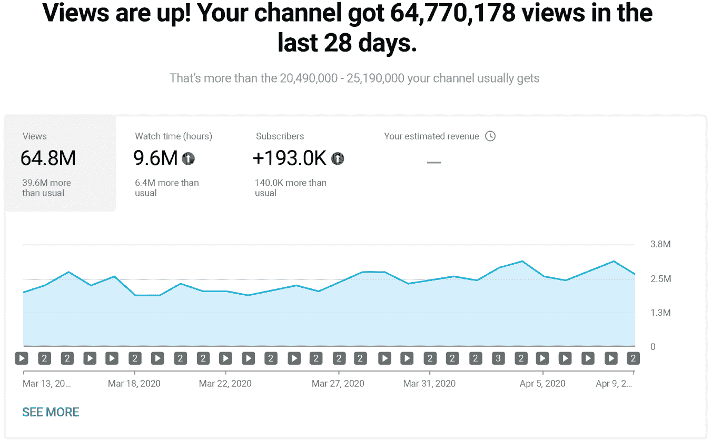
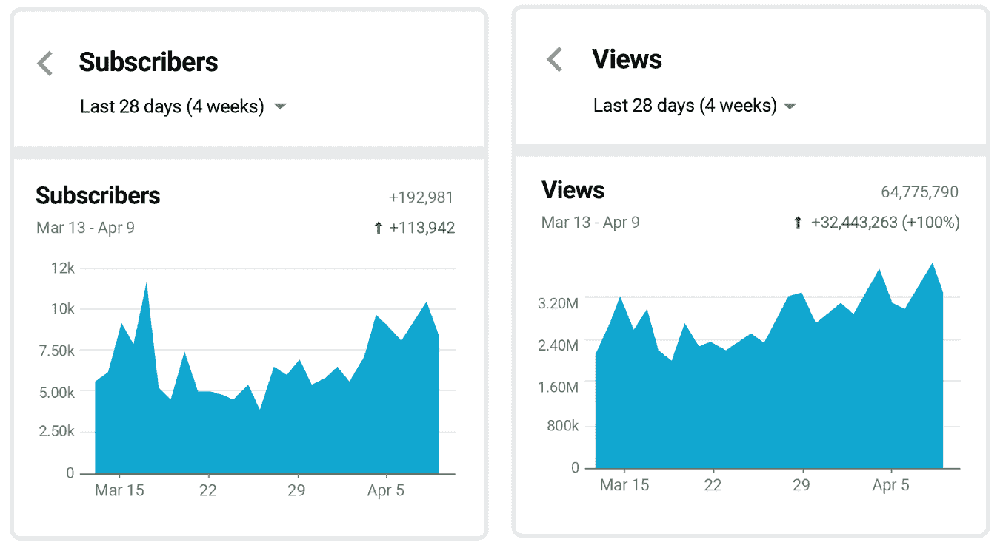
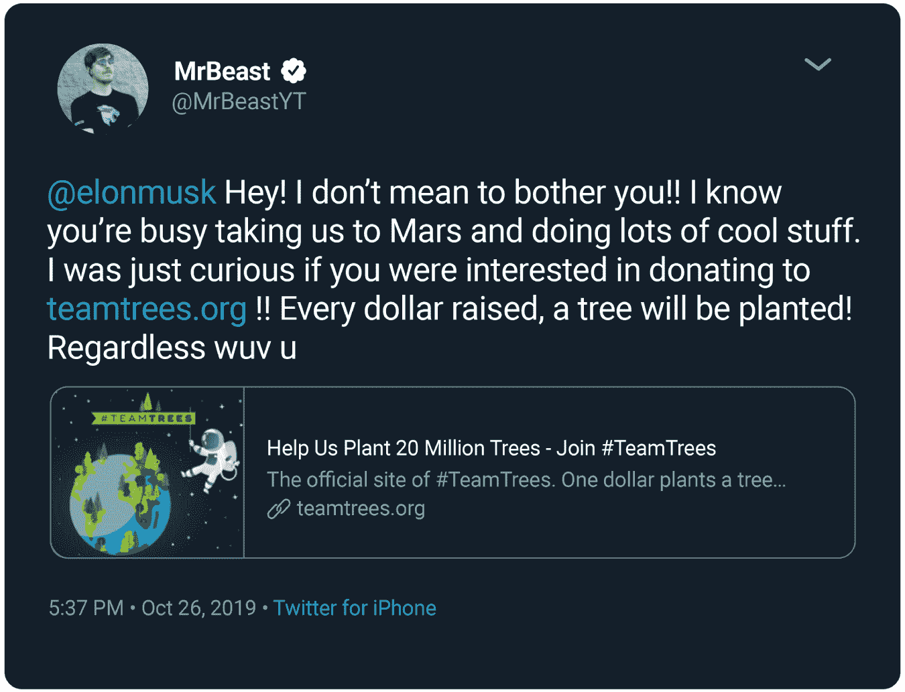

# 第二部分：机会

# 5 为什么大多数 YouTube 频道无法成功

可以肯定地假设你从第一部分中学到了很多关于 YouTube 的知识，这可能是你之前没有想到会在这本书中学到的。其中一些可能在这一点上对你来说似乎不相关，但我保证最终它们都会联系在一起。但让我们诚实一点，你来这里是因为你想在这个平台上取得巨大的成功。一些创作者将成功定义为“x”数量的观看次数或订阅者，但所有 YouTube 成功的故事都指向一件事：赚钱。

YouTube 为人们提供了一个与世界分享他们的激情的地方，这很棒，但你知道什么也很棒吗？当人们因他们的激情而得到报酬时。赚钱不是一件坏事。*这就是我们在这里的原因*。你可以传播你的激情，并通过这样做赚钱，而不会变成卖断货。事实上，你赚的钱越多，你就能把你的信息传播给更多人。

也许你已经努力了很长时间，以实现 YouTube 的成功，但你的努力仍然毫无结果。还记得我说过你的宝贝可能很丑吗？怀着这样的想法，我邀请你放下你的防御，对我即将告诉你的事情持开放态度：

不是 YouTube 的问题，是你的问题。

多年来，我已经帮助了数百甚至数千名 YouTube 创作者看到了他们自己无法看到的关于他们频道的东西。我从许多 YouTube 的“失败”中学到了东西，以改变那些不起作用的东西。我用引号是因为我实际上并不认为它们是失败；我认为它们是过程的重要部分。就像托马斯·爱迪生说的，“我并没有失败。我只是找到了一万种行不通的方法。”“失败”是一个严厉的老师，但它仍然是一位老师，当你开始接受你可能做错了什么时，你就准备好前进了。一些 YouTuber 不分析视频表现不佳的原因，或者他们不知道该看什么。那么他们会做什么？一遍又一遍地做同样的事情，希望得到不同的结果。这就是疯狂，它会导致 YouTuber 疲惫不堪，要么放弃，要么减少规模。我经常看到这种情况发生。在 YouTube 上谋生并不容易，当你不知道为什么你的内容表现不佳，所以不知道如何进行小的调整来纠正时。

我与大多数创作者合作时，他们知道自己应该做什么，但他们继续发布内容，假设某些东西会神奇地开始起作用，或者突然吸引观众。YouTube 并不是这样运作的。采取这种方法会导致挫折和自我设限，阻止或减缓你实现目标的步伐。你在 YouTube 上取得成功的第一步可能是承认你的内容不起作用。现在大步向后退，问问自己你是否真的对你的内容感到满意。你是吗？它起作用吗？你知道它为什么不起作用吗？从潜在观众的角度来看待它是一种方法。你认为他们会观看你的视频，甚至只是你视频的一半吗？

作为一家公司，YouTube 是学习那些不起作用的东西的一个典范。请记住，它最初是一个约会网站，根据“失败”的反馈进行了更改。即使他们提供 20 美元的视频，他们也无法让女性在他们的网站上发布视频。约会网站没有起作用，所以他们根据用户的需求改变了网站。如果你所做的事情一直没有起作用，就愿意改变它。一些在 YouTube 上有一段时间的创作者经常陷入旧习惯。如果你属于“老 YouTuber”类别，请重新评估你的意识形态和方法论。坚持过时的流程和想法可能是阻碍你实现真正增长的原因。仅仅因为某些东西曾经适用于你的内容并不意味着它将永远适用。不要害怕抛弃“老式”YouTube，看看当前成功的创作者是如何做事的。

下一步是接受数据不会说谎这个事实。也许你的妈妈告诉你你的视频很棒，但你有没有考虑过她可能是唯一这么认为的人？我不禁想起那些不幸的美国偶像希望者，他们带着妈妈的赞美走进评委会的房间，却在观众尴尬的表现和西蒙·考威尔的严厉批评后被赶出房间。

对你来说的好消息是，你可以学会如何分析数据和创造出色的内容，比一个糟糕的歌手学会找到完美音高要容易得多。这一切都与数据有关。你必须愿意成为数据的学生。## 成为数据的学生

为了成为数据的学生，你必须改变你在 YouTube 上处理一切的方式。停止只是为了娱乐而观看，开始观看以学习。假装你已经在 YouTube 大学注册并支付了学费。这可能会让你感到惊讶，但很多创作者甚至根本不看 YouTube 上的任何东西；他们只是去那里上传自己的内容。我曾和一个创作者进行咨询，他想要改善他的视频。我观看了他的两个视频，然后问他：“你多久看一次 YouTube？”他说：“从来没有。那不是我喜欢的。”这就好像想要参加环法自行车赛，因为你有一辆自行车，但你从来没有看过比赛。而且你的自行车是一辆带香蕉座的 Huffy。你没有正确的工具，也没有通过观看其他做得很好的人学到东西。这是你吗？如果你想在 YouTube 上做得很好，你必须观看其他创作者在 YouTube 上做了什么来看看什么是有效的。如果你从来不去看热门页面，你怎么能看到趋势？你怎么能看到什么正在起作用以及为什么？一个 YouTube 的学生会消化 YouTube 上的一切，渴望理解成功内容是如何运作的。这是通过寻找模式来实现的。

寻找模式包括观察内容、受众和所有细节。为了确保我们在同一频道上，你需要明白内容不仅仅是视频本身。当我说内容时，我指的是视频的标题、缩略图、描述、引导和视频本身。开始积极地寻找那些做得很好的频道上每个内容细分中的模式，我向你保证你会看到它们。它们之所以能获得观看次数是有原因的……你能想出为什么吗？对成功视频或频道的受众也要做同样的事情。我总是深入探讨并提出问题，比如：他们是谁？他们来自哪里？他们的年龄和性别是什么？他们在评论中说了什么？他们还在看什么其他视频？

除了学习模式，你还必须学会 YouTube 作为创作者给你的工具和系统。没有一个成功的创作者不知道如何观察和解释分析数据。不要害怕你的分析数据！成为分析专家的唯一方法是……等待……就是查看你的分析数据。这并不是什么高深的科学。我意识到这对像我这样的人来说可能很容易，但对一些创作者来说可能一开始会感到不知所措。再次强调，我只要求你愿意倾听我将教给你的东西，并愿意付出努力。

当我去北卡罗来纳州拜访我的客户 Jimmy Donaldson，也就是“MrBeast”时，另一个名叫 Zachary Hsieh，也就是“ZHC”的创作者前来送给 Jimmy 一辆定制的特斯拉。我们在一天结束时吃寿司，谈论着我们最喜欢的话题：YouTube 数据。我看了 Zach 的几个视频，问了他一些关于他数据的问题。然后我打赌我能猜出他频道的受众群体。Jimmy 说如果我能在 2%以内，他会付晚餐的钱。赌注被接受了。

嗯，我在 YouTube 上已经有一段时间了，我见过很多数据。我总是寻找模式，而且我已经做了很长时间，所以我以为我可能猜对了。在了解了频道的一些情况之后，我做出了一个经过深思熟虑的猜测，认为扎克的观众有 46%来自美国，男女比例更倾向于男性。他拿出了他的分析数据，猜猜我猜对了；确实是 46%。他们对我的准确性感到震惊，而我则为自己赢得了赌注而感到兴奋，因为吉米得为我的晚餐买单。没有什么比赢得赌注和免费寿司更好的了！谢谢，吉米。

了解你的分析数据。这是唯一知道需要改变的方法，而且总是需要改变的。即使是最成功的频道也会不断调整以变得更好。这就是他们成功的方式，一旦你在成功之后，这种调整也不会停止。你的观众会随着时间的推移而改变和发展。如果你不注意这一点，观众就会停止观看你的内容，因为你的内容会变得陈旧。有很多方法可以学习如何改进你的内容，但最好的方法总是基于你在分析数据中观察到的内容。

为了创作出最好的作品并做出最明智的决定，你必须了解你所在的特定领域。你要怎么做呢？研究你所在领域的其他成功创作者。问问他们为什么成功。注意一下他们有什么共同之处。为什么他们制作视频和进行编辑的方式会这样？观看他们最成功的视频，并注意这些模式。看看他们如何与他们的社区互动，无论是在视频评论中还是在社区选项卡上。阅读他们最受欢迎的视频评论，并注意哪些具体评论参与度最高。看看他们在说些什么，通过阅读他们的评论，你会更好地了解观众。通过分析和应用的视角来看所有内容——标题结构、缩略图和描述模式以及视频构成，当你准备创作自己的内容时，你就会做好准备。

## 比较和模仿的陷阱

然而，需要注意的是：不要陷入比较的陷阱。是的，你需要进行特定领域的研究，但这并不意味着你要坐下来比较你的频道和其他频道。我无法告诉你有多少频道咨询我时，创作者告诉我他们的内容比竞争对手的内容好得多。他们不明白为什么一个质量较低的频道会表现得比他们的好。不要这样做。相反，专注于你能学到什么。问问自己，那个创作者可能在做什么，以获得比你更多的观看时间和观众参与度。专注于让你生气或沮丧的事情，会让你很难进行分析观察。摒除情感，戴上你的思考帽。比较是一条泥泞的坡道，会让你感到沮丧和无法动弹。专注于自己和你可以改进的方式。当我和 MrBeast 交谈时，他拿一部旧视频（在过去的一年里）和新视频进行比较时，我经常会笑。关于一部旧视频，他说，“为什么会有人看这个？”认为这是一个糟糕的视频（而它有 5000 万次观看）。我们现在知道了，我们本可以做得更好。然后我们讨论了基于数据，我们如何可以使视频更好。这就是超能力。当你与自己竞争时，你总是可以学到很多。始终不断改进。

此外，要小心成为一个模仿创作者。跟随潮流和彻底抄袭一个想法是有区别的。你可以从他人的方法、内容和主题中学习，并利用它们，而不是完全复制他们的说法和做法。我见过太多克隆视频，这些视频是模仿者制作的其他创作者视频的逐帧复制——不要成为这样的人。采用你喜欢的想法，并加入你自己的特色。即使与其他人做的类似，也要制作独特的内容以适应你的受众。Casey Neistat 和 MrBeast 的模仿者不计其数；做你自己。

## 调整方向和一致性

很多创作者不知道在事情变得糟糕时如何调整方向，甚至在事情变得好时也不知道。也许他们获得了一大波观看量，然后观看量稳定下来并下降。他们不知道如何分析是什么出了问题，也不知道如何复制好的数据。他们只是继续上传内容，而不学会如何调整以最大化结果。这就是为什么摆脱可怕的“分析麻痹”是如此重要。不要害怕分析！一些创作者变得如此害怕看到负面结果，以至于他们不发布任何新内容。这显然对他们不利，绝对会阻碍创造力。

创作者遇到问题的另一个原因是缺乏一致性。创作者需要按照正确的时间和日期进行一致的上传计划。并没有适用于所有频道的推荐时间表。例如，每周一、三、五早上 8 点的时间表并不适用于所有频道。每个创作者都必须测试他们特定内容的上传时间，以找到适合自己受众的最佳时间。当创作者不一致时，很难获得指标反馈。找出哪种内容与你的受众产生共鸣，以及何时产生共鸣，并坚持下去。这是你获得指标数据的方法，它将告诉你如何改变或改进。

如果你的流量来自搜索，这种一致性并不那么重要。对于 YouTube 推荐流量——这就是你想要的地方——重要的是你在 YouTube 上活跃并准备好参与时上传和互动。

以游戏频道*Thinknoodles*为例。拥有 500 多万订阅者的*Thinknoodles*一直在按照“如果你建造（或上传）它，他们就会来”的指令进行操作，没有按计划上传新视频。数百万的订阅者提供了足够的观众，但不一致性削弱了其速度潜力。

*Thinknoodles*的创作者要求我查看他的频道，并根据我在数据中看到的内容，我强烈建议他的受众理想的上传时间，这对他来说是没有意义的。这是一个游戏频道，所以他一直在下午上传视频，因为游戏玩家会在放学和下班后回家。但我看到他的内容在清晨表现最好，所以我建议他这样做。这是违反逻辑的。他有些不同意，但最终，当他听从我的建议时，那个视频成为了他很长一段时间以来表现最好的视频。一旦他纠正了自己的方向并调整了策略，他的频道在 28 天内就爆炸性增长到了 6400 万次观看。请记住，这只是一个小小的调整，让他在不到一个月的时间里获得了数百万次观看。见图 5.1 和 5.2。

## 获得正确的反馈

现在你已经成为数据的学生，并意识到自己可能做错了一些事情，你可以把精力放在获取反馈上。从正确的地方（不是你妈妈）获取正确的反馈是非常重要的。一些创作者错误地认为，获得任何反馈都是好的，但并非所有的反馈都是平等的。如果你从一个并不代表你理想观众的团队那里得到反馈，那么你可能会带来更多的伤害，因为他们对你的内容不感兴趣，而你的理想观众是感兴趣的。因此，当他们与你的内容互动时，他们的行为是不稳定的，会向人工智能发送错误的信息，影响你的分析数据。所以，如果你的观众主要是 Z 世代，你不应该从千禧一代和婴儿潮一代那里获得大部分反馈。与其从错误的来源获得反馈，不如根本不获得反馈。

**图 5.1** **超过 6400 万次新观看**

**图 5.2** **28 天内观看次数和订阅者的增加**

或者你可能是从一个并不太了解 YouTube 及其人工智能工作方式的团队那里得到反馈。例如，一个小型户外频道决定制作视频，射击子弹穿过物体，看它们是否防弹。创作者目前的内容是围绕在树林里走动，所以这似乎是一个与他当前视频相关的好主题。他的问责团队喜欢这个想法，并帮助他制作视频内容。

但这个话题存在一个主要问题。从 YouTube 的角度来看，枪支暴力是一个新的伤口。他们最近在 YouTube 总部发生了大规模枪击事件，而且美国也发生了多起大规模枪击事件等事情，围绕着枪支出现了很多动荡。这位创作者和他的问责团队没有考虑到的是，你必须创作 YouTube 和其人工智能“乐意”推广和推荐给观众的内容。基本上，你是 YouTube 的合作伙伴；你必须将你的内容与他们愿意推广的内容相匹配。这个领域成功的内容来自于已经与 YouTube 建立了他们的内容的老渠道。

这位创作者在他的第一个视频上放上了一个缩略图，上面他指着自己的脸露出震惊的表情，手里拿着一把枪。这是他表现最差的视频。他联系我问原因，所以我帮助他理解了我之前列出的原因。他得到了错误的反馈。他的团队本意是好的，但他们不了解 YouTube 是如何看待和推荐内容的。

另一种获得不良反馈的方式是从一个只会拍你的后背并给予你鼓励的团队那里得到。围绕自己与积极的人在一起是有意义的，但当涉及到获取你的内容的诚实反馈时，积极的人是不够的。有很多人喜欢给出反馈，即使他们从未上传过一个视频。有时这个人就是你的观众。相信那些真正知道如何制作好视频的人。

## 错误的内容

归根结底，很多创作者发布了不适合自己的内容。有时“不适合”意味着创作者在做一些他或她并不热衷的事情。不要浪费时间做一些你不在乎的事情，只是因为你认为它会奏效。

我有一个朋友，我们叫她莎莉，她在 YouTube 上已经有 10 年了，也可能正在阅读这本书。我多年来一直给莎莉这个建议。她最初是日常视频博主，然后下个月，她改变了内容，成为了一个喜剧频道。然后几个月后，她又改变了，成为了一个挑战频道。之后，她想做严肃的采访。*停止这样做*。找出你的热情所在，不要随着潮流改变。花更多时间找出你真正想要制作的内容。

想想 YouTube AI 对这样的频道会有怎样的反应。如果我作为一个观众感到困惑，你认为 AI 会发生什么？它对观众可能感到困惑，不知道该向谁推荐。没有模式可循。

有时“错误”的内容意味着随意。这是指创作者没有为特定的受众创作内容；他们上传他们想要的任何内容，就像把一切都扔进 Dropbox 一样。这样的多样化频道根本不起作用。

此外，有时“错误”意味着内容不能吸引观众。没有保持观众的内容是没有转化的。为了让观众继续观看而不是离开，问问自己为什么内容没有引起共鸣。不要考虑自己，从他们的角度考虑。找出观众流失的原因，找出内容引起共鸣的模式，然后把这些内容带回你的创作过程中，制作更多类似的内容。## YouTube 迷信

有些创作者认为 YouTube 后台有一个巫师在拉动杆子，随心所欲地控制内容。当然，你已经学到这不是真的，因为你已经成为了 YouTube 的分析学生，知道数据不会说谎。但其他人继续浪费时间和精力在那些无关紧要的事情上。让我给你讲一个故事来阐述。

有一位女士在把肉眼放入烤盘之前把肉眼的两端都切掉。她这样做了很多年。有一天，她的丈夫问她为什么这样做，她说这是她母亲一直都这样做的。于是丈夫去问了他的岳母同样的问题。她回答说：“因为我的烤盘太小，放不下整块肉眼。”原来妻子的烤盘一直都够大，她多年来做的任务都是不必要的（更不用说她浪费了完全好的肉）。

同样地，当创作者不知道有更好的方法时，会浪费很多能量。例如，YouTube 曾经出现过一个问题，导致频道订阅者无法收到新上传视频的通知。创作者开始手动上传，因为他们认为这是解决问题的唯一方法。问题后来得到了解决，但很多创作者仍然认为它是有问题的。他们多年来都相信这一点，成了时间的奴隶。无论它干扰了什么——睡眠、白天的工作、家庭义务——他们都坚持手动上传。YouTube 的定时工具本来可以节省他们很多的挫折，但他们就是不用。想象一下他们的能量和时间本可以用在其他地方。

如果你就像是把肉眼的两端都切掉，知道为什么你这样做，如果你不喜欢，探索你的选择。也许已经有解决方案了，只是你还不知道。## 精疲力尽

在 YouTube 成功的希望者中，我经常看到的一个普遍情况是创作者的倦怠。人们对内容创作感到兴奋，但他们工作得越辛苦，付出越多，似乎什么都不起作用，也没有结果。所以他们更加努力地工作，上传更多的内容，因为他们认为这是一个数量的问题。这样工作是灾难和最终倦怠的一个很好的配方。感觉就像在一个非常漫长的隧道尽头没有光明。能够与倦怠的“受害者”一起工作，并为他们提供帮助，让他们重新感到希望，最理想的情况是最终开始看到成功，对我来说是非常有益的。其他创作者试图做太多事情，最终危及他们的心理健康。如果你有这两种情况中的任何一种，你来对地方了。请留下来；我在这里帮助你。

不要觉得你必须每周上传三次视频才能成功。我的朋友和 YouTube 创作者马克·罗伯是一名工程师和发明家，他每个月只上传一次新视频。他仍然每个视频都获得数千万的观看次数，因为他的内容真的很好。他的视频需要大量的策划和执行，但他在每一步都很开心。他做了一个关于制作完美防松鼠的鸟食器的视频，需要很多时间，但这是很棒的内容，很快就获得了数百万的观看次数。他还有一个关于剥皮西瓜的视频，观看次数超过 1 亿。另一个视频需要大量的工程和故障排除，但他制作了一个给门口偷包裹的人的闪光弹，这个视频有超过 8000 万的观看次数。去研究一下马克的频道，看看为什么你不必为了在 YouTube 上取得成功而拼命上传视频。

现实情况是，是的，如果马克经常上传视频，他会获得更多的观看次数，但他的频道做得很好，他赚了很多钱，他没有倦怠或者心理健康问题。我知道有几个每天都上传视频的 vlogger，他们连续几年每天上传视频，最终负担变得太重，所以他们退出了。如果你觉得自己的时间安排不可持续，就修改你的时间表。

记住这是一门生意，有方法可以减轻你的负担。你不必孤军奋战。你可以，也应该建立一个团队。为了你的心理健康，建立一个团队。当我开始自己的生意时，我爸爸告诉我，成功的最快途径之一就是与那些与你分享目标并帮助你保持理智的人们团结在一起。然后他教会了我现在所谓的“工作周分析”。我把我每天做的事情都记录下来，从查看邮件到在社交媒体上发布内容，再到办事，以及其他一切。在一周结束时，我拿出两种不同颜色的荧光笔。用一种颜色，我标记出所有我讨厌做的事情，用第二种颜色，我标记出所有浪费我时间的事情。然后我雇了别人或者几个人来做所有被标记的任务。这将帮助你专注于你所热爱的事情和重要的事情，并避免倦怠。## 焦点

不要让你的专注成为你的失败。你的困扰可能是你一直以来专注在错误的事情上。你认为你需要更好的相机或其他设备（你不需要）；你为了频道曝光而评论了大量视频（你不应该这样做）；你责怪 YouTube 或其他人或其他事情导致你缺乏曝光和成功（不是他们的问题；是你的问题，记住吗？）。如果你的专注已经错位，就承认并向前迈进。

你已经准备好设定清晰的目标，引导你朝着正确的方向努力。当你这样做时，它有助于巩固对你的目的的激光焦点，不会再犹豫不决。这使你能够专注于每天要做的事情，朝着即将到来的成功努力。我们在这里没有重新发明任何东西：这是一个行之有效的公式……如果你愿意成为一个 YouTube 学生，分析你的视频表现，并做出调整，制作更好的内容，让观众产生共鸣。

# 6 与 YouTube 合作赚钱

所以你准备在 YouTube 上赚钱...等等，你可以在 YouTube 上赚钱吗？你如何在 YouTube 上赚钱？你全职做这个？怎么做？

这些都是我告诉别人我以什么为生时经常被问到的问题。普通大众不知道，也不理解。第一个简单的答案是，你可以通过成为 YouTube 合作伙伴计划（YPP）的成员开始赚钱。正如你将看到的，这只是一个开始，但我们将在接下来的几章中详细介绍。

你还记得在第二章中了解到 YouTube 生态系统的情况，该计划始于 2007 年，就像加利福尼亚的淘金热一样。在[google.com](http://google.com)和[youtube.com](http://youtube.com)上从未有过的广告收入分享，因此这是一个巨大的全新机会。如果内容表现良好，创作者可以变现他们的内容，因此他们尽一切努力来实现这一点。换句话说，YPP 提高了优质内容和可靠的持续数量的标准。

我已经告诉过你，YouTube 最终分享了他们 2019 年的年度收入，声称在 2019 年实现了 151.5 亿美元的收入，但所有这些钱并没有直接进入 YouTube。其中一大部分进入了合作伙伴计划的创作者。该计划最初是以 45/55 的比例开始的，这意味着 YouTube 从与内容一起播放的广告收入中拿走了 45%，而内容创作者拿走了 55%。现在这些百分比变得更加复杂，因为考虑了许多因素，但对于创作者来说，这仍然是一个不错的回报。变现一直是 YouTube 成功的主要原因。它也帮助人们将 YouTube 视为一条可行的职业道路或商业。

让我再说一遍：与将内容放在他们的网站上的普通人分享收入是*YouTube*实现指数增长的原因。是的，这改变了创作者的游戏规则，但想想它对 YouTube 的一切都产生了什么样的改变。这是一个天才的举动。YouTube 有这么多的钱进账，因为他们开始大量分发。并且因为他们在激励创作者，创作者制作了更好的内容，从而获得了更多的曝光和观看次数。当内容更好时，人们就更想观看。合作伙伴计划是一个非常聪明的三赢局面。是的，这是三个赢：为了使 YouTube 生态系统蓬勃发展，每个人都需要在收入三角形中获胜，包括创作者、广告商和平台。

今天，有无数的创作者想要变现，但在早期，YouTube 实际上是在寻找创作者加入该计划。肖恩和明迪·麦克奈特就是早期 YPP 招募的创作者之一。他们曾经经营着一个受欢迎的发型博客，并在 YouTube 上上传了一个如何做发型的视频来嵌入他们的网站。肖恩和明迪甚至没有注意到他们的 YouTube 频道*Cute Girls Hairstyles*上发生了什么，但它获得了足够的流量，以至于 YouTube 联系他们询问是否想加入合作伙伴计划。肖恩和明迪在开始变现时赚了一些有趣的“额外”钱，但他们并不知道因为广告收入而等待着他们的是什么。最终，肖恩辞去了工作，他们成为了拥有数百万订阅者的第一个 YouTube 家庭，他们的孩子们也拥有了自己的频道，订阅者也达到了数百万。更多内容请参见下一章。

## 加入合作伙伴计划

现在您知道您想在 YouTube 上赚钱了，即使只是因为我告诉您这样做，让我们谈谈您将如何做到这一点。要获得货币化并保持货币化，您必须遵守 YPP 的规则，没有“如果”、“和”或“但是”。如果您违反规则，您可能会被取消货币化，失去合作伙伴身份，甚至可能被删除整个频道。这是严肃的；我每天都有几个人联系我寻求帮助，因为 YouTube 取消了或删除了他们的频道。YouTube 对这个项目不开玩笑。阅读所有文件可能会很烦人，但如果您想保持良好的地位，您需要熟悉社区准则、服务条款、版权规则和 AdSense 计划政策。您可能会发现您需要了解的任何内容都可以通过访问 YouTube 的支持页面并从那里导航来找到。

但首先，要有资格。过去您可以通过一个视频实现货币化，但 YouTube 不再这样做，因为这会带来很多“垃圾”内容逐个视频实现货币化。他们希望鼓励人们真正观看的视频和他们真正订阅的频道。

您需要在过去 12 个月内拥有 1,000 名订阅者和 4,000 小时的观看时间才能申请合作伙伴计划。您还必须有一个关联的 AdSense 账户。一旦达到这些要求，转到菜单中的货币化并签署条款，然后您就可以了。您将自动被列入审核以获得货币化批准。批准过去是自动的，但现在审查团队可以并且会拒绝一个频道，如果他们认为内容不符合 YouTube 的准则。通常的周转时间是几周到一个月，但当然，总会有可能需要更长时间的原因。这是您练习耐心的时候，但也是检查您的内容和频道是否符合 YouTube 准则的好时机。

这需要一些时间，因为真正的人类进行评估和批准，而不是机器，所以在您敲门寻求答案之前，请给他们一些空间来完成他们的工作。如果您做好了一切准备，那么您收到 YPP 欢迎邮件只是一个“何时”而不是“是否”的问题。

YouTube 将在 YPP 批准后继续监控您的频道，以确保您的内容继续符合政策。没有创作者因为符合数字游戏就有资格参加该计划。请记住这是一个合作伙伴关系，您必须履行自己的责任才能保持该计划的好处。

审查团队将检查您的频道的主题，最受欢迎和最新的视频，标题，缩略图和描述，以验证合规性。但这并不意味着您可以“逃脱”让其他事情滑落，因为他们确实可以检查任何东西，如果他们发现违反政策的内容，视频甚至您的频道都可能被取消货币化。遵守规则就好。

## 货币逻辑

让我解释一下 YPP 货币是如何运作的：广告商向 YouTube 支付费用，以在网站上显示他们的广告，包括展示广告、搜索结果广告以及视频前、中和后的广告。当观众在视频上看到广告时，广告商已经支付了一定的费用，这笔费用由 YouTube 收取并与播放广告的创作者分享。广告商支付了多少被称为 CPM，即每千次展示的成本。

作为创作者，您可以查看您从这些广告播放视频中赚了多少钱，方法是查看 RPM（每千次收入）指标。根据 YouTube 的说法，他们从广告、频道会员、超级聊天和超级贴纸、YouTube Premium 中获取您的总收入，然后乘以 1,000，再除以同一时间段内的总观看次数。这个指标过去是一个“估算”的指标，但 YouTube 在 2020 年 7 月宣布了新的 RPM 指标，以显示透明度和向创作者保证，因为数字因 Covid-19 而下降。我很高兴地报告，RPM 指标不再是估算的，您也不必自己计算。它一直是一个尴尬的“估算”指标，所以很棒 YouTube 修复了它。谢谢，YouTube。

了解广告主的支出（CPM）和您可以赚多少钱（RPM）是很有帮助的。当您登录 YouTube 时，跟踪这些数字，您会发现自己以新的和令人兴奋的方式思考您的内容和策略，关注带来收入的正确数据点。

作为创作者，您不能选择哪些广告商与您的内容一起播放广告；事实上，情况正好相反。广告商选择他们的广告在哪里播放，他们得到他们所付出的。这意味着他们在定位上越具体，他们就必须付出更多。例如，为了向“女性”展示广告，广告商的每千次费用要比选择“35-45 岁的亚裔女性，邮编 90210 在南加州”要便宜得多。他们可以在这里变得非常具体。他们可以将他们的目标定位为猫爱好者，或者在一个家庭收入范围内。

此外，仅仅因为您被接受进入合作伙伴计划并不意味着您有权利让优质广告与您的内容一起播放。想想看：如果您的内容没有被广告商选择的任何人群规格观看，广告就不会与您的内容一起显示，因为它不符合规格。因此，理论上，您可能是一个 YPP 创作者，但没有收入。您能做些什么？了解您的观众，然后想出如何吸引流行文化，这也扩大了您对更广泛人群的影响。我们在[第十一章]中更多地讨论了这个令人兴奋的观众融合。

此外，CPM 可能会波动；随着更多人进行广告投放，它会上升。通常在假期和重大活动期间会出现广告激增。想想您在圣诞节期间看到的所有广告。当有更多广告时，广告商在那个时候运行它们的成本更高。

## 其他 YPP 收入机会

合作伙伴计划还提供了什么？除了广告收入，YPP 还提供其他赚钱的方式，包括频道会员、直播超级聊天和超级贴纸、商品货架，以及当 YouTube Premium 订阅者观看您的内容时，您将获得一部分订阅费。每种方式都有自己的一套要求——有些有订阅者数量、年龄和/或地区限制——因此，当您想要实施它们时，找出这些要求是很重要的。您还将获得像创作者支持团队和版权匹配等工具的访问权限。

### 频道会员资格

频道观众可以支付订阅费加入频道会员，这支持频道并为观众提供特殊待遇。会员资格可以提供仅限会员的内容，如提前访问、幕后花絮和独家视频。它们还可以包括聊天徽章或自定义表情符号，以便会员在评论和聊天中脱颖而出。一些观众支付会员费仅仅是为了支持他们喜欢的频道，并加入他们的独家社区。

要申请频道会员计划，您必须在 YouTube 上保持良好的地位。游戏频道必须拥有 1,000 名订阅者，而所有其他频道必须拥有 30,000 名。您还需要成为 YouTube 合作伙伴。会员计划并非在世界各地都可用，因此请检查您所在地区是否可用。会员资格不能提供一些东西，包括一对一会议，下载内容和面向儿童的营销。收入与 YouTube 分成 70/30，因此您可以保留会员费的 70％，而 YouTube 则拿走 30％。

一些创作者通过他们的频道会员计划赚了很多钱。根据 2018 年《Variety》杂志的一篇文章（Todd Spangler 撰写的“YouTube 创作者获得新的付费会员，商品销售，视频首映”），一位音乐家从频道会员计划中获得了 50％的 YouTube 收入，并计划用这笔额外收入资助世界巡回演出。一对旅行视频博主承诺提供独家迷你系列，迅速吸引了成员，仅在六天内就在数十个国家获得了 1,000 名成员。另一位创作者在实施该计划后，他的喜剧频道收入增加了三倍以上。

### 直播，Super Chat 和 Super Stickers

Super Chat 和 Super Stickers 是直播的有趣补充，也是您可以多样化 YouTube 收入的另一种方式。它们基本上是观众的“小费”。Super Chat 在直播期间的评论流中显示为固定评论。根据所付金额的颜色和持续时间进行突出显示。这鼓励观众花更多的钱。而 Super Chats 则鼓励其他观众效仿，通常会产生多米诺效应。当您将 Super Chat 添加到直播中时，请向您的观众介绍。他们中的许多人不知道这一点，因此在开始直播之前进行简短的介绍，然后在收到 Super Chat 时让他们知道，以重新引起他们的注意。

YouTube 游戏玩家 PrestonPlayz 喜欢 Super Chat 为忠实观众和内容创作者之间创造了另一种互动方式。他在承认直播贡献者的同时，仍然专注于直播的目的。始终要向你的 Super Chatters 大声喊出或表示感谢。

我的朋友*The Ohana Adventure*频道每周一都会进行两年的家庭游戏之夜直播。当他们实施了 Super Chat 后，他们最终赚了足够的钱，以至于他们能够全职从事 YouTube 频道。他们的追随者不仅给了他们钱，而且还为未来的内容创作提供了很好的想法，表现非常出色。

我见过一场直播，他们的 Super Chat 每分钟收入超过 400 美元。这是一个简单的集成，可以让您赚很多钱，同时也很有趣。您可以实施自动触发器，以在不同层次的捐赠进来时做出响应。层次分解鼓励观众捐赠更多，如果他们想要更大的响应触发。例如，您可以用自动灯光和彩纸炮装饰您的设置，当您收到 Super Chat 时，它会触发灯光闪烁，或者炮火，或者两者，取决于观众捐赠的金额。加入[IFTTT.com](http://ifttt.com)（如果这样，那么），您可以应用自动 YouTube Super Chat 功能。

Super Stickers 是观众可以购买的动画图形，显示在聊天流中。这是一种有趣的方式，可以为您的观众提供捐赠选项，同时帮助他们感觉自己属于您的社区。贴纸是与 Super Chats 分开购买的。

### 商品

YouTube 的商品货架为一些创作者带来了大量收入。货架位于视频下方，提供的不仅仅是 T 恤。YouTube 与 Teespring 合作，以便创作者可以设计和销售各种品牌物品，如包，枕头，毯子，毛绒动物，马克杯等。

根据《促销营销》杂志的一篇文章（作者布伦丹·梅纳佩斯），商品点击率比其他功能（如横幅链接、注释和描述链接）多 30%的流量。杯子、玩具动物和 T 恤衫一直是观众们想要支持或展示品牌的热门商品。利用这些经典产品来进一步多样化你的收入来源。一只名叫卢卡斯的跳动蜘蛛在频道的商品货架上的前 10 天就卖出了价值 80 万美元的卢卡斯毛绒玩具，拥有超过 4 亿次观看！这只毛绒娃娃在 Teespring 上以 20 美元的价格销售，但其他选择包括 T 恤、婴儿连体衣、背包和写着“Boop！”的贴纸，这是卢卡斯的口头禅。给自己弄一个商品货架吧。### YouTube 高级会员

观众可以支付会员费加入 YouTube 高级会员，享受无广告的平台体验。高级会员还可以下载和后台播放选项。YouTube 会将大部分收入返还给创作者，这意味着当高级会员观看你的内容时，你将获得一定比例的收入。即使观众以下载或后台播放的方式观看你的内容，你也会获得相同的观看时间积分。我希望我有一个推广链接可以鼓励每个人注册 YouTube 高级会员，因为它真的很棒。无广告的体验以及下载和后台播放选项是非常值得的！## 通过广告收入赚更多

一旦成为 YouTube 合作伙伴，你的广告收入仍然有可能发生变化和增长——并非所有广告收入都是相同的。YouTube 创作者比例以男性为主，因此想要与女性创作者合作的广告客户竞争更激烈。同样，针对特定种族、年龄、宗教和其他各种人口统计数据的观众群体，也存在激烈的竞争和机会。因此，相同的广告在不同内容上播放时，根据创作者和观众群体的不同，可能会产生不同的费用。

### 谷歌首选

例如，查德·怀尔德·克莱和他的妻子兼合作伙伴维·奎恩特一起制作内容，并在他们的频道上发布相同类型的视频。查德的频道订阅者比维的多几百万，但维的频道的广告收入是查德的两倍多，因为广告客户愿意为在女性少数群体频道上播放广告支付更多。在 YouTube 上，“查德”是千篇一律的，但“维”是热门商品。

当查德和维创建一个他们知道会表现良好的视频时，他们会将其上传到维的频道，因为他们可以赚更多的钱。维属于独家的谷歌首选阵容计划，该计划仅保留给所有 YouTube 频道中排名前 5%的频道。只有顶级广告客户会在谷歌首选创作者旁边播放广告，反之亦然；只有顶级创作者才能获得高级广告和广告收入，这可能是平均 CPM 的三到五倍。此外，首选计划内部甚至还有不同的层次。你几乎可以用两只手数出最高收入层次的创作者数量——它就是那么独特。他们的收入比首选计划内其他创作者要多得多。

我相信你会想：“好吧，我在哪里可以申请？”但创作者无法申请加入首选阵容计划。YouTube 从五个类别收集信号，生成“P-Score”，对符合首选标准的内容进行排名。P-Score 算法观察的五个类别是（1）受欢迎程度（基于观看时间），（2）平台（更频繁在大屏幕上观看的内容，如电视），（3）热情（参与度），（4）保护（内容适宜性），以及（5）制作（卓越的电影技术和摄像工作）。这些信号的组合可以在海量内容中找到最具吸引力和品牌适宜的内容，无论该内容属于哪个类别。

与品牌相关的合适内容对 YouTube 来说非常重要，而且理由充分：在一些大的矛盾之后，他们正在努力修复与广告商的不稳定关系。当广告商的广告与不适当的内容一起播放时，广告商纷纷离开 YouTube，甚至有些人抵制，因此 YouTube 正在竭尽全力向广告公司证明他们已经让在 YouTube 上营销变得安全和有吸引力。适宜性是吸引广告商看到优选计划价值的重要卖点。

P-Score 算法一直在工作并定期更新，因此即使是突破性的人才也可以进入名单；并没有基于创作者的长期性而排除优选计划的成员。优选计划的成员在品牌提升、广告回忆和购买意图方面都有很大的增长。品牌提升意味着观众对品牌的认识和看法增加。他们会更容易记住你和你的广告，这被称为“广告回忆”。它还增加了你的观众购买你的产品或服务的意愿。简而言之，一切都会从一个好的广告活动中提升。

因为你无法申请成为优选创作者，你最好的行动方向是记住滋养 P-Score 的五个信号：受欢迎程度、平台、热情、保护和制作。在制定内容创作和目标规划时使用这些信号。

不要忘记，广告商会花更多的钱来选择谁看到他们的广告。如果他们想要针对年龄、性别、种族、地点、兴趣、家庭收入或任何其他特征或人口统计数据的观众进行定位，他们会为每个具体的定位付费。因此，即使你不是优选合作伙伴，如果你的内容与特定的利基或人口统计数据配对得很好，你仍然可以比其他创作者赚更多的广告收入。做好功课，让这些信息对你有利。如果你想获得更多广告商在 CPM 上花费的钱，就创作内容来吸引那些独特的观众。### YouTube Selects

广告商还可以选择支付 YouTube Selects 计划。YT Selects 收集了一系列内容，可以与广告商理想的客户匹配，并在该系列上播放他们的广告。 “新兴系列”功能还额外吸引了新的/崛起的内容和创作者。YouTube 还保证品牌安全和适宜性控制，这意味着品牌可以放心，他们的广告不会在不适当或可疑的内容上播放。

YT Selects 确保广告商在所有设备和 YouTube 应用上都能获得曝光，因此他们的广告将在人们实际观看的地方被看到。他们甚至提供品牌提升测量，让广告商可以看到他们的广告活动有多有效。### 案例研究：丹·马克汉姆@What's Inside

让我们更深入地谈谈 YouTube 最有趣的部分，以及一些令人惊叹的成功故事。YouTube 最有趣的部分是什么？当然是赚钱！以*What's Inside*频道的丹·马克汉姆为例。他可以和儿子一起玩耍，并且赚了很多钱。他们在视频中剖开东西，六年来一直在 YouTube 上活跃，一起留下了很多回忆。他们的百万订阅频道为马克汉姆家庭提供了丰厚的收入，让他们可以过上任何他们想要的生活方式，但丹还记得成为 YouTube 合作伙伴的早期日子，对微薄的回报感到兴奋。他的频道一开始只赚了几毛钱，所以他非常清楚地记得那天他赚了 4 美元的广告收入……并为此感到兴奋。

“我想也许我们可以为大学存一些钱，如果我们有一些收入在我们睡觉时进账的话，”丹说。“所以我开始阅读大量的文章，研究如何做 YouTube。”他开始每周上传视频，那是他在白天工作和家庭生活中能做的全部。四个月后，他获得了一千名订阅者；再过三个月，他有了十万名订阅者，仅仅四个月后，他有了一百万名订阅者。

在早期，丹能够看到 YPP AdSense 的真正增长潜力，但他从未梦想过会因此而获得多种机会。它为品牌交易、赞助和商业大计划打开了大门。对于那些在常规工作中没有赚很多钱的人来说，这将是令人兴奋的，但丹不是。他有一份薪水不错的非常舒适、稳定的工作，他的妻子也是。她是 Honeywell 的高级副总裁，他们每个人都有六位数的收入（更不用说他们的福利待遇了）。对于马克汉姆一家来说，钱不是问题。因此，即使 YouTube 频道起飞并且比日常工作赚得更多，丹对于放弃一份稳定的工作去做一些可能只是阶段性的事情感到不安。回想起来，他可以看到自己本可以更早地全职从事 YouTube，但他必须接受“传统意义上的稳定”可能是有害的这个想法。

### 案例研究：杰基@ JackieNerdECrafter

有时候失去是对你最好的事情。对于杰基“NerdECrafter”来说，这是真的。她参加了一个赠品活动，想要赢得一个带鹦鹉的可爱徽章。当她没有赢得时，她想她会买这个徽章，因为她非常喜欢它，但当她看到 80 美元的价格标签时，她有了一个更好的主意：她可以自己制作。杰基已经尝试过一些 YouTube 视频，但没有方向和没有成功。大多数时候，这只是在她失去工作后消磨时间的事情。现在她想制作一个关于她可爱的鹦鹉徽章手工制作的视频，并教其他手工艺人如何制作。

当时，女性频道通常被归类为美容和化妆。即使是手工艺频道也给人一种完美的感觉。杰基认为，为了成功，她必须做同样的事情。但这对她来说行不通。所以她停止了按照他们的方式做，而是按照自己的方式做。当她决定不再试图完美，而是做自己时，有趣的事情发生了……她的频道开始起飞。她的真实性对那些认同她朴实的“书呆子”一面的观众产生了共鸣。她是一个喜欢游戏和极客文化的书呆子手工艺人，她的幽默感对合适的观众非常有吸引力。

在杰基成为 YouTube 合作伙伴的第一年，她在 YPP AdSense 上总共赚了大约 100 美元。她的第二年赚了 500 美元。她花了很多时间创作和编辑视频，基本上是免费的，并且总是在她教学工作之外的业余时间。然后在第三年发生了一些很棒的事情：她始终如一、真实的内容吸引了她的观众，她赚了 23000 美元。第四年赚了 34000 美元，之后增加了三倍。 “我能看到有一个模式，”杰基在一次采访中告诉我。“我在镜头前越自信，我越率真、傻傻的，我的视频就越好。”她休假了一段时间，这样她就可以把她的 YouTube 频道当作一个企业来经营，同时始终保持乐趣。

杰基的妈妈在她年幼时去世，她的爸爸没有照顾好家人，所以杰基不得不挺身而出，成为她兄弟姐妹的父母。“在我妈妈去世后，我家基本上就是一个破碎的家庭的定义，因为她是家里的粘合剂，是家里的快乐。我的首要目标一直是照顾好我的家人。我不想从任何人那里得到任何东西。但就 YouTube 上的金钱方面而言，我想给我的兄弟姐妹一个他们本应该拥有的生活。”杰基喜欢带家人去旅行，看到他们在体验新地方时脸上的喜悦。“我以前靠教书的工资是做不到这一点的。老实说，目前来看，教书的钱就是小钱。”  ### 案例研究：Shay Carl Butler @ Shaytards

Shay Carl Butler 是一个 YouTube 的老牌创作者，基本上从平台开始就在上面。他是最早从广告收入中赚钱的人之一。“我在 2008 年 2 月成为了 YouTube 合作伙伴，2008 年 4 月 24 日收到了我的第一张 YPP AdSense 支票，金额为 367.40 美元，是一个月的视频收入，”Shay 在[Forbes.com](http://forbes.com)上说（迈克尔·汉弗莱的“ShayCarl's Epic Journey to YouTube Stardom”）。“我*简直*不敢相信我居然能因为‘娱乐’而得到钱。我知道我的家人不能靠不到 400 美元的收入生活，但我的脑子里的轮子开始转动。我全身心投入到了 YouTube 中。”Shay 退出了他的花岗岩台面生意，成为了一个周末 DJ 来维持生计，其他的就是历史了。

福布斯称沙伊为 YouTube 上“最成功的视频企业家”之一。这个人曾是一名上门推销员、校车司机、多层次营销人员、台面安装工、电台 DJ 和大学辍学生，因为他从来找不到停车位。现在他是一个与合作伙伴一起将公司以 5 亿美元的价格卖给迪士尼的人。这全都是因为 YouTube。*旁注：沙伊将是有史以来最酷的校车司机！*  ### 案例研究：Ryan Kaji @ Ryan's World

福布斯 2019 年 YouTube 收入最高的创作者名单总额巨大（而且这个名单并不完全准确，因为一些创作者，比如 MrBeast，不公开他们的收入）。这些数字令人震惊，但这个名单让那些不理解这里的增长机会的人大开眼界。以 YouTube 童星 Ryan Kaji 为例。他的频道最初是*Ryan Toys Review*，后来变成了*Ryan's World*。他的“开箱”视频让他成为了 YouTube 的明星——在前五年里，Ryan 的频道总共获得了超过 400 亿次观看。福布斯将 Ryan 的频道列为 2019 年总收入 2600 万美元的第一名。但频道的广告收入并不是他们唯一的收入来源。事实上，这甚至不是他们最大的收入来源。让这个事实在你的脑海里沉淀一下。他们的广告收入达到了*数千万美元……而这并不是他们最大的收入来源*。YouTube 为 Ryan 和他的家人打开了一扇机会之门，对于每一个 YouTube 创作者或企业来说，也是如此。  ## YPP AdSense 只是开始

你可能会翻白眼，想着，“当然，成为 YouTube 上的第一频道肯定很不错。”但是请先别急。你不必像这些创作者一样上榜福布斯榜单才能在 YouTube 上赚很多钱。成为 YouTube 合作伙伴是一个很好的开始，那里有很多钱可赚，但你可以做得更多。只要你坚持自己的激情，并通过使用 YouTube 公式与观众建立联系，你就会为等待的每一个机会做好准备。

YouTube 首席执行官苏珊·沃伊奇基在 2019 年底报告说，“与去年相比，拥有百万或更多订阅者的创作者数量增长了 65%，年收入达到五位或六位数的创作者增加了 40%以上。YouTube 作为创作者的平台继续蓬勃发展。”她说得没错。YouTube 创作者继续利用平台上创造的机会。

YouTube 为创作者提供了一个独特的机会，不仅可以获得额外收入或全职收入，还可以开启无限的可能性。这是建立业务和品牌的机会。没有其他平台有 YouTube 拥有的分享收入的力量或手段。正如你在这里学到的，广告收入只是一个开始。

# 7 利用你的影响力赚取大笔钱

Jessica Hatch 在家人的餐厅全职工作了 12 年，在 YouTube 上工作了 7 年，当她的妈妈把她拉到一边问她为什么不全职做 YouTube 时。这是一个不同寻常的回应，通常家人或亲人对于 YouTuber 想成为全职创作者时会更加批判。第二天，Jessica 在餐厅训练了她的兄弟，第二天，她全身心投入到她的 YouTube 频道*Gone to the Snow Dogs*中，展示她和西伯利亚哈士奇的生活。对她来说，离开日常工作和稳定的工作岗位是一个可怕的转变——她作为 YouTube 合作伙伴的收入是她在餐厅上班时的两倍多。即使现在，作为一个全职 YouTube 创作者，经历了多种收入来源的四年后，她仍然无法相信 YouTube 上可以赚到这么多钱，以及她花了多长时间才意识到 YouTube 的真正机会。

正如你在第六章中所读到的，YouTube 合作伙伴计划（YPP）的 AdSense 是在 YouTube 上赚钱的好地方，但这只是一个开始。当 Jessica 第一次发现 YPP AdSense 之外的收入可能性时，她感到震惊。她告诉我，“我听说过人们谈论品牌交易和赞助，我的第一个想法是，‘哇，我可以做到。我可以联系人。’所以我最早的一些品牌交易就是我亲自拿起狗玩具，说，‘这是谁做的？我能和这些人谈谈吗？当然，我可以找到他们的邮箱，’然后我就给人发邮件。”最初是免费产品最终变成了与索尼影视、迪士尼等公司的大交易。我们稍后会再谈谈品牌交易和赞助。

Jessica 的品牌交易/广告收入比例继续攀升，达到 70/30，有时会下降到 50/50，但无论哪种情况，你都可以看到 YPP AdSense 之外的巨大机会。Jessica 在一个非常特定的利基和受众群体中取得了令人难以置信的成功，扩大了自己的影响力，并参与了她可能本来不会有的机会……所有这一切都是因为她的妈妈足够明智，给了她追求激情所需的推动。多么伟大的妈妈。大多数父母则相反，告诉他们的孩子去找一份“真正的工作”，但大多数父母不理解 YouTube 上取得巨大成功的机会。

*Slice n Rice*频道展示了 Matt 和 Glory 的跨种族关系，是一个很棒的 YouTube 从贫穷到富有的故事。Matt（“Slice”）曾经做了他讨厌的零售工作，勉强维持生计，而 Glory（“Rice”）冒险辞去了工作，专注于他们的 YouTube 频道。Matt 感到很大的压力，尤其是在他们即将举行的婚礼上。他们有几个视频“爆红”，或者迅速获得了很多观看次数，这产生了一个 YPP AdSense 的收入，恰好和他们计划的婚礼费用一样。这感觉像是命运或神的干预。Matt 向他的老板请了两个月的辞职通知，决定全职做 YouTube，和他的新娘一起。这对他们来说是一个巨大的信仰飞跃和一个很大的风险。从那时起，频道和广告收入继续增长，Matt 和 Glory 感到非常感激他们为自己的激情付出了努力。

这个故事（以及大多数其他故事）最好的部分是 AdSense 之后发生的事情：更多的机会。特别是一个品牌合作对*Slice n Rice*产生了巨大影响。华纳兄弟找到他们，推广一部即将上映的电影，该电影以一对混血夫妇为特色。Matt 记得当时觉得华纳兄弟给他们的钱一定是个错误，所以他没有谈判条款或搅乱局面。当时他们的订阅者只有两到三十万，这个交易似乎不符合他们的影响力，华纳兄弟一定是付得过多了。但他们不知道华纳兄弟知道的：一个忠实观众的价值。在看到华纳兄弟的电影取得成功，并部分归功于他们的推荐之后，Matt 和 Glory 开始理解影响力的力量，特别是他们自己的影响力。他们真诚的创作者-观众关系可以为正确的品牌赚很多钱。

Matt 和 Glory 在 YouTube 上短时间内赚的钱比大多数人一年的工资还要多。Matt 说：“我们一直盯着我们的银行账户看，我们不知道该怎么办。”他们只是刚刚开始。

## 为什么不是你？

像这样的 YouTube 成功故事并不罕见；我可以给你成千上万的例子，我们还没有触及表面。我想说的是*任何人都可以做到*。你不需要很多可支配收入，也不需要花哨的摄像设备或每周 60 个小时才能在 YouTube 上成功。你*需要*了解这个平台，看看别人是怎么做到的，认识到无尽的机会，并按照我给你的公式去做。哦，而且有一点热情也不会有坏处。实际上，如果你没有热情，很可能你会成为那些失败的统计数字之一。我见过很多 YouTube 创作者烧光了自己。我见过很多创作者只靠 YPP AdSense 赚钱，没有多元化收入来源，最后一无所有。但我也见过很多创作者取得了巨大的成功，超越了他们可能拥有的任何期望，获得了他们从未想过的机会。

如果你认为你没有足够的观众，再想想。每个人都有自己的利基。我所在小镇的一个家伙拥有一家 24/7 的拖车服务公司，他开始用手机拍摄和剪辑视频，记录他的拖车救援和冒险，他的频道在一年多的时间里就有超过 2600 万次观看。拖车。真的……*拖车*。他现在是我的学生，我迫不及待地想向他展示外面的机会。看看*Matt's Off‐Road Recovery*，看看你甚至不需要最好的设备就能成功。

YouTube 的成功可以被任何人在任何地方用业余设备实现。如果你对某件事感兴趣，很可能还有很多其他人对同样的事感兴趣。当你找到你的人群时，你可以对他们产生有价值的影响，这会给你很多成长的机会。

## 商品销售

大多数人认为 YouTube 上的商品销售意味着你有一个链接让观众购买 T 恤和连帽衫。影响者们喜欢称之为“商品”，但它可以不仅仅是偶尔出售一件 T 恤那么简单。我和 MrBeast 一起制定了一项商品策略，他承诺亲笔签名一批限量版 MrBeast 衬衫。目的是为了为他的第 4 千万订阅者制作一部大型赠奖视频。他向互联网发起了“尽情发挥”的挑战，它也以同样的方式回应。他卖出了 68,337 件衬衫，花了他 12 天的时间来签名。但现在他有了一个巨额预算来制作一部史诗般的第 4 千万订阅者视频。

商品销售可以不仅仅是“商品架”。你可以与品牌合作，制作适合你的频道或你的利基市场的产品。美妆影响者 Jeffree Star 在 YouTube 上有大量粉丝。2019 年，他与 YouTube 名人 Shane Dawson 合作制作了一部纪录片系列和一个眼影盘。这对组合从他们联合的在线存在中产生了大量的炒作和曝光，反响惊人。眼影盘推出时，在 30 分钟内售出了 100 万个。每个眼影盘 52 美元，他们赚了 5200 万美元。如果没有卖光，他们本可以卖得更多。涌入的流量让 Shopify 崩溃了数小时。Star 估计销售额达数百万美元，但我猜他甚至对他的影响力所带来的美元数量感到震惊。Star 拥有 Jeffree Star Cosmetics（JSC），2019 年带来了大约 2.1 亿美元的收入。

在第六章中，我告诉过你世界上收入最高的 YouTube 明星 Ryan Kaji，在 2019 年通过广告收入赚取了 2600 万美元。一个小细节……他才八岁。他的父母从他还是幼儿园小朋友的时候就开始经营他的频道*Ryan's World*。五年后，这个频道拥有超过 2500 万订阅者。这意味着有很多机会和远远超过 2600 万美元广告收入的钱。Ryan 有自己的电视节目，与尼克儿童频道合作，名为*Ryan's Mystery Playdate*。但最重要的是：商品销售。Ryan 的面孔出现在沃尔玛和 Target 的一整套产品上，包括玩具、DIY 项目、牙刷，甚至内衣。2019 年，Ryan 的产品零售额超过 1.5 亿美元。

## 品牌整合和影响者营销

了解影响者力量的品牌和企业会花钱利用这种力量。他们知道这有效。人们会对他们关心的事物产生连接感，并对真实性作出回应。因此，当创作者与他们的粉丝分享真实的热情时，他们可以轻松地说服他们做某事、购买某物或支持某个事业。

谷歌创建了 FameBit，它将品牌与创作者匹配。这就像一个将人们匹配的约会应用，但它的目的是帮助品牌和创作者找到彼此。有许多机构在做这件事。Ricky Ray Butler 是我的商业伙伴。我们制作了一部名为*The Chosen*的电视系列，还共同主持了一档名为 Creative Disruption 的播客。Ricky Ray 对影响者营销了如指掌。事实上，他在大学时就开始与 Facebook 影响者合作，那时数字媒体机构还不存在（实际上，“影响者”这个词还不存在，但为了清楚起见，我们将在这里追溯使用这个术语）。他很快发现，你可以通过影响者与品牌的连接获得投资回报率——那时是一个新概念。

他成立了自己的媒体公司 Plaid Social Labs，并开始利用那些拥有大量朋友或粉丝的人的影响力。Ricky Ray 注意到这些年轻的内容创作者正在围绕原始或“不专业”的内容发展他们自己的有机社区。这是一个你可以用一只手数出在线上拥有超过一百万粉丝的人数的时代。影响力是全新的（这甚至还没有算上 Instagram，它还需要几年才会出现）。Ricky Ray 意识到有一个整个世界的有价值的品牌合作等着有人去抓住。

传统的营销机构当时并不追踪广告；他们的唯一标准是利润。但是 Ricky Ray 的公司收集数据来追踪他们客户的消费者。他们的品牌整合产生了惊人的结果，并且他们有数据来支持这一点。即便如此，当 Ricky 将他的商业模式带到董事会时，他们嗤之以鼻。他只是一个二十出头的小伙子，试图说服大公司，年轻的、不专业的内容创作者可以让人们购买东西。传统营销人员不知道如何将这种新媒体视为合法的销售渠道。Ricky Ray 的第一个成功的品牌整合之一是 YouTube 创作者 Shay Carl Butler 和新的口腔卫生产品 Orabrush 之间的合作。Shay Carl 向他忠实的粉丝推广了这个产品，这次合作仅花费了几千美元就吸引了数百万次观看。这种品牌认知度和提升是非常有价值的，但传统的营销人员却不愿意听。

所以 Ricky Ray 继续做他的事情。Plaid Social Labs 与 Crispin Porter + Bogusky 的社交媒体主管 Travis Chambers 合作，这是一家为土耳其航空公司做广告活动的广告公司。你可以在[第九章]中获得完整的故事，但简而言之，这则广告在创意和分发方面都是极具创新和前所未有的。Travis 和 Ricky Ray 的公司与 800 多名意见领袖联系起来，他们会推动他们的粉丝观看和分享。他们基本上使用了当时所有顶级的 YouTuber。这则广告获得了超过 1.4 亿次观看和 300 万次社交分享。

Ricky Ray 还与一个名为 Steripod 的口腔卫生产品进行了另一次广告活动。Steripod 知道他们的广告需要出现在内容中，因此他们专门关注 YouTube 意见领袖的整合。Ricky Ray 将 YouTube 音乐明星 Lindsey Stirling 和其他几十名意见领袖与 Steripod 合作，三个月内，该产品在美国和加拿大的 Bed, Bath 和 Beyond 商店中完全售罄。他们的销售额增加了 15%。

2015 年，Plaid Social Labs 被比尔·盖茨的 Branded Entertainment Network（BEN）收购。BEN 在全球范围内处理品牌整合和媒体意见领袖，Ricky Ray 成为了它的新 CEO。他每月向比尔·盖茨汇报。BEN 的先进技术和深度学习机器使得从人工智能的角度运营成为可能，甚至是必要的。“我们被迫转变成一个人工智能公司，因为如今的内容和分发量使得要保持领先和相关变得困难，”Ricky Ray 告诉我。为了保持行业的前沿，他们为每个与之合作的品牌创建了定制算法。他们根据客户的期望结果（观看次数、点击次数或实际销售）定制每个算法。因此，他们拥有比其他任何人更多的性能和转化数据。

该机构与 100 多名影响者合作，宣布了一款名为《Apex Legends》的新游戏，该游戏于 2019 年初发布。该游戏在第一周就吸引了 2500 万玩家。《Apex Legends》的下载量和转化率都非常好，但更令人印象深刻的是观看预测。BEN 开发了一种人工智能，能够使用结构化和非结构化数据预测活动观看量的 99.5%。当他们在不同季节启动下一个活动时，他们将预测提高到 99.8%，因为他们有更多的数据可供参考。这种精确度以前从未发生过。如果数据存在，工作就变得可预测；不再是猜测。该机构是世界上最擅长利用数据来发挥影响者力量，产生巨大成果和巨额利润的机构之一。

品牌交易和整合行业经过十年的发展和成熟。激活广告活动的系统和流程必须与传统方式完全不同。如今，品牌必须与众不同，必须是数据驱动的。他们必须愿意学习他们不知道的东西和他们从未做过的事情。

品牌娱乐网络是全球最大的做影响营销和产品放置的公司，因此他们了解正在发生的事情，了解哪些品牌正在起作用，哪些不起作用。 YouTube 上超过 80%的内容来自内容创作者，这意味着在品牌整合的潜力方面，我们只看到了冰山一角。

与 YouTubers 合作可以成为销售渠道，但对品牌知名度也可能有巨大影响。如今，品牌在一周内可以获得与超级碗广告一样多的观看次数，但这是一种更有效的营销方式，因为它融入了内容中。互联网上的其他广告可能会被广告拦截工具屏蔽，通常是浏览器扩展。在 YouTube 上，广告库存可以与忠诚、投入和信任的观众正在消费的内容一起看到。没有理由你不应该利用这些观众。

在个人层面上，Ricky Ray 热衷于自己的工作，因为他认为这是保护和赋予艺术力量的一种方式。在历史上，无论是和平时期还是动荡时期，艺术始终是需要保留的至关重要的东西。在数字时代，内容创作者是我们过去著名艺术家的现代版本。Ricky Ray 觉得，“我们正在做一些重要的事情，以一种可以被消费、欣赏和归档的方式将他们的艺术呈现给世界。我们希望赋予我们现代和未来的艺术家和创新者力量。”品牌有机会为这一运动做出贡献。这是一项重要的工作，可以将其作为职业——金钱只是额外的奖励。

## 业务所有权

除了品牌交易和赞助，还有更大的机会来建立自己的业务或品牌。许多 YouTube 创作者开始频道时并没有考虑到这一点，但他们应该。这是创作者最大的机会所在。

在第六章中，我向你介绍了肖恩和明迪·麦克奈特，他们的发型博客转变成 YouTube 频道，改变了他们从未梦想过的生活。肖恩在 Nature's Sunshine Products 担任国际业务总监的工作很舒适，他很喜欢。明迪是一位全职的妈妈博主，试图赚一点额外的杂货和零花钱。当 YouTube 要求他们加入广告分成计划时，麦克奈特夫妇认为这将是一个有趣的方式来赚一些额外的钱。很快，肖恩发现自己在权衡选择：他应该留在他稳定收入、有保险和 401(k)的工作，但基本上没有机会晋升吗？还是应该辞职和妻子一起工作，致力于一个现在赚钱较少但有更多增长机会的 YouTube 频道？他选择辞职。仅仅三个月后，他们的 YouTube 收入就超过了他以前的工资。

麦克奈特夫妇参加了一个名为“On the Rise”的 YouTube 频道比赛。这个月度比赛突出了一些“崛起中”的频道，获胜者是由大众投票选出的。麦克奈特夫妇的频道*CuteGirlsHairstyles*获胜，使他们登上了 YouTube 的首页，并且他们的频道被 Facebook 和其他地方推荐。他们的订阅量一天内增加了 10%。他们那个月的 YPP AdSense 支票增加了 5,667%。这并不是夸大其词。幸好肖恩决定迈出这一步！

2013 年至 2014 年，麦克奈特夫妇的频道经历了惊人的增长。YouTube 已经改变了算法模型，跟随观众、观众的兴趣，并开始向他们推荐内容，因此麦克奈特夫妇因此获得了更多的观看次数。此外，由于 YouTube 转向移动观看，他们开始看到了更多的广告收入。YouTube 也走向国际化，因此麦克奈特夫妇利用了这个新的全球观众，他们第一次发现了他们的内容。YouTube 真的在研究他们的算法，对于那些已经有算法喜欢的内容的创作者来说，这是值得的。

麦克奈特夫妇通往 YouTube 成功的道路是缓慢而稳定的。他们的收入起初只是 YPP AdSense，但后来变成了 AdSense 和品牌交易的 50/50。AdSense 和品牌交易都很好，可以赚取很多钱，但他们把流量和销售发送给了别人。尽管钱很多，但与真正的机会相比，这并不重要：他们需要成为自己的品牌交易。他们开始自己的业务并推出自己的产品，如果可以重来，他们不会等那么久才这样做。当时，他们担心向观众推销产品会把他们推开，而不是促使他们购买。回想起来，他们会跳过品牌交易和许可交易的中间阶段，直接拥有自己的产品。“观众喜欢你是因为你对内容充满激情，”麦克奈特夫妇说，“所以他们会喜欢你的产品，因为你对它也充满激情。”真实性直接传达到货架上的产品。

明迪想创造一系列产品，成为各种不同类型头发的一站式购物。她想要自己会使用的优质产品。她为“Hairitage”设计了产品并设计了美丽的包装，并向沃尔玛推销。在他们规定的一个小时内，沃尔玛会议室里的人在 45 分钟后说，总的来说，我们之前都听过这些，你还有什么别的？麦克奈特家族随后以他们的数字营销知识和影响力范围使他们印象深刻。会议结束时，沃尔玛想要合作（据说他们在第一次提出的会议上从未做出过这样的承诺），并且他们给了明迪的产品最佳的货架位置。对于像沃尔玛这样的零售巨头，有默认设置和安全措施来控制产品品牌能做什么和不能做什么。然而，对于明迪来说，沃尔玛全力支持并给予她仓库安全库存，因为她的产品可以更快地销售。

这对麦克奈特家族来说是一个大成功，但对沃尔玛也有好处。明迪认为她的 Hairitage 产品与目标和丝芙兰等商店里的其他品牌是一脉相承的，因此她提高了沃尔玛货架上产品的质量……也提高了进入商店的人的质量和数量。许多沃尔玛顾客去那里购买杂货，但现在他们也会去购买护发产品。

此外，沃尔玛高管们传统的营销方式是老派的，所以他们向明迪请教如何进行数字营销。明迪教给他们“滑动”和联盟链接的知识。对于她的产品，明迪希望微影响者向他们的专属粉丝推广她的产品。她希望产品在网上引起讨论，而不是毫无意义、无效果的名人代言。微影响者之后的下一步是让更大影响力的人告诉他们的观众。明迪在审美设计上的细心呵护导致了“Instagram 值得”产品的诞生，这意味着人们会想要拍照并发布。她知道如果她的产品既漂亮又高质量，那么影响者对她的产品的反应会更大。

明迪的激情是头发产品，所以她创造了 Hairitage，而她在 YouTube 上有名的女儿布鲁克林和贝莉对睫毛膏充满热情，所以她们创造了自己的睫毛膏系列 Lash Next Door。明迪对 YouTube 创作者的建议是专注于你的激情，而不是金钱或名声。如果你充满激情并努力推动自己多样化并找到新的令人兴奋的成长方式，金钱和机会就会随之而来。## 无限机会

肖恩和明迪·麦克奈特从 YouTube 上获得了一些广告收入。他们拥有六个 YouTube 频道，与优秀的创作者和品牌合作，并建立了多个企业。他们创造了产品。他们谈判了巨额交易。他们在世界各地演讲。这一切都始于一篇关于如何打理头发的博客。在 YouTube 上，成千上万的例子都可以找到巨大的增长和大量的金钱，无论在哪个领域，遍布全球。不要限制自己。这不可能不是你的原因。

# 8 你的影响力的真正力量：产生影响

你长大后想成为什么？

孩子们一代又一代地被问到这个问题。最常见的答案通常包括宇航员、运动员、医生、兽医和教师等职业。但如今的孩子们不同，因为他们在互联网的影响下长大，对他们的答案产生了影响。在美国，成为 YouTuber 是如今孩子们的第一选择。我的儿子布里奇自从穿尿布的时候就想成为一名 YouTuber。

谁能责怪他们呢？成功的 YouTuber 经常展示他们的奢华生活，有豪车、大房子、异国度假和无尽的乐趣。他们中的许多人让它看起来像是一个无尽天堂的生活。

然而，并非所有成功的 YouTuber 都炫耀奢华的影响者生活。吉米·唐纳森，也就是“MrBeast”，是一个在 YouTube 上取得成功的孩子，但他保持着脚踏实地的态度。当我了解到 MrBeast 时，我在 YouTube 和他的社交媒体上关注了他。然后我注意到他也关注了我。几天后，他在 Twitter 上给我发了一条私信，说他看了我的一些视频，这些视频帮助他更好地理解了 YouTube 的算法，并且他很愿意有机会交流一下谈论数据。当时的 MrBeast 并不像现在这么大牌，他只有 470 万订阅者，但我能看出他将在 YouTube 上掀起巨大的波澜。所以我回复他说我很愿意交流。

吉米问我当时在哪里，我说我正在德克萨斯州达拉斯和一个客户一起工作。他回答说他住在北卡罗来纳州，但他想立刻见我。他说：“我要赶上一架飞机；六个小时后见。”果然，六个小时后他出现了，我们立刻开始交谈，谈论 YouTube 和数据谈了几个小时。最终，对话转向了 YouTube 的金钱方面。我问他开什么样的车，他告诉我他开的是别克。当我问他为什么不像很多舒适的 YouTuber 一样开兰博基尼时，他说他不会开他的团队不会买的车。他宁愿把那么多钱投入到业务中，而不是买那么多昂贵的跑车。

吉米吸引了我。在我和他的第一次对话中，他说：“我想成为有史以来最好的 YouTuber。如果我可以重新投资我的钱来创造更大的壮举并产生更大的影响，我会这么做。”他成了我的客户，后来成了我的商业伙伴。随着我和他的对话越来越深入，我意识到 MrBeast 真的想在这个世界上产生影响。这就是我想要做生意的 YouTuber，也是我想在个人层面上交往的人。## 播下影响的种子

快进到第二年，我在一次工作旅行中的酒店房间里睡着了。半夜里我的手机突然响个不停。我收到了 20 多条短信，所以我以为一定发生了紧急情况！结果原来是吉米，他对一个刚想到的大点子感到非常兴奋。他为打扰我睡觉而道歉，但他实在是太想分享他的想法了。YouTube 在频道达到一定的订阅数时会赠送里程碑奖杯：10 万订阅者的银奖杯，100 万订阅者的金奖杯，1000 万的钻石奖杯，5000 万的定制奖杯。吉米已经在每个订阅者里程碑上做了商标赠品。他给了他的第三百万订阅者三百万枚便士（3 万美元），第四百万订阅者四百万块饼干，第五百万订阅者五百万颗爆米花，依此类推。他即将迎来 2000 万订阅者，他想要做一些大的事情。

在 Reddit 上，吉米看到了一个“玩笑”帖子，说他应该为他的 2000 万订阅者里程碑种植 2000 万棵树。Twitter 上也有这样的帖子。吉米想要做到。我们讨论了如何让这个“玩笑”变成现实，吉米决定去做。于是他转发了这个帖子，得到了很多积极的回应。其中一个回应来自另一位大型 YouTube 创作者 Mark Rober。Mark 的科学类频道源自他的工程和发明背景。他曾在 NASA 工作，并在苹果公司的研究和设计部门工作过。Mark 想要帮助这个项目的科学方面，MrBeast 同意了。

他们创建了一个名为 Team Trees 的组织，并对将这个巨大的项目变为现实感到兴奋。在头脑风暴和研究中，Team Trees 了解到，按照最初的计划一起种植 2000 万棵树对环境实际上是有害的，因此他们修改了计划。Team Trees 与阿伯日基金会合作，这是致力于植树的最大非营利组织。计划是传播消息，并邀请其他影响者和组织为阿伯日基金会做出贡献。然后阿伯日基金会可以在世界各地需要的地方种植树木，而不是一起种植。

当该项目制作视频时，吉米想展示自己和团队种树，这是可以预料到的，但我看到了使它变得更大的潜力。这个项目需要不仅仅是吉米一个 MrBeast 视频的推动；他需要邀请影响者传播消息和推动运动。我们需要让消息传播开来。所以吉米联系了数百位 YouTube 创作者传播消息。这些数百人响应了号召，甚至激励了成千上万的人加入。关于该项目制作了 8000 多个视频。

这在 Twitter 和 Reddit 上被广泛讨论。吉米甚至联系并要求有影响力（和有钱）的人为植树团队做出贡献。见图 8.1。他吸引了特斯拉和 SpaceX 首席执行官埃隆·马斯克的注意，后者捐赠了 100 万美元，并留言“为树人”（J.R.R.托尔金经典奇幻小说《指环王》中的一位树巨人角色）。埃隆甚至暂时将他的推特个人资料名称改为“Treelon”。

只有 MrBeast 才能对埃隆·马斯克说“wuv u”，并得到一百万美元的回复！ Shopify 首席执行官托比亚斯·吕特克在第二天以玩笑的口吻回复，将 Treelon 的捐款增加了一美元，1000001 美元，并留言“为洛拉克斯”（Dr. Seuss 的角色，他“代表树木发言”）。然后他暂时将他的个人资料名称改为“Tobi Lorax”。

这个运动像野火一样蔓延开来（原谅这个讽刺），在 55 天内获得了超过 50 万个个人捐赠。植树团队筹集了近 2200 万美元。MrBeast 在推特上发推文说：“我们做到了！！……

# TeamTrees 不仅仅是种植 2000 万棵树，它是一个表明我们关心并且想要做出改变的运动。”

**图 8.1** **MrBeast 向埃隆·马斯克发推文**  ## 筹集资金和意识

在我们达到植树团队的目标后不久，全球新冠疫情爆发了。我们刚刚见识到了大影响力的力量，我们想再次做出改变。所以我帮助 MrBeast 制作了一个与史上最大的 32 位 YouTube 创作者一起筹集新冠疫情救援资金的直播活动。这场直播是一个虚拟的石头剪刀布比赛，筹集了超过 580 万美元。谷歌匹配并超过了这个数额，捐赠了 1200 万美元。这是有史以来最大的 YouTube 赞助直播。这些影响者有能力真正改变世界，以独特和有趣的方式帮助世界。

听起来我随意地提到了大数字，但让我们停下来记住这些数字和这些事业是很重要的。拥有数百万订阅者是一件大事。赚取数百万美元也是一件大事。但利用你对数百万人的影响力来筹集资金和意识，这对整个世界来说是无价的。

YouTube 为任何人提供了建立这种追随和影响力的独特机会。当然，许多人并不选择慈善之路，他们的 YouTube 财富被浪费在兰博基尼、豪宅和昂贵的宠物珠宝上。但也有一些人选择了慈善之路。有些人给街上的人钱，或者购买整个杂货店的食物捐赠给食品银行或无家可归者收容所。

MrBeast 不止一次或两次这样做。2019 年，他制作了一个视频，展示了购买商店所有食物并赠送给真正需要的人的过程。2020 年 3 月，当人们开始囤积食物以应对 Covid‐19 爆发时，MrBeast 捐赠了 100 万磅的蛋白质。他还与 Smithfood 合作，承诺在一个名为 Good Food Challenge 的活动中，每捐赠一美元就匹配一份蛋白质。他提醒了数百万人，当你囤积食物时，你停止了将其捐赠给同样真正需要的人。仅仅两个月后，MrBeast 制作了另一个视频，帮助因 Covid‐19 受到经济影响的人们，在一个假新闻站上给他们钱。一些受赠者失去了工作，而另一些在感染病毒后有了巨额医疗费用。所有人都感到谦卑和感激，有些人承诺要回报。

MrBeast 以他的大型赠送形式而闻名。他为愚蠢的事情赠送了大笔钱，比如“最后停止骑自行车赢得 100 万美元”，或者“你能拿什么，我就付款……”我带着我的儿子凯尔顿和我一起出差去和 MrBeast 合作，飞机上，我给了他一次长时间的“父亲谈话”，告诉他成功来自于努力工作，生活中没有什么是白捡的，所以你必须去赢得它。第二天，凯尔顿只是在观察视频拍摄时，MrBeast 走过来问：“凯尔顿，你在干什么？”凯尔顿说：“我只是看你拍一个很酷的视频。”然后 MrBeast 以真正的 MrBeast 风格做了一些事情。他说：“好吧，我开了一个免费银行，我正在发放免费钱。你为什么不去排队。”凯尔顿很兴奋。他参与了视频拍摄，并因此得到了 5000 美元。说到终极的逆袭。在我大谈努力工作而不是白捡的时候，MrBeast 真的把 5000 美元扔到了我儿子的怀里。MrBeast 做所有这些并不是为了炫耀奢华的 YouTuber 生活方式；他一直在努力实现他的目标，将他的钱重新投资，以“创造更大的壮举，产生更大的影响”。这一切都是为了一个重要的目标。

马克·霍瓦斯的 YouTube 频道*Invisible People*的存在是为了改变围绕无家可归问题的叙事。马克游历全国采访无家可归者，以引起人们对这个问题的关注，并希望引发改变。马克说：“我们不需要偶然的善举或一个月的影响。我们需要有意识、故意的同情行为作为一种生活方式。”*Invisible People*正在产生真正的影响。

名人可以利用他们的影响力来发起重大变革。比尔和梅琳达·盖茨创立了他们的基金会，以促进全球健康和发展的有意义的工作。盖茨夫妇寻求其他有影响力的人的帮助，包括许多 YouTuber，以传播信息并采取行动解决全球问题。来自*What's Inside*的丹·马克汉姆制作了一段视频，强调了菲律宾需要清洁水的问题，并谈到了盖茨基金会的工作。在这个世界上有很多改变的方式，但是当你有很多人关注你时，你可以拥有更多的影响力。认真对待这种影响力，并考虑如何用你的内容和权力做一些有意义的事情。

为了为“团队树”活动做准备，MrBeast 在一段预告视频中告诉其他 YouTuber，“我们想要展示 YouTube 不仅仅是一场戏剧盛会。我们实际上有真正的影响力，可以带来真正的改变。”这就是我们希望我们的孩子观看和效仿的 YouTuber 类型。如果这意味着他可以像这样影响世界，我将全力支持我儿子布里杰的 YouTube 抱负。如果你认识一个想成为 YouTuber 的孩子，你可以向他们展示以有意义的方式创作的创作者的例子。

# 9 企业如何扩大影响力和创收

无论你是一家小店、实体店还是财富 100 强公司，你想要接触的每个人都可以在 YouTube 上找到。如果你认为你可以跳过或略过这一章，因为你“不是一家企业”，那你就错了。每个从 YouTube 赚钱或想从 YouTube 赚钱的频道都必须把自己看作一家企业。

我最喜欢的一个关于扩大影响力和在 YouTube 上创收的例子来自美国小镇的一个缝纫公司。珍妮和罗恩·多恩拥有密苏里之星缝纫公司，他们的 YouTube 频道在 2020 年中期拥有近 70 万订阅者。但在 90 年代初，缝纫还不在他们的视野中，多恩一家住在加利福尼亚，运气不佳。他们的七个孩子中有一个需要非常昂贵的治疗。医疗费用使他们负债累累。当他们决定是时候搬到一个更实惠的地方，他们可以节省开支并摆脱债务时，他们几乎破产了。他们真的拿出了一张美国地图，闭上了眼睛，然后指了指。密苏里赢了。

所以在 1995 年，多恩一家搬到了中西部的一个叫汉密尔顿的小镇。罗恩在一家报社找到了一份作为机械师的工作，但这是一份通勤时间长、工作时间长、离家很多夜晚的工作。珍妮找到了一些零工来帮助收支平衡。不幸的是，他们在 2008 年的股市崩盘中失去了退休储蓄。罗恩的工作安全感不确定，多恩一家再次运气不佳。在一个小镇上，企业往往难以维持生计，这在当时的汉密尔顿的很多商店都是如此。因为他们是一个小社区，每当他们中的一个不得不关闭他们的店铺时，这都感觉像是一次个人打击。多恩一家是一个小镇上的大家庭。

## 需求=机会

珍妮擅长缝纫，在加利福尼亚州曾是一名服装裁缝。汉密尔顿几乎没有对服装设计师的需求，所以有人建议她去上缝纫课。珍妮的回应是？缝制是老年人的活动。但她确实上了这门课，她发现缝制需要极大的创造力。她迷上了缝制。珍妮是一个拼布者，意味着她把拼布的顶层部分拼在一起。要完成拼布，你需要一台长臂缝纫机，它可以把拼布的顶层、蓬松的填充物和底布缝在一起。缝纫者和他们的机器很少见，因为这些机器非常昂贵。准备好被完成的拼布必须排队等候，珍妮的拼布也不例外。

其中一件拼布终于完成了，准备好取回，珍妮的儿子艾伦问是哪件拼布。珍妮记不得拼布的样子，因为它等了很久。艾伦和他的妹妹莎拉对此感到困惑。这是一个可以抓住的机会：妈妈应该买一台长臂缝纫机，成为一名拼布者！多恩一家决定尝试。他们投资了昂贵的机器，但他们家里没有空间放。所以他们还买了一栋建筑。在他们贫穷的小镇上，房地产很便宜，多恩一家为这栋建筑付的钱比他们为缝纫机付的还少。 

珍妮练习直到她对自己的技能充满信心，然后他们开了一家店。2008 年，密苏里星缝制公司“推出”了，但他们不知道要推向谁。在那些早期日子里，他们所在的 1500 人的小镇生意很少。送货到他们建筑物的 UPS 的家伙为他们感到难过，因为他确信他们的生意不会成功。在这样的地方开一家这样的生意，你必须疯了！每天一笔交易对多安一家来说就像是成功了。他们建立了一个 Facebook 页面，得到了两个赞。艾伦想出了一个“缝纫者每日特惠”的主意，以出售仓库里闲置的随机物品，但缝纫者们还没有上网。这是一个艰难的开始，因为他们不知道在哪里找到他们的受众。多安一家找到了一个机会，但他们在一个没有人流的小镇上投资了一台昂贵的机器。

艾伦请来了他的朋友大卫·米夫苏德的营销专家来帮助他在线运营，而珍妮和她的女儿莎拉和娜塔莉则经营着商店。多安一家的一个优势是他们的电子邮件列表。对他们来说，他们的通讯给读者带来价值很重要，所以他们免费提供了很多有用的缝纫信息。人们期待着这封电子邮件，并希望与其他缝纫朋友分享，他们也会注册。就在这时，他们做出了一个最终改变他们生活的决定。艾伦建议他的妈妈拍摄教程并将它们放在 YouTube 上。珍妮说：“当然，但什么是教程？”他向她解释了，她说：“没有人会上 YouTube 去寻找缝纫的东西。”

珍妮在她的第一个视频拍摄中非常紧张和笨拙。不仅如此，她当天还发生了意外，摔断了腿！在经历了如此艰难的开始后，她很容易就放弃了，但她没有。她克服了在镜头前的尴尬，并继续拍摄视频。传统上，在缝纫世界中，缝纫是一件“精英”事物，但珍妮在她的教程中使其变得简单易行。她展示了她的错误以及如何修复它们。她真心热爱自己所做的事情。多安一家在他们的通讯中放置了这些 YouTube 教程的链接，读者们很喜欢它们。

缝纫者们聚在一起观看珍妮的 YouTube 频道。观众开始询问珍妮在视频中使用的产品和面料，所以她告诉他们在哪里购买东西，产品就会从缝纫货架上飞出去。

他们网站上的“缝纫者每日特惠”提供了当天物品 40-100%的折扣，并随着他们的影响力扩大而大获成功，但真正让公司收入提升到下一个水平的是预切割面料。找到协调的面料，知道要购买多少，要切割什么形状和尺寸，以及进行实际切割是一项巨大的工作。这就是为什么许多人完全避免缝纫的原因。珍妮的目标是简化缝纫，所以他们制作了自己的预切割面料系列，已经协调，切割好，准备组装。他们在头六个月内完成了 14,400 个在线订单。生意继续增长，他们的 YouTube 频道也是如此。他们现在每天处理超过 6,000 个订单，并雇佣了汉密尔顿镇的一半人口。

密苏里星棉被公司是 YouTube 上最大的缝纫频道，让珍妮成为了棉被界最大的“缝纫名人”，正如他们所称呼的那样。YouTube 帮助珍妮接触到了她在乡下小镇无法找到的全球棉被制作人观众。她的粉丝甚至从世界各地寄来信件。其中一封信特别触动了珍妮。一位来自伊朗的女士写道：“你用色彩填满了我饱受战乱的生活”，珍妮哭了。她以为自己只是在做棉被，她没有意识到它可以以如此重要的方式影响人们的生活。她所提供的可能是某人生活中唯一的和平或快乐之处。## 想得更远

除了成为最大的缝纫 YouTube 频道外，密苏里星棉被公司还是世界上最大的预切割棉被面料供应商。他们甚至有自己的缝纫图案和自己的杂志叫做 BLOCK。该公司的在线影响力为汉密尔顿陷入困境的社区注入了新的生机。大巴车载着缝纫者们来到这个小镇，它已经成为了一个旅游胜地。多恩一家在汉密尔顿拥有并经营着 14 家不同主题的棉被店、三家餐厅和一家酒店，现在它被称为“缝纫迪士尼乐园”或“棉被之乡，美国”。

Jenny 和她的家人最初只是想支付账单，但当他们开始做棉被时，YouTube 为他们提供了一个平台，让他们能够向全世界的棉被制作人教学和销售。根据估计，多恩一家每年的收入达到了 4 千万美元，他们对 YouTube 将他们平凡的生意带到了远远超出他们想象的地步感到惊讶。

你明白我在试图告诉你什么吗？这不仅仅是一个关于一个好家庭靠 YouTube 支付账单的可爱故事。他们的年收入达到了数千万美元，因为 YouTube 让他们在偏远地区的棉被店取得了成功。我不在乎你有什么样的频道或者你有什么借口，任何人都有在 YouTube 上成长和赚钱的潜力！没有一个 YouTube 频道是从拥有数百万订阅者、品牌合作和产品推出开始的。不要因为你是一个小频道就自我设限。要有更大的想法。扩大影响力和收入的机会就在那里，如果你还没有把它当作一门生意来对待，现在就开始吧。## 打入大品牌

在第二章中，我谈到了广告收入分享是如何改变 YouTube 生态系统的。我介绍了 Orabrush 作为利用 YouTube 的力量取得巨大成功的一个原始案例。回头去读一下杰弗里·哈蒙是如何将一款濒临死亡的产品推向国际分销并创造了数百万美元的长期销售的。Orabrush 的发明者“鲍勃博士”尝试了许多方法来销售他的舌头清洁刷，但都没有成功。当一家公司花费两美元赚取一美元时，他们有两个选择：放弃，或者尝试一些全新的东西。鲍勃选择了第二个选项，并把这个营销学生交给了他。YouTube 是全新的，杰弗里想尝试使用它来帮助鲍勃挽救他的发明。当时广告商还没有进入 YouTube；这是一个原始的平台，用来购买广告并吸引流量。这就是为什么这是一个巨大的机会：当时还没有竞争者。杰弗里寻求了他认识的其他业余创作者的帮助，用几百美元为 Orabrush 制作了一部视频，并将其发布到了网上。

按照今天的标准，杰弗里每次广告观看支付一分钱——这是一个疯狂便宜的金额——Orabrush 开始赚大钱。广告平台将销售百分比提高了*数千倍*。事实上，杰弗里不断购买更多广告，在广告分享的早期赚了很多钱，以至于 YouTube 不得不匆忙想办法限制广告商的收入百分比。因为一个人！他一直在购买广告观看的所有库存，就像自己印钞一样。YouTube 察觉到了，并且他们想控制资金流动。（我喜欢称这一刻为 YouTube 历史上的杰弗里哈蒙效应。哦，这种力量！）

在广告的第一个月，Orabrush 赚了 30,000 美元。第二个月收入达到了 70,000 美元。2009 年，杰弗里帮助 Orabrush 创建了一个名为“脏舌头日记”的网络系列，其中有一个名叫戴夫·阿克曼的男子穿着巨大的会说话的舌头的服装。网络系列的理念是创造品牌追随者，在当时是闻所未闻的。杰弗里让戴夫和舌头服装与他一起参加了 VidCon，作为该会议的第一个赞助商。那一年有 600 名与会者。（作为参考，2019 年的 VidCon 美国吸引了超过 75,000 名与会者。而且这只是全球几个年度 VidCon 活动中的一个。）杰弗里从会议中得到的启示是，活动中的每个人都想建立追随者。

他们继续为网络系列创作剧集，拥有超过 20 万粉丝。Orabrush 是第一个创建网络系列的品牌；之前没有人这样做过。它绝对领先于时代——杰弗里甚至承认，就实现影响力和收入潜力而言，可能太超前了。当时，连受人尊敬的有线电视网络也只有 10 万订阅者。当时最大的 YouTube 创作者也有同样数量的粉丝，这意味着这些个人基本上就是他们自己的有线电视网络。不同之处在于，他们不必向任何高管负责。这是一个令人大开眼界的认识。杰弗里开始意识到利用 YouTube 实现大规模增长的潜在力量。

Orabrush 创造了真正的粉丝，并因为人们在网上自然分享广告而产生了数百万次视频观看。他们与客户的亲和力使得他们的产品能够进入沃尔玛、好市多和国际市场。

杰弗里第二年去 VidCon 时，有人从谷歌公司走向他，因为 Orabrush 给了他一个真正的拥抱。他告诉杰弗里，他们一直无法打入大品牌，但因为 Orabrush 在沃尔玛的合作，他已经成功与可口可乐达成了交易……可能还救了他的工作。Orabrush 改变了业务的轨迹。“当你们找到了赚钱的方法，”那个人对杰弗里说，“为所有人打开了大门。”

## 通过分割测试进行优化

接下来，杰弗里和他的兄弟尼尔和丹尼尔要与一个名为 PooPourri 的公司合作。哈蒙兄弟开始合作成为一家广告代理公司，尽管并未正式成立。PooPourri 的广告活动非常迅速，从构思到发布只用了三周。在短短 21 天内，他们完成了剧本写作、选角、拍摄、剪辑和广告发布。这令人印象深刻。广告真正走红了。当人们谈论病毒视频时，他们指的就是 PooPourri 的广告之类的广告。由于他们在做 Orabrush 时所学到的知识，哈蒙兄弟学会了如何进行不同开场、结尾和长度的分割测试。在测试中，《赫芬顿邮报》的记者威廉·古德曼得到了这个视频，并将其嵌入了他写的关于这则广告的文章中，名为“PooPourri 喷雾承诺消除公共排便的臭味”。这篇文章让视频在测试完成之前就走红了，所以杰弗里和客户决定立即启动广告活动。

尽管广告非常成功，杰弗里说如果他们能完成分割测试，广告可能会走得更远，产生更多的收入。视频的标题是“如何让你的大便不臭”，测试表明标题“女孩不拉屎”效果更好。这是杰弗里的专家建议：使用你的追随者用来描述你的品牌的词语。“女孩不拉屎”在视频评论中已经说了好几次，所以他们把这个短语变成了广告的最佳版本。“你可以在评论中找到你真正的品牌信息，”杰弗里说，“如果你没有使用这些词，你可能不在目标上。”从杰弗里那里得到这个建议——他已经做过一两次成功的广告。哈蒙兄弟在 PooPourri 广告活动上赚了很多钱。（有趣的事实：PooPourri 问他们要把钱打到哪里，哈蒙兄弟甚至还没有在银行开设业务账户。他们赶紧在州的网站上注册成为一家公司，这样他们就可以跑到银行开设账户。）

## 冒明智的风险

哈蒙兄弟帮助的另一个客户是比尔和朱迪·爱德华兹及其儿子鲍比，他们是 Squatty Potty 的所有者。 Squatty Potty 是一个脚凳，可以在上厕所时使用。它的人体工程学形状可以完美地放在马桶下方，方便存放。Squatty Potty 曾经在电视节目《Shark Tank》上露面，这是一个现实秀，给予企业家与投资者合作并推动他们的产品的机会。一位《Shark Tank》的投资者以 10%的股份加入了 Squatty Potty 公司。

爱德华兹一家已经把他们的马桶凳放进了商店，但人们不知道它是如何工作的。他们以为这是一个恶作剧。很快，Squatty Potty 与投资者赚取的收入达到了顶峰，所以鲍比·爱德华兹需要比目前更多地渗透市场。他需要让更多的人知道这个产品。他请哈蒙兄弟帮忙，但当他听到他们提出一个有关拉屎的独角兽广告时，他犹豫了。鲍比的投资者拒绝了。投资者说这应该是一个免费的广告活动，这意味着哈蒙兄弟将免费做。这是杰弗里拒绝的时候。他知道他们的技能有多么宝贵，他也有履历可以证明。他们同意不同意，杰弗里继续他的快乐生活。

快进三个月。鲍比参加了一个活动，碰巧那里有独角兽。这一定是一个积极的经历，因为鲍比回来告诉杰弗里和我（我是该项目的执行制片人）他想做广告。他在没有涉及拒绝的投资者的情况下，给了哈蒙兄弟执行的许可。这对鲍比来说是一个巨大的风险——这个广告活动非常昂贵……而且他最终要向 10%的投资者负责。

我和杰弗里、丹尼尔·哈蒙以及杰夫·万斯（一位才华横溢的作家）在一个撤退会议上商讨创意广告活动。我们每个人都带来了自己版本的剧本，但杰夫·万斯的版本是最好的。它以一个独角兽和一个王子为特色，非常神奇。我们将杰夫的巧妙剧本与杰弗里和我的销售部分剧本配对。然后我们让丹尼尔在创意方面发挥他的艺术才能。我们一起创造了一些特别的东西。这次撤退给了我们规划一个杀手级广告活动的不间断空间。

我们回家后立即开始制作。虽然有些问题要解决（不是故意的...去看广告），但我们保持了原定的广告计划并继续前进。在过去的广告拍摄中，我们曾遇到客户在现场，这会影响创意工作的流程。当你处于同样的情况时，一个建议是：让创意人员创作，不要让品牌来决定。所以我们计划在 Bobby 和 Squatty Potty 参加会议时拍摄广告，以避免这个问题。Bobby 和他的父母担心在我们拍摄时不在家，但我们告诉他们，“你雇了我们，所以请相信我们。”

在发布前的几周，Bobby 一直催促我给他发送广告，我不知道这有什么大不了的。为什么他要这么着急？最后，他告诉我，他还没有和他的合作伙伴商讨决定是否继续进行广告活动。他在这一点上已经投入了很多钱，所以如果投资者再次拒绝，他将损失很多钱。我们把广告发给他，这样他就可以向投资者展示...这次他们批准了。广告中的激进的厕所幽默可能会受到批评，但它是如此出色，值得冒险。我们决定在 Facebook 上发布，这对两个 YouTube 的人来说有点紧张。当时 Facebook 广告还很新，我们认为在那里表现最好，然后再在 YouTube 上发布。

我们没有错。广告迅速走红。在 Facebook 和 YouTube 上的广告活动在第一天就获得了超过 2000 万次的观看，而我们还没有投入一分钱的广告费。我们赚了很多钱。再次，大平台不得不匆忙想办法如何调节广告收入，因为 Jeffrey Harmon 和他的团队。Facebook 现在有规定来限制广告收入，但仍然有很多利润可图。这个广告活动只花了 50 万美元，我们在短短几天内就收回了投资。Squatty Potty 的收入从几百万美元增加到了 2,800 万美元。

一个可爱的拉屎独角兽和一个雄辩的王子让数百万人感到愉悦，并带来了数千万的销售额。评论、标记和分享使销售额飙升，产品销售一空。我曾警告 Bobby 增加库存以满足我们预料到的需求。他确实增加了一些，但很保守。他已经在这个广告活动上投入了很多钱。没有人能预测到广告的影响有多大，有多少人想购买 - 这太疯狂了。Bobby 立即加大了 24/7 的生产力，但即使在美国进行制造，他在圣诞节前就已经卖光了 Squatty Potty 马桶。

每个品牌推出广告活动时，首要关注两件事：品牌信息和分割测试。无论如何都要忠实于品牌信息。并进行分割测试，以找到最佳的结果和收入。在为 Squatty Potty 进行分割测试时，我们发现售价 29.95 美元的广告比售价 24.95 美元的广告表现更好，所以我们将价格提高到 29.95 美元。它的转化率更高，为每个人赚了更多的钱。双赢。你还需要提前考虑分发。凭借其幽默感，我们知道这则广告会被自然地分享，并且我们可以通过付费策略来放大它。我们知道即使广告平台花费更多，我们也可以获得想要的收入。## 想想长青

如果你是一家企业，你需要停止季度思维。制作永久有效的内容，意味着它将在未来几年继续产生结果。没有平台喜欢老广告，所以在最初的三到六周内拍摄，但任何具有良好广告内容基础的作品都将继续发挥作用。总会有人没有看过它，会像全新的一样看待它。最初的 Squatty Potty 广告是在 2015 年播出的，现在仍在播放。每次他们重新播放*Squatty Potty*在*Shark Tank*的片段时，我们都会看到销售量的激增。

## 成为你自己的影响者

YouTube 是围绕成为自己品牌影响者的创作者建立起来的。这不是好莱坞的方式。好莱坞有两个问题：制片厂坐在观众和影响者之间，以及大量的内容。有太多内容可以消费。Netflix、Hulu、亚马逊 Prime、HBO Max、Vudu、Disney Plus、Apple TV、Peacock 等等都在争夺消费者的注意力。你的品牌如何在这一切噪音中脱颖而出？建立一个与你作为影响者有亲和力的追随者群。每秒上传到 YouTube 的视频时长达到 100 小时，这是让自己被看到的唯一方式。你必须与你的观众建立直接联系。

如果好莱坞想要生存下去，他们也必须采用这种模式。实际上，这已经在发生。例如，道恩“巨石”约翰逊的薪水更高，不是因为他的表演能力，而是因为他庞大的社交媒体追随者。他已经直接与他的粉丝联系起来，他们因此而喜爱他。曾经是三个独立的事物，创作者、影响者和品牌现在都是同一个东西。杰弗里说得最好：“弱品牌依附于影响者。好品牌*就是*影响者。”这是你扩展影响力的方式。直接与你的观众联系，并看着钱跟着来。

## 拥抱数字世界

只有坚持传统营销的公司被困在上世纪 90 年代。对于这么多公司来说，自我和奖项继续妨碍着实际赚钱和品牌影响力。他们会进行“研究”或蓬松的广告活动来迎合高管、股东和投资者。作为回报，他们会得到一些鼓励和更多的工作保障。这些公司不会看真实的数字来衡量广告活动的收入和品牌提升，也不会考虑可能带来数百万收入的直接消费者电子商务。

拥抱营销演变的公司远远领先于潮流。他们已经建立了正确的框架来推动转化。正确的框架意味着他们保留了问题/解决方案、娱乐和品牌意识等传统元素，同时也整合了在当今数字时代有效的新策略。比如直接回应、归因和影响者激活。

如今有很多可以帮助你追踪营销的工具。分析、像素和品牌提升是衡量的重要指标。你可以通过去谷歌并查看搜索量增加和直接流量增加来进行家庭品牌提升研究。你也可以查看谷歌趋势。如果你愿意花钱，谷歌可以和你一起进行品牌提升研究。

有时这些数字被埋没了，因为公司和创作者只是不知道如何正确地看待它们。一家公司可能会查看他们的平台内跟踪像素，并认为他们的投资回报率只有两比一，所以放弃了广告活动，将其标记为失败。这就是全渠道归因必须被考虑的地方。全渠道意味着客户与品牌的体验应该在在线、离线、社交和移动互动中是整合和无缝的。企业需要能够追踪所有这些收入流。

2013 年，广告公司 Crispin Porter + Bogusky（CP+B）聘请了 25 岁的 Travis Chambers 担任社交媒体主管。同年，CP+B 的高管与土耳其航空公司举行了会议，其下一个广告活动目标是拥有有史以来最具传染性的广告。当时，CP+B 作为“十年代的代理公司”正处于成功的巅峰。CP+B 的首席数字官 Ivan Perez‐Armendariz 在会议室里，私下发短信给 Travis 说“参加这个会议”。会议上有许多高管和创意总监/团队参加，但 Perez‐Armendariz 知道他们需要 Travis 在这个项目上的特定技能。Travis 告诉他们如何运行一个成功的广告活动，并且他得到了土耳其航空公司广告活动的分发和内容策略工作。

Perez‐Armendariz 给了 Travis 绿灯，让他为广告活动做他需要做的事情。涉及太多高管和太多繁文缛节会拖慢项目所需的创意自由。所以他让 Travis 自己去做。Travis 聘请了 Ricky Ray Butler 的品牌整合公司 Plaid Social Labs 来将影响者与广告活动联系起来。他们邀请了职业篮球运动员科比·布莱恩特和职业足球运动员利昂内尔·梅西在广告中竞争一个崇拜的小球迷的注意力，广告标题为“科比 vs 梅西：自拍大战”。CP+B 的任务是在广告活动中获得超过 1 亿次观看，以打破前一年的商业广告记录。Travis 在 Plaid Social Labs 的帮助下，有 800 多名影响者告诉他们的观众观看土耳其航空公司的视频。他们的社区接受了并分享了视频。视频获得了超过 1.4 亿次观看。整个广告活动的成本约为 350 万美元，而且，这里来了疯狂的部分——他们甚至没有追踪它。

CP+B 的人没有看过这些数字，除了欧洲办公室的总裁，他发了一封电子邮件详细描述了他的震惊。他将 YouTube 广告活动的 350 万美元广告支出与他们传统的电视购买进行了比较，后者花费了 2500 万美元，获得了 YouTube 广告活动获得的一半的印象。他想知道为什么他们在电视购买上跟踪数据和品牌提升，而在更成功的 YouTube 购买上却没有。他建议 YouTube 策略应该是代理公司未来的计划。但没有人听。他们忙着获得戛纳狮和大奖，并互相拍背。这则广告被称为“十年来最具传染性的广告”，甚至没有人确切知道它赚了多少钱。Travis 猜测它在所有收入渠道上很容易超过了 5000 万美元。

## 应用全渠道归因

无论您是一家小企业还是一家大公司，您都必须进行全渠道归因。全渠道归因跟踪和衡量客户在品牌的在线、离线、社交和移动体验中的整体互动。它跟踪营销收入流，因此品牌知道什么失败了，什么起作用了，以便他们可以在随后的广告活动中做得更好（并赚更多钱）。

例如，Travis 继续创办了自己的广告公司 Chamber.Media（最终入选了 2018 年福布斯 30 岁以下精英榜），并与丝芙兰和 PMD Beauty 合作了一项广告活动。丝芙兰要求 PMD 增加零售销售额 15%，以便继续留在他们的商店里。如果没有全渠道归因，丝芙兰可能会认为该广告活动只带来了 1.5 倍的回报，但 Chamber.Media 去拉取了所有零售加上其他收入渠道，除了 YouTube、Facebook 和 Google 广告，他们发现实际上是 4 倍的回报。他们将零售销售额提高了 30%，拯救了 PMD 免于失去丝芙兰。

另一个 Chamber.Media 的客户 MRCOOL 认为他们的投资回报率仅为 2 比 1，这对于平均订单价值为 1500 美元的产品来说是相当糟糕的。但当他们考虑到[homedepot.com](http://homedepot.com)、[lowes.com](http://lowes.com)、他们的母公司还在他们的网站上销售，以及亚马逊和谷歌购物时，显示出 20 比 1 的回报。几百万美元的广告支出带来了 5 千万美元的收入。“这是我们有过的最成功的广告活动之一，”特拉维斯说。“如果有人不理解全渠道归因模型，他们可能会关闭它。

很多公司都没有看到大局，因为由于跟踪不佳而关闭了广告活动，或者只做了短期活动而没有考虑长期发展。您必须变得有策略。您必须查看所有数据并进行长期规划。电视广告活动非常难以跟踪。数字广告活动可以被跟踪、测量，并且是长期的。如果您还没有使用全渠道营销和跟踪，请立即开始。## 使用付费获取

特拉维斯和我一起合作过几个项目，我们已经看到 YouTube 的力量如何帮助企业在触及和收入方面扩展，这是他们从未梦想过的。随着互联网随着时间的推移而饱和，有机增长可能正在减缓，但总是有策略和创意的方法。

人们喜欢哈蒙兄弟和特拉维斯·查默斯这样的人在自由触及时进入市场。过去，您可以通过观众增长、社交关注、媒体报道、联盟营销、SEO 排名和影响者交易获得大量免费触及。现在，这些努力很难持续增长很长一段时间，因为谷歌、Facebook、Pinterest、TikTok、亚马逊和其他公司拥有触及领域的实力。那种最初的“淘金热”已经被充分开发，所以现在被看到的最好方法是通过付费获取策略或广告购买。只要您的内容足够有创意，您就应该能够持续存在。

在未来几年内，广告购买可能会变得非常容易，因为互联网算法和人工智能将能够完成广告购买者的工作。那么，您将在竞争中占据优势的地方将是拥有出色的创意内容。机器人永远无法像人类那样跳出思维定势。因此，如果您真的想要获得触及，确保您有一个出色的创意计划，并使用持久的付费获取策略。一个做得很好的品牌是 Purple mattresses。他们使用付费获取，但他们有令人难以置信的创意内容来支持它。

其他品牌清楚地解释问题和解决方案，有时甚至不用言语，表现得非常出色。他们在视觉上吸引人，在一个无休止滚动的世界中起到奇迹般的作用。在当今这个充斥着无尽内容的海洋中，要吸引消费者的注意需要付出很大的努力。因此，如果您能在滚动的时间内吸引他们的注意，您必须尽快到达问题解决方案的点。Instagram 广告在这方面做得非常好。下次您在那里时请注意。## 学习策略并使用它们

无论您拥有什么样的渠道或业务，您想要触及的任何人都可以在 YouTube 上找到。学会如何利用 YouTube 的力量与您的观众联系。使用那些成功做到的人的策略。在当今这个充斥着大量在线内容的噪音中，要想引起消费者的注意是非常困难的，但只要您有正确的创意和付费策略，就可以做到。学习并使用它们。不要让它成为猜测。利用跟踪系统，最好是全渠道归因。并且实施数据驱动的 YouTube 成功方法，即将在第三部分中出现。
